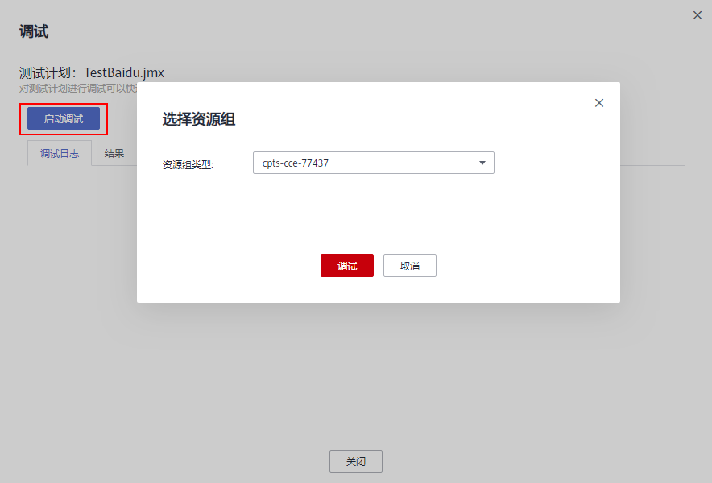
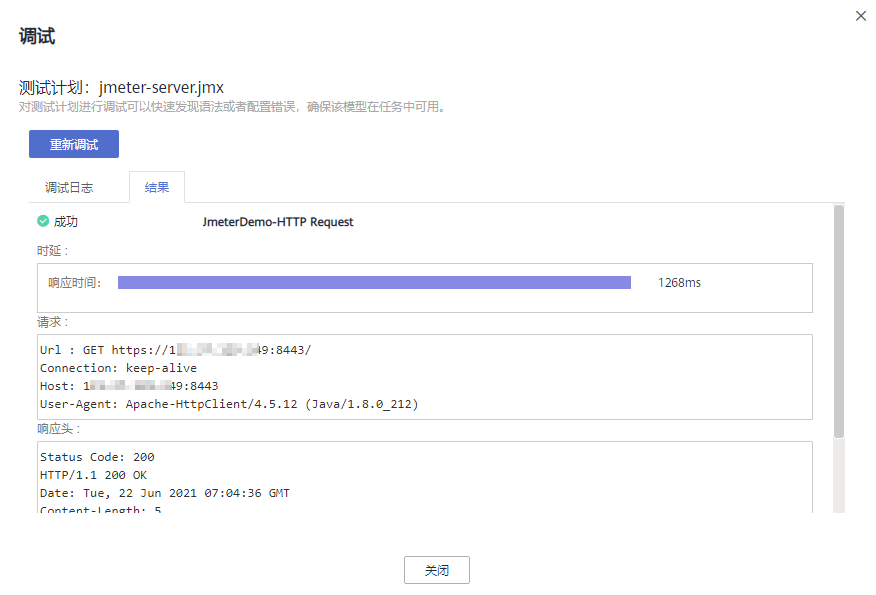
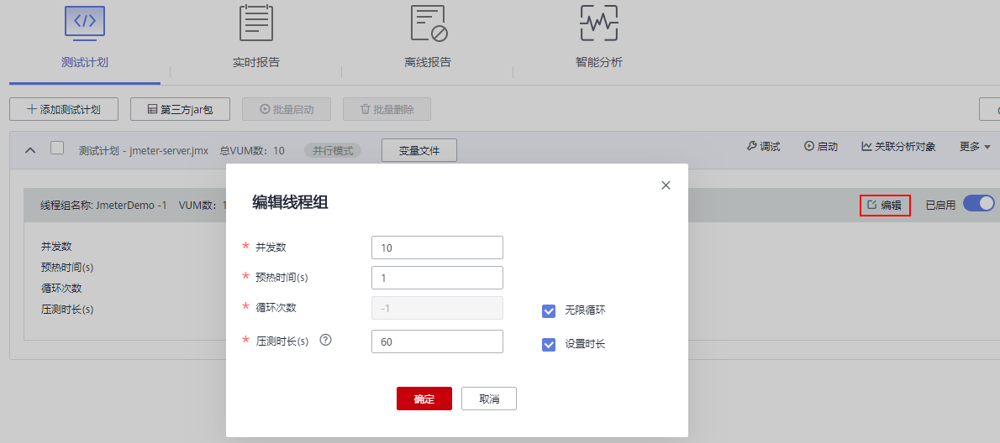
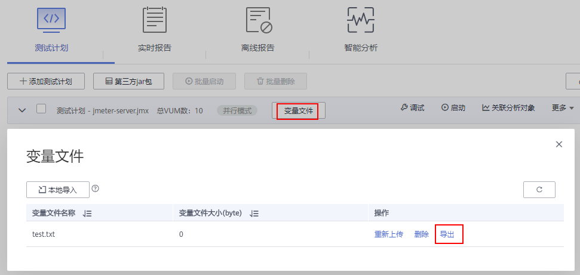
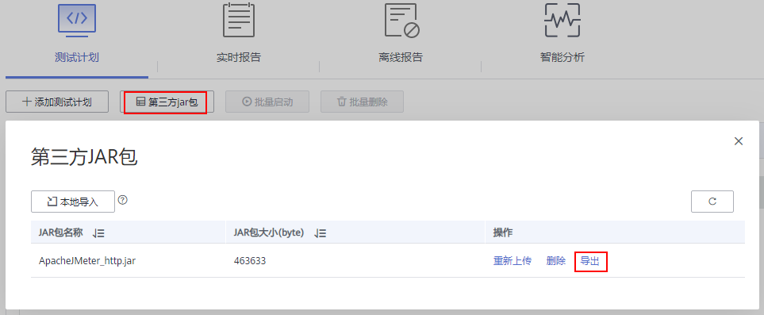

# JMeter测试计划管理

## 创建测试计划

测试计划是指基于已定义的JMeter文件和依赖的Jar包和变量文件发起一次性能测试的活动。

**操作步骤**

1.  登录CPTS控制台，在左侧导航栏中选择“JMeter测试工程“，单击待操作工程后的“编辑测试计划“。
2.  在“测试计划“页签中，单击“添加测试计划”。
3.  在弹出的窗口中单击“添加文件”，选择格式为\*.jmx的文件，单击“导入“，导入成功后将自动“关闭”窗口并返回“测试计划“页签，可以看到已添加的测试计划。

    > **说明：**   
    >-   jmx文件大小限制为10M。  
    >-   若jmx文件中涉及使用beanshell进行文件写入，请使用绝对路径“/opt/cpts/jmeter/task-file/\{cpts::jmeter::task-id\}/\(文件名\) ”；若需要读取该文件，请使用该绝对路径。（\{cpts::jmeter::task-id\}请保持不变）  

4.  在“测试计划“页签中，单击“第三方Jar包”，在弹出的窗口中单击“本地导入“，选择测试计划所依赖的JAR包并导入，导入成功后将自动“关闭”窗口并返回“测试计划“页签。

    **图 1**  导入JAR包  
    

    > **说明：**   
    >JAR包大小限制为10M。  

5.  在“测试计划“页签中，可以查看新添加的测试计划。

## 调试测试计划

新增或修改测试计划后，可通过调试快速发现语法或配置错误，确保该模型在任务中可用。

**操作步骤**

1.  登录CPTS控制台，在左侧导航栏中选择“JMeter测试工程“。单击待调试测试计划所在工程后的“编辑测试计划“。
2.  在“测试计划“页签中，单击展开待调试的测试计划，单击该测试计划后的“调试”。
3.  在弹出的窗口中单击“启动调试”，选择资源组后单击“调试“，如[图2](#fig12991031110)所示。

    **图 2**  选择资源组  
    

    -   云容器CCE资源组：本机创建的云容器引擎CCE资源组。
    -   云容器实例CCI资源组：基于CCI的云容器实例CCI资源组。

    > **说明：**   
    >JMeter测试和CPTS测试不能共用资源组，建议创建单独用于JMeter测试的资源组。  

4.  在“调试日志”页签，查看调试的操作日志。

    **图 3**  调试日志  
    

5.  调试完成后，在“结果”页签，查看测试计划调试的具体内容。

    若调试结果报错，可根据错误日志信息，修改jmx文件后重新导入。导入方法请参见[管理测试计划](#section28265262599)中的修改测试计划部分。

    **图 4**  查看调试结果  
    

## 关联分析对象（可选）

**前提条件**

测试计划处于未启动状态。

**操作步骤**

1.  登录CPTS控制台，在左侧导航栏中选择“JMeter测试工程“，单击待操作工程后的“编辑测试计划“。
2.  在“测试计划“页签中，选择需要关联分析对象的测试计划，单击“关联分析对象”。
3.  勾选需要关联的分析对象，若需关联新的分析对象，单击“添加”，参照[为JMeter设置智能分析](为JMeter设置智能分析.md)添加分析对象，添加完毕后，选择需关联的分析对象，单击“确定”。

## 启动压测计划

测试计划指通过在不同压测点执行一系列测试，持续对系统发起压力测试，通过测试获取并分析系统运行的性能数据。

您可以在一个测试工程中添加多个测试计划。

**前提条件**

-   确保资源组状态为“运行中”。
-   确保资源组的管理节点上的32001和32003端口在安全组被开启。
-   确保资源组的执行节点和被压测的应用之间网络互通。

**操作步骤**

1.  登录CPTS控制台，在左侧导航栏中选择“JMeter测试工程“，单击待操作工程后的“编辑测试计划“。
2.  创建测试计划，具体操作请参见[创建测试计划](#section194181611576)。
3.  创建完成后，单击任务后的。
4.  在“启动测试任务”对话框中，选择“资源组类型”，如[图5](#fig47991765519)所示。

    **图 5**  选择资源组类型  
    

    -   云容器CCE资源组：本机创建的云容器CCE资源组。
    -   云容器实例CCI资源组：基于CCI的云容器实例CCI资源组。

5.  单击“启动”，启动测试任务。

    > **说明：**   
    >压测时长建议至少300s，并发数请根据被压测应用的实际情况填写。通过多次调整压测数据进行反复测试，得到应用所能承受的最大值，进行持续优化和验证。  

6.  （可选）单击“查看报告”，您可以查看实时测试报告。

## 管理测试计划

测试计划创建成功后，您可以对测试计划进行管理。

**批量启动测试计划**

启动同一测试工程下的多个测试计划。

1.  登录CPTS控制台，在左侧导航栏中选择“JMeter测试工程“，单击待操作工程后的“编辑测试计划“。
2.  在“测试计划“页签中，选中多个需要启动的测试计划，单击“批量启动”。

    **图 6**  批量启动  
    

3.  选择对应的资源组，单击“启动”。

**修改测试计划**

1.  登录CPTS控制台，在左侧导航栏中选择“JMeter测试工程“，单击待操作工程后的“编辑测试计划“。
2.  在“测试计划“页签中，单击展开待修改的测试计划，单击测试计划后的“更多 \> 编辑”。
3.  在弹出的“编辑测试计划“窗口中，重新导入格式为\*.jmx的文件，单击“关闭”。

    **图 7**  编辑测试计划  
    

4.  单击测试计划名称后的变量文件，可重新导入测试计划需要引用的文件。

    **图 8**  修改变量文件  
    

    > **说明：**   
    >变量文件上传大小限制为：专业版10M，铂金版80M。  

**删除测试计划**

测试计划删除后将无法恢复，请谨慎操作。

1.  登录CPTS控制台，在左侧导航栏中选择“JMeter测试工程“，单击待操作工程后的“编辑测试计划“。
2.  在“测试计划“页签中，单击待删除测试计划后的“更多 \> 删除”。或选中多个测试计划，单击“批量删除”，一次性删除多个测试计划。

    **图 9**  删除与批量删除测试计划  
    

3.  根据系统提示执行删除操作。

**修改线程组**

1.  登录CPTS控制台，在左侧导航栏中选择“JMeter测试工程“，单击待操作工程后的“编辑测试计划“。
2.  在“测试计划“页签中，单击展开测试计划，单击待修改线程组后的“编辑“。
3.  在弹出的编辑线程组窗口中，可修改并发数、压测时长、预热时间和循环次数，也可点选开启或关闭“无限循环“和“设置时长“。

    **图 10**  编辑线程组  
    

**导出jmx文件、JAR包和变量文件**

1.  登录CPTS控制台，在左侧导航栏中选择“JMeter测试工程“，单击待操作工程后的“编辑测试计划“。
2.  在“测试计划“页签中，单击待导出jmx文件的测试计划后的“更多 \> 导出”。

    导出jmx文件。

    **图 11**  导出jmx文件  
    

3.  在待导出变量文件的测试计划所在行，单击“变量文件”，弹出“变量文件”对话框。
4.  在待导出变量文件所在行，单击“导出”。

    导出变量文件。

    **图 12**  导出变量文件  
    

5.  单击“第三方jar包”，弹出“第三方JAR包”对话框。
6.  在待导出的JAR包所在行，单击“导出”。

    导出JAR包。

    **图 13**  导出JAR包  
    

