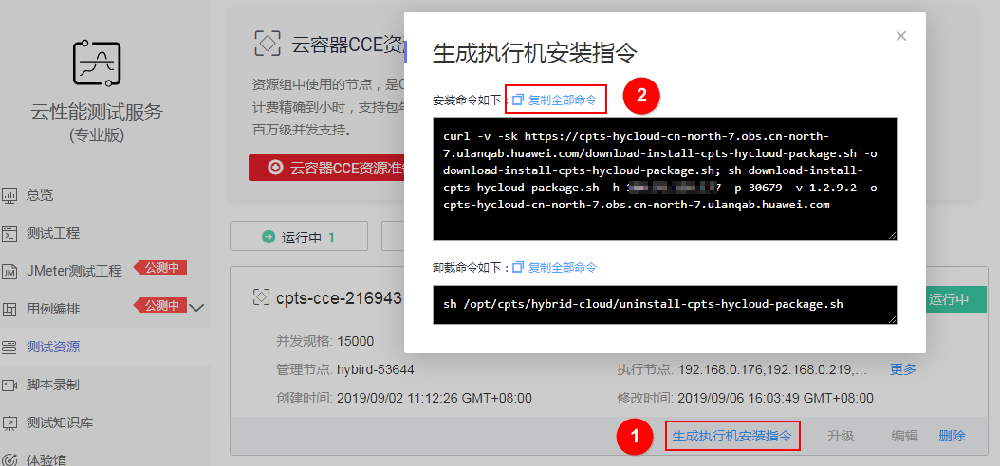
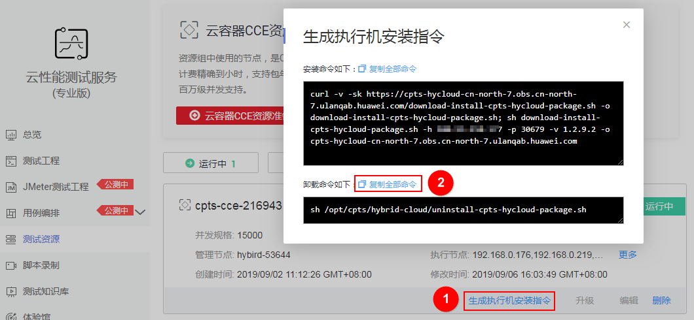

# 创建云容器CCE资源组

压测过程中或结束后，如果需要查看压测的各项数据，您需要先创建一个资源组并选择已创建的节点（即弹性云服务器）。此资源组作为压测的管理机和执行机。

云容器CCE资源组中使用的管理节点是CCE的虚拟机节点。

## 使用建议

-   用于压测资源组的节点不要运行任何应用或做其他用途，可能会导致应用运行异常。
-   请根据需要压测的并发用户数，创建对应规格的节点，节点需要在云容器引擎服务中创建。

    至少创建2个节点，1个作为压测资源组的管理机（即管理执行机的节点），1个作为压测资源组的执行机（即在压测过程中能够提供自身性能数据的施压目标机器）。如需要压测外部服务，请为执行节点绑定弹性IP。

    **表 1**  规格推荐

    
    <table><thead align="left"><tr id="row139675545187"><th class="cellrowborder" valign="top" width="26.732673267326728%" id="mcps1.2.4.1.1">
并发用户数

    </th>
    <th class="cellrowborder" valign="top" width="33.66336633663366%" id="mcps1.2.4.1.2">
所需规格

    </th>
    <th class="cellrowborder" valign="top" width="39.6039603960396%" id="mcps1.2.4.1.3">
数量

    </th>
    </tr>
    </thead>
    <tbody><tr id="row9971154141815"><td class="cellrowborder" rowspan="2" valign="top" width="26.732673267326728%" headers="mcps1.2.4.1.1 ">
0-5,000

    </td>
    <td class="cellrowborder" valign="top" width="33.66336633663366%" headers="mcps1.2.4.1.2 ">
管理节点：2U4G

    </td>
    <td class="cellrowborder" valign="top" width="39.6039603960396%" headers="mcps1.2.4.1.3 ">
1

    </td>
    </tr>
    <tr id="row1292115222287"><td class="cellrowborder" valign="top" headers="mcps1.2.4.1.1 ">
执行节点：4U8G

    </td>
    <td class="cellrowborder" valign="top" headers="mcps1.2.4.1.2 ">
1

    </td>
    </tr>
    <tr id="row76471156152913"><td class="cellrowborder" rowspan="2" valign="top" width="26.732673267326728%" headers="mcps1.2.4.1.1 ">
5,001-10,000

    </td>
    <td class="cellrowborder" valign="top" width="33.66336633663366%" headers="mcps1.2.4.1.2 ">
管理节点：2U4G

    </td>
    <td class="cellrowborder" valign="top" width="39.6039603960396%" headers="mcps1.2.4.1.3 ">
1

    </td>
    </tr>
    <tr id="row193561354192913"><td class="cellrowborder" valign="top" headers="mcps1.2.4.1.1 ">
执行节点：8U16G

    </td>
    <td class="cellrowborder" valign="top" headers="mcps1.2.4.1.2 ">
1

    </td>
    </tr>
    <tr id="row16318163884013"><td class="cellrowborder" rowspan="2" valign="top" width="26.732673267326728%" headers="mcps1.2.4.1.1 ">
10,001-20,000

    </td>
    <td class="cellrowborder" valign="top" width="33.66336633663366%" headers="mcps1.2.4.1.2 ">
管理节点：2U4G

    </td>
    <td class="cellrowborder" valign="top" width="39.6039603960396%" headers="mcps1.2.4.1.3 ">
1

    </td>
    </tr>
    <tr id="row2633173414011"><td class="cellrowborder" valign="top" headers="mcps1.2.4.1.1 ">
执行节点：8U16G

    </td>
    <td class="cellrowborder" valign="top" headers="mcps1.2.4.1.2 ">
2

    </td>
    </tr>
    <tr id="row1792915173010"><td class="cellrowborder" rowspan="2" valign="top" width="26.732673267326728%" headers="mcps1.2.4.1.1 ">
20,001-30,000

    </td>
    <td class="cellrowborder" valign="top" width="33.66336633663366%" headers="mcps1.2.4.1.2 ">
管理节点：2U4G

    </td>
    <td class="cellrowborder" valign="top" width="39.6039603960396%" headers="mcps1.2.4.1.3 ">
1

    </td>
    </tr>
    <tr id="row1492805114297"><td class="cellrowborder" valign="top" headers="mcps1.2.4.1.1 ">
执行节点：8U16G

    </td>
    <td class="cellrowborder" valign="top" headers="mcps1.2.4.1.2 ">
3

    </td>
    </tr>
    <tr id="row16730949112918"><td class="cellrowborder" rowspan="2" valign="top" width="26.732673267326728%" headers="mcps1.2.4.1.1 ">
30,001-40,000

    </td>
    <td class="cellrowborder" valign="top" width="33.66336633663366%" headers="mcps1.2.4.1.2 ">
管理节点：2U4G

    </td>
    <td class="cellrowborder" valign="top" width="39.6039603960396%" headers="mcps1.2.4.1.3 ">
1

    </td>
    </tr>
    <tr id="row128451446142919"><td class="cellrowborder" valign="top" headers="mcps1.2.4.1.1 ">
执行节点：8U16G

    </td>
    <td class="cellrowborder" valign="top" headers="mcps1.2.4.1.2 ">
4

    </td>
    </tr>
    <tr id="row199984546180"><td class="cellrowborder" rowspan="2" valign="top" width="26.732673267326728%" headers="mcps1.2.4.1.1 ">
40,001-50,000

    </td>
    <td class="cellrowborder" valign="top" width="33.66336633663366%" headers="mcps1.2.4.1.2 ">
管理节点：2U4G

    </td>
    <td class="cellrowborder" valign="top" width="39.6039603960396%" headers="mcps1.2.4.1.3 ">
1

    </td>
    </tr>
    <tr id="row1043963112370"><td class="cellrowborder" valign="top" headers="mcps1.2.4.1.1 ">
执行节点：8U16G

    </td>
    <td class="cellrowborder" valign="top" headers="mcps1.2.4.1.2 ">
5

    </td>
    </tr>
    <tr id="row1614914117387"><td class="cellrowborder" rowspan="2" valign="top" width="26.732673267326728%" headers="mcps1.2.4.1.1 ">
50,001以上

    </td>
    <td class="cellrowborder" valign="top" width="33.66336633663366%" headers="mcps1.2.4.1.2 ">
管理节点：2U4G

    </td>
    <td class="cellrowborder" valign="top" width="39.6039603960396%" headers="mcps1.2.4.1.3 ">
1

    </td>
    </tr>
    <tr id="row13312714143814"><td class="cellrowborder" valign="top" headers="mcps1.2.4.1.1 ">
执行节点：8U16G

    </td>
    <td class="cellrowborder" valign="top" headers="mcps1.2.4.1.2 ">
n

    
 说明： 

每台8U16G的执行节点可支撑10,000并发。

    

    </td>
    </tr>
    </tbody>
    </table>

    > **说明：**   
    >-   以上资源节点规格推荐是通用规格，仅供参考。实际压测时，资源规格的需求受思考时间、压测的协议类型、请求和响应的大小数量、响应时间、结果验证等因素影响，用户可根据实际情况进行调整。  
    >-   在需要压测外部服务时请在执行机绑定弹性IP，测试带宽受限于购买的EIP带宽。  
    >-   当集群上的节点已经被部署上了应用，创建私有资源组时，该节点无法被选用。  
    >-   JMeter引擎不适用该规格。  

## 添加节点

在CPTS服务中，压测服务需要运行在用户自己创建的节点中。进行压测前，您需要先添加节点，作为CPTS压测资源组中的管理机和执行机。

1.  登录CCE控制台。
2.  创建集群并添加节点。节点数量和规格请根据实际业务需求选择。

    -   若CCE中已有可用集群，请添加管理机和执行机节点，如果使用混合云模式进行压测，则只需要添加管理机。添加节点操作请参考[购买节点（按需计费）](https://support.huaweicloud.com/usermanual-cce/cce_01_0033.html)或[购买节点（包年包月）](https://support.huaweicloud.com/usermanual-cce/cce_01_0003.html)。
    -   若CCE中无可用集群，请先创建集群。创建集群操作请参考[创建混合集群](https://support.huaweicloud.com/usermanual-cce/cce_01_0028.html)。集群创建成功后，再添加压测服务的管理机和执行机，如果使用混合云模式进行压测，则只需要添加管理机。

    > **说明：**   
    >压测外部应用（部署在其他VPC的应用、部署在线下或其他公有云上的应用）时，需确保资源组中执行机已绑定弹性IP。  

## 创建云容器CCE资源组

1.  登录CPTS控制台，在左侧导航栏中选择“测试资源”，单击“云容器CCE资源准备“。
2.  参照[表2](#table126755518422)设置基本信息。

    **表 2**  创建压测资源组

    
    <table><thead align="left"><tr id="row9266115554210"><th class="cellrowborder" valign="top" width="18.68%" id="mcps1.2.3.1.1">
参数

    </th>
    <th class="cellrowborder" valign="top" width="81.32000000000001%" id="mcps1.2.3.1.2">
参数说明

    </th>
    </tr>
    </thead>
    <tbody><tr id="row32661455164218"><td class="cellrowborder" valign="top" width="18.68%" headers="mcps1.2.3.1.1 ">
资源组名称

    </td>
    <td class="cellrowborder" valign="top" width="81.32000000000001%" headers="mcps1.2.3.1.2 ">
新建云容器CCE资源组的名称，可自定义。

    </td>
    </tr>
    <tr id="row1842110671118"><td class="cellrowborder" valign="top" width="18.68%" headers="mcps1.2.3.1.1 ">
混合云模式

    </td>
    <td class="cellrowborder" valign="top" width="81.32000000000001%" headers="mcps1.2.3.1.2 "><ul id="ul179482213146"><li>是：管理节点使用CCE的虚拟机节点，执行节点使用您自己的节点。</li><li>否：管理节点和执行节点只能使用CCE的虚拟机节点。</li></ul>
    </td>
    </tr>
    <tr id="row129525911412"><td class="cellrowborder" valign="top" width="18.68%" headers="mcps1.2.3.1.1 ">
引擎选择

    </td>
    <td class="cellrowborder" valign="top" width="81.32000000000001%" headers="mcps1.2.3.1.2 ">
CPTS引擎：默认压测引擎。

    
JMeter引擎：JMeter是Apache组织开发的基于Java的压力测试工具。用于对软件做压力测试，它最初被设计用于Web应用测试，但后来扩展到其他测试领域。 它可以用于测试静态和动态资源，例如静态文件、Java小服务程序、CGI脚本、Java对象、数据库、FTP服务器等。

    </td>
    </tr>
    <tr id="row426715559425"><td class="cellrowborder" valign="top" width="18.68%" headers="mcps1.2.3.1.1 ">
管理节点

    </td>
    <td class="cellrowborder" valign="top" width="81.32000000000001%" headers="mcps1.2.3.1.2 ">
执行压测的管理机。

    
管理节点在资源组创建成功后不可修改。

    </td>
    </tr>
    <tr id="row164531518181114"><td class="cellrowborder" valign="top" width="18.68%" headers="mcps1.2.3.1.1 ">
连接地址选择

    </td>
    <td class="cellrowborder" valign="top" width="81.32000000000001%" headers="mcps1.2.3.1.2 ">
仅在使用混合云时，需要选择，主要目的是使管理节点和执行节点可以相互通信。

    <ul id="ul1158161317145"><li>外网地址：当管理节点和执行节点通过管理节点的弹性IP地址通信时，选择外网地址</li><li>内网地址：当管理节点和执行节点通过管理节点的私有IP地址通信时，选择内网地址</li><li>手动输入：当管理节点和执行节点即不是通过管理节点的弹性IP地址，也不是通过管理节点的私有IP地址通信时，选择手动输入</li></ul>
    </td>
    </tr>
    <tr id="row5445422161117"><td class="cellrowborder" valign="top" width="18.68%" headers="mcps1.2.3.1.1 ">
连接地址

    </td>
    <td class="cellrowborder" valign="top" width="81.32000000000001%" headers="mcps1.2.3.1.2 ">
仅在使用混合云，且连接地址选择手动输入时，需要填写。

    </td>
    </tr>
    <tr id="row3267555144212"><td class="cellrowborder" valign="top" width="18.68%" headers="mcps1.2.3.1.1 ">
执行节点

    </td>
    <td class="cellrowborder" valign="top" width="81.32000000000001%" headers="mcps1.2.3.1.2 ">
执行压测的执行机，即在压测过程中能够提供自身性能数据的施压目标机器。

    <ul id="ul986010674418"><li>非混合云模式时，选择CCE的虚拟机节点</li><li>混合云模式时，选择“自动安装”，由管理节点为执行节点安装压测所需执行包，选择“手动安装”，您需要复制安装命令到您的节点中执行</li></ul>
    </td>
    </tr>
    <tr id="row1417614274312"><td class="cellrowborder" valign="top" width="18.68%" headers="mcps1.2.3.1.1 ">
密码

    </td>
    <td class="cellrowborder" valign="top" width="81.32000000000001%" headers="mcps1.2.3.1.2 ">
仅在自动安装执行节点时，需要设置。

    
使用“root”用户登录执行节点的密码

    </td>
    </tr>
    <tr id="row91612521717"><td class="cellrowborder" valign="top" width="18.68%" headers="mcps1.2.3.1.1 ">
执行节点IP

    </td>
    <td class="cellrowborder" valign="top" width="81.32000000000001%" headers="mcps1.2.3.1.2 ">
仅在自动安装执行节点时，需要设置。

    
输入执行节点的IP地址。支持添加多台执行节点IP，注意，此时需要确保多台执行节点的密码相同。

    </td>
    </tr>
    </tbody>
    </table>

3.  单击“创建“。

    创建成功后，会通过AOS应用编排服务分别为管理节点和执行节点部署压测服务所用的堆栈。

4.  （可选）修改、删除以及升级该资源组和手动新增、删除资源组中的执行节点。
    -   修改资源组：在资源组列表中，单击待修改资源组后的“编辑”，根据需要进行修改，仅支持修改“资源组名称”和“执行节点”，修改完成后，单击“确定”。

        > **说明：**   
        >仅当资源组状态为“运行中”时才可修改资源组。其他状态如“部署中”、“升级中”、“异常”等，不支持修改资源组。  
        >混合云模板不支持修改资源组。  

    -   删除资源组：在资源组列表中，单击待删除资源组中的“删除”，根据系统提示执行删除操作。

        > **说明：**   
        >删除资源组，会同时删除该资源组部署在AOS的堆栈，但不会删除节点，仅表示该资源组中的节点不会再被压测服务使用。如需彻底删除节点，请到对应服务中删除。  

    -   升级资源组：在资源组列表中，单击待升级资源组中的“升级”，根据系统提示执行升级操作。
    -   手动新增资源组中的执行节点：在待新增节点的资源组中，单击“生成执行机安装指令”，复制安装命令，在待新增的节点中执行复制的命令，安装执行节点。

        **图 1**  复制安装命令  
        

    -   手动删除资源组中的执行节点：在待删除节点的资源组中，单击“生成执行机安装指令”，复制卸载命令，在待删除的节点中执行复制的命令，删除执行节点。

        **图 2**  复制卸载命令  
        

