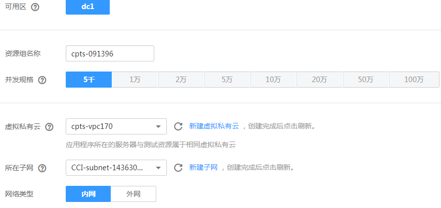

# 创建实例化资源组

1.  登录CPTS控制台。
2.  选择左侧导航栏的“测试资源“，单击“实例化资源购买“。
3.  参照[表1](#table5854195819284)设置基本信息。

    **图 1**  创建实例化资源组  
    

    **表 1**  创建实例化资源组

    
    <table><thead align="left"><tr id="row1085216581283"><th class="cellrowborder" valign="top" width="16%" id="mcps1.2.3.1.1">
参数

    </th>
    <th class="cellrowborder" valign="top" width="84%" id="mcps1.2.3.1.2">
参数说明

    </th>
    </tr>
    </thead>
    <tbody><tr id="row385245862819"><td class="cellrowborder" valign="top" width="16%" headers="mcps1.2.3.1.1 ">
可用区

    </td>
    <td class="cellrowborder" valign="top" width="84%" headers="mcps1.2.3.1.2 ">
保持默认值，不可修改。

    </td>
    </tr>
    <tr id="row128531158122817"><td class="cellrowborder" valign="top" width="16%" headers="mcps1.2.3.1.1 ">
资源组名称

    </td>
    <td class="cellrowborder" valign="top" width="84%" headers="mcps1.2.3.1.2 ">
输入实例化资源组名称。

    </td>
    </tr>
    <tr id="row1985435817284"><td class="cellrowborder" valign="top" width="16%" headers="mcps1.2.3.1.1 ">
并发规格

    </td>
    <td class="cellrowborder" valign="top" width="84%" headers="mcps1.2.3.1.2 ">
当前仅支持5000并发数。

    </td>
    </tr>
    <tr id="row56225325594"><td class="cellrowborder" valign="top" width="16%" headers="mcps1.2.3.1.1 ">
虚拟私有云

    </td>
    <td class="cellrowborder" valign="top" width="84%" headers="mcps1.2.3.1.2 ">
选择已创建的虚拟私有云，若无可用的虚拟私有云，单击“新建虚拟私有云”创建虚拟私有云。

    </td>
    </tr>
    <tr id="row1462923925919"><td class="cellrowborder" valign="top" width="16%" headers="mcps1.2.3.1.1 ">
所在子网

    </td>
    <td class="cellrowborder" valign="top" width="84%" headers="mcps1.2.3.1.2 ">
选择所在子网，若无可用的子网，单击“新建子网”创建子网。

    </td>
    </tr>
    <tr id="row966618368593"><td class="cellrowborder" valign="top" width="16%" headers="mcps1.2.3.1.1 ">
网络类型

    </td>
    <td class="cellrowborder" valign="top" width="84%" headers="mcps1.2.3.1.2 ">
提供两种网络类型：

    <ul id="ul121514253265"><li>内网</li><li>外网</li></ul>
    </td>
    </tr>
    <tr id="row6854234145913"><td class="cellrowborder" colspan="2" valign="top" headers="mcps1.2.3.1.1 mcps1.2.3.1.2 ">
当网络类型为外网时，需要配置以下参数：

    </td>
    </tr>
    <tr id="row12777141122814"><td class="cellrowborder" valign="top" width="16%" headers="mcps1.2.3.1.1 ">
弹性IP

    </td>
    <td class="cellrowborder" valign="top" width="84%" headers="mcps1.2.3.1.2 ">
提供两种弹性IP：

    <ul id="ul1658074417303"><li>现在购买</li><li>使用已有</li></ul>
    
 说明： 

当选择“使用已有”，则需要配置“已有IP”。

    

    </td>
    </tr>
    <tr id="row1258912439287"><td class="cellrowborder" valign="top" width="16%" headers="mcps1.2.3.1.1 ">
购买量

    </td>
    <td class="cellrowborder" valign="top" width="84%" headers="mcps1.2.3.1.2 ">
购买弹性IP的数量，如果当前并发量不够使用，可以单击“扩大弹性IP配额”扩大弹性IP配额。

    </td>
    </tr>
    <tr id="row8978142242919"><td class="cellrowborder" valign="top" width="16%" headers="mcps1.2.3.1.1 ">
规格

    </td>
    <td class="cellrowborder" valign="top" width="84%" headers="mcps1.2.3.1.2 ">
提供两种规格：

    <ul id="ul31911312203417"><li>全动态BPG</li><li>静态BPG</li></ul>
    </td>
    </tr>
    <tr id="row107047365291"><td class="cellrowborder" valign="top" width="16%" headers="mcps1.2.3.1.1 ">
计费模式

    </td>
    <td class="cellrowborder" valign="top" width="84%" headers="mcps1.2.3.1.2 ">
提供两种计费模式：

    <ul id="ul353117383512"><li>按带宽计费</li><li>按流量计费</li></ul>
    </td>
    </tr>
    <tr id="row16158134717294"><td class="cellrowborder" valign="top" width="16%" headers="mcps1.2.3.1.1 ">
带宽

    </td>
    <td class="cellrowborder" valign="top" width="84%" headers="mcps1.2.3.1.2 ">
可根据需要调整带宽。

    </td>
    </tr>
    </tbody>
    </table>

4.  单击“立即购买“。

    创建成功后，会在AOS、CCI分别创建模板、堆栈、命名空间、工作负载。

