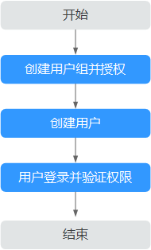

# 创建并授权使用CPTS

如果您需要对您所拥有的云性能测试服务（CPTS）进行精细的权限管理，您可以使用[统一身份认证服务](https://support.huaweicloud.com/usermanual-iam/iam_01_0001.html)（Identity and Access Management，简称IAM），通过IAM，您可以：

-   根据企业的业务组织，在您的华为云账号中，给企业中不同职能部门的员工创建IAM用户，让员工拥有唯一安全凭证，并使用CPTS资源。
-   根据企业用户的职能，设置不同的访问权限，以达到用户之间的权限隔离。
-   将CPTS资源委托给更专业、高效的其他华为云账号或者云服务，这些账号或者云服务可以根据权限进行代运维。

如果华为云账号已经能满足您的要求，不需要创建独立的IAM用户，您可以跳过本章节，不影响您使用CPTS服务的其它功能。

本章节为您介绍对用户授权的方法，操作流程如[图1](#fig15451536531)所示。

## 前提条件

给用户组授权之前，请您了解用户组可以添加的CPTS权限，并结合实际需求进行选择，CPTS支持的系统权限，请参见[表1](#table20303044164219)。若您需要对除CPTS之外的其它服务授权，IAM支持服务的所有权限请参见[系统权限](https://support.huaweicloud.com/permissions/policy_list.html?product=cpts)。

**表 1**  CPTS用户权限

<table><thead align="left"><tr id="row43038444428"><th class="cellrowborder" valign="top" width="24.43%" id="mcps1.2.3.1.1">
权限名称

</th>
<th class="cellrowborder" valign="top" width="75.57000000000001%" id="mcps1.2.3.1.2">
权限说明

</th>
</tr>
</thead>
<tbody><tr id="row19304144184220"><td class="cellrowborder" valign="top" width="24.43%" headers="mcps1.2.3.1.1 ">
SvcStg&nbsp;Admin

</td>
<td class="cellrowborder" valign="top" width="75.57000000000001%" headers="mcps1.2.3.1.2 ">
拥有该权限的用户对CPTS的所有用户下的测试资源具有执行权限（如增删改查），能够操作所有用户的测试资源。

</td>
</tr>
<tr id="row930484414429"><td class="cellrowborder" valign="top" width="24.43%" headers="mcps1.2.3.1.1 ">
SvcStg Developer

</td>
<td class="cellrowborder" valign="top" width="75.57000000000001%" headers="mcps1.2.3.1.2 ">
拥有该权限的用户只对本用户测试资源具有执行权限（如增删改查）。

</td>
</tr>
<tr id="row1530464410423"><td class="cellrowborder" valign="top" width="24.43%" headers="mcps1.2.3.1.1 ">
SvcStg Operator

</td>
<td class="cellrowborder" valign="top" width="75.57000000000001%" headers="mcps1.2.3.1.2 ">
拥有该权限的用户只对本用户测试资源具有可读权限。

</td>
</tr>
</tbody>
</table>

> **说明：**   
>对于租户用户，默认具有admin权限，不需要额外配置，该权限配置仅针对租户下面的子用户。  

## 示例流程

**图 1**  给用户授予CPTS权限流程  

1.  [创建用户组并授权](https://support.huaweicloud.com/usermanual-iam/iam_03_0001.html)

    在IAM控制台创建用户组，并授予云性能测试服务管理员权限“SvcStg Admin”。

2.  [创建用户并加入用户组](https://support.huaweicloud.com/usermanual-iam/iam_02_0001.html)

    在IAM控制台创建用户，并将其加入[1](#li10176121316284)中创建的用户组。

3.  [用户登录](https://support.huaweicloud.com/usermanual-iam/iam_01_0552.html)并验证权限

    新创建的用户登录控制台，切换至授权区域，验证权限：在“服务列表”中选择“云性能测试服务”，进入CPTS主界面，左侧导航栏中选择“测试工程“，在右侧页面单击“创建测试工程“，如果能创建测试工程，说明权限设置成功。

