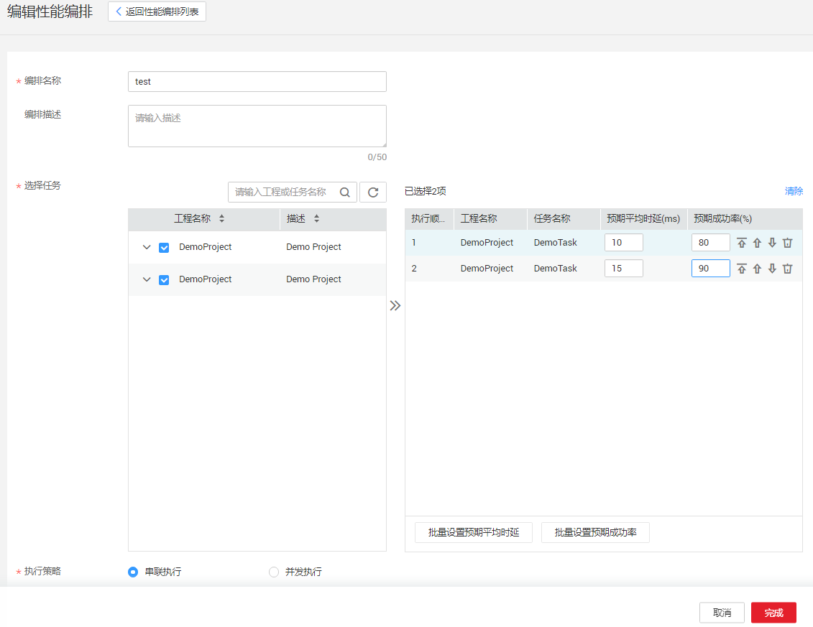

# 创建性能编排

性能编排主要是为性能测试场景提供灵活的执行策略配置，支持串行执行和并发执行。

## 操作步骤

1.  登录CPTS控制台，在左侧导航栏中选择“用例编排 \> 性能编排“，单击“创建性能编排”。
2.  在“创建性能编排“页面的填写以下配置参数：

    -   编排名称：新建性能编排的名称。
    -   编排描述：新建性能编排的描述信息，可不填。
    -   选择任务：选择需要编排的任务，单击，可对任务进行排序、删除操作。
    -   预期平均时延（ms）：可对每个任务设置预期平均时延时间。任务执行成功后会产生实际的平均时延，此时系统会将实际平均时延和预期平均时延进行对比，如果实际平均时延低于预期平均时延，则判定此任务执行失败。
    -   预期成功率（%）：可对每个任务设置预期成功率。任务执行成功后会产生实际的成功率，此时系统会将实际成功率和预期成功率进行对比，如果实际成功率低于预期成功率，则判定此任务执行失败。
    -   串联执行：存在多个任务的情况下，任务按照编排的顺序执行，完成一个之后才能进行下一个。如果其中一个任务执行失败，不会继续执行下一个任务，而是判定此性能编排执行失败。
    -   并发执行：两个或两个以上的任务同时执行。

    **图 1**  创建性能编排  
    

3.  配置完成后，单击“完成”。
4.  性能编排创建完成后，单击“返回性能编排列表”，在待执行的性能编排所在行，单击“执行”，并且选择资源组，即可开始执行性能编排。
5.  在已执行的性能编排所在行，单击“查看报告”，可查看测试报告。

