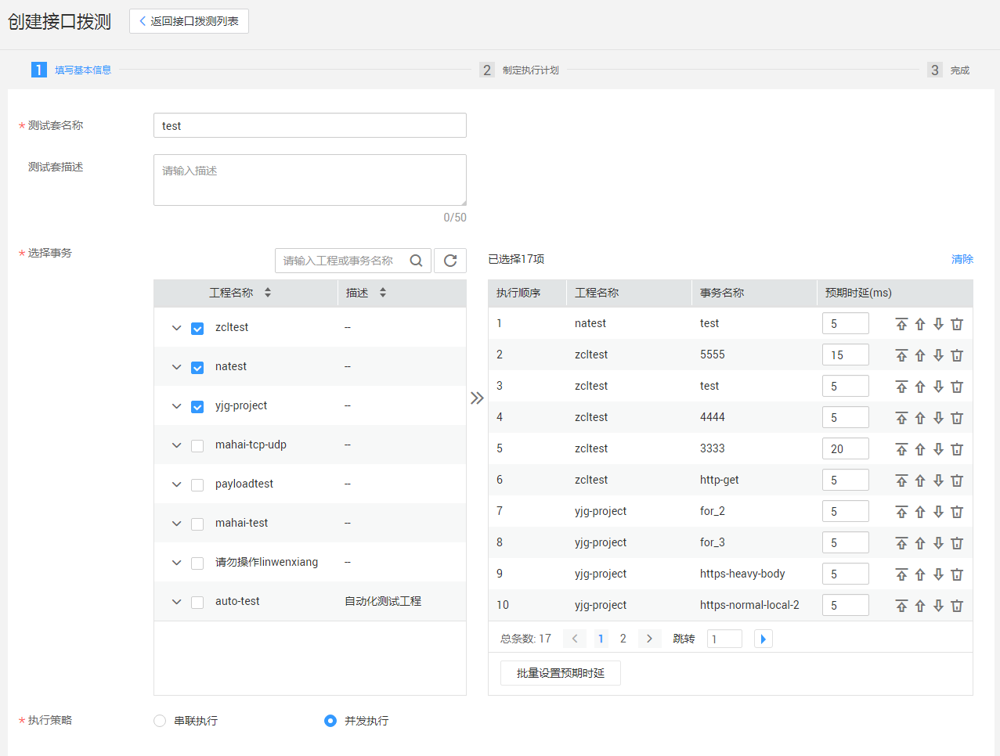
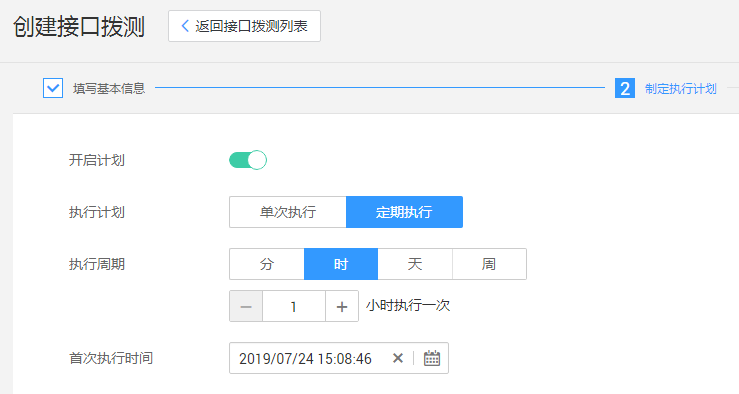

# 创建接口拨测

接口拨测旨在为应用提供快速的接口功能测试能力，支持串联及并发两种执行策略，支持完备的测试报告及测试指标分析统计。

## 操作步骤

1.  登录CPTS控制台，在左侧导航栏中选择“用例编排 \> 接口拨测“，单击“创建接口拨测”。
2.  在“创建接口拨测“页面的“填写基本信息”页签下，配置以下参数：

    -   测试套名称：新建测试套的名称。
    -   测试套描述：新建测试套的描述信息，可不填。
    -   选择事务：选择需要编排的事务，选中后单击，可对事务进行排序、删除操作。
    -   预期时延（ms）：可对每个事务设置预期时延时间。
    -   批量设置预期时延：单击后可批量设置预期时延。
    -   串联执行：存在多个事务的情况下，事务按照编排的顺序执行，完成一个之后才能进行下一个。
    -   并发执行：两个或两个以上的事务同时执行，但是若编排中存在预置事务，则预置事务优先执行。

    **图 1**  填写基本信息  
    

3.  完成基本信息配置完成后，单击“下一步”进入“制定执行计划”页签，选择是否“开启计划“，开启后配置如下参数：
    -   执行计划：
        -   单次执行：只执行一次计划。选择执行计划的时间，可精确到秒。
        -   定期执行：根据设定时间定期执行计划。
            -   执行周期：选择执行周期，目前支持“分“、“时“、“天“和“周“，如5分钟执行一次、1小时执行一次、2天执行一次、每周一执行等。
            -   首次执行日期：设置首次开始执行周期计划的时间点。

    -   选择资源组：单击“选择“，在弹出的窗口中选择共享资源组类型。

        **图 2**  制定执行计划  
        

4.  配置完成后，单击“完成”。
5.  接口拨测创建完成后，单击“返回接口拨测列表”，单击待执行的测试套后操作栏中的“执行”，并且选择资源组类型，即可开始执行测试套。
6.  单击待执行的测试套后操作栏中的“查看报告”，可查看测试报告。

