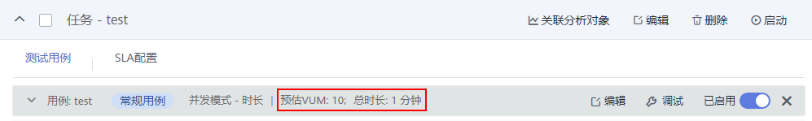

# 创建测试任务

测试任务是指基于已定义的测试模型发起一次性能测试的活动。

## 前提条件

（可选）已添加完事务。

## 操作步骤

1.  登录CPTS控制台，在左侧导航栏中选择“CPTS测试工程“。
2.  在待编辑CPTS测试工程所在行，单击“编辑测试任务”。
3.  在“测试任务“页签中，单击“添加任务”。
4.  输入测试任务名称和基准并发，单击“确定”。

    基准并发：自定义的基准值，为设置[7](#li1840292014814)中的并发用户，提供参考比例。并发用户=基准并发\*并发百分比。

5.  单击展开新添加的测试任务，在“测试用例”页签，单击“添加用例”，输入用例名称和用例类型，单击“确定”。
    -   常规用例：只能添加常规事务和HTTP/HTTPS/TCP/UDP协议的请求信息。
    -   预置用例：相当于测试任务的提前条件，当和常规用例一起使用时，首先执行预置用例，且只会执行一次，不支持循环执行。

6.  根据实际情况，选择添加请求、事务或者数据指令。

    常规用例和预置用例支持同时添加请求、事务，也可以只添加其中之一。在实际使用过程中，数据指令一般和和请求联合使用。

    -   添加数据指令：仅在本任务需要执行的数据指令，添加请求的具体步骤请参考[添加数据指令](添加数据指令.md)。
    -   添加请求：仅在本任务需要执行的请求，无相关事务模型。添加请求的具体步骤请参考[添加请求信息（报文）](添加请求信息（报文）.md)、[添加请求信息（思考时间）](添加请求信息（思考时间）.md)、[添加请求信息（响应提取）](添加请求信息（响应提取）.md)和[添加请求信息（检查点）](添加请求信息（检查点）.md)。
    -   添加事务：已在事务库中存在事务模型。单击“添加事务”，勾选事务模型的名称，单击“确定”。创建事务模型的具体步骤请参考[添加事务模型](添加事务模型.md)。

7.  请求或者事务添加后，单击“添加阶段”，参照[表1](#table119664118592)设置阶段参数。

    > **说明：** 
    >-   一个常规用例最多添加1000个阶段。
    >-   预置用例不支持添加阶段。

    **图 1**  添加阶段  
    

    **表 1**  添加阶段

    
    <table><thead align="left"><tr id="row897104112598"><th class="cellrowborder" valign="top" width="25%" id="mcps1.2.3.1.1">
参数

    </th>
    <th class="cellrowborder" valign="top" width="75%" id="mcps1.2.3.1.2">
参数说明

    </th>
    </tr>
    </thead>
    <tbody><tr id="row297104112593"><td class="cellrowborder" valign="top" width="25%" headers="mcps1.2.3.1.1 ">
阶段名称

    </td>
    <td class="cellrowborder" valign="top" width="75%" headers="mcps1.2.3.1.2 ">
自定义阶段名称，用于区分不同的阶段，比如首页测试。

    </td>
    </tr>
    <tr id="row2097541155917"><td class="cellrowborder" valign="top" width="25%" headers="mcps1.2.3.1.1 ">
压力模式

    </td>
    <td class="cellrowborder" valign="top" width="75%" headers="mcps1.2.3.1.2 ">
压力模式目前支持并发模式和TPS模式。

    <ul id="ul582191515612"><li>并发模式：用例按照固定或者梯度递增的并发用户数进行压测。</li><li>TPS模式：用例按照每秒指定的事务数进行压测。TPS模式中，一个虚拟用户执行一次测试用例为一个事务。实际压测时，能否达到指定的事务数取决于最大并发数和事务平均响应时延。</li></ul>
    </td>
    </tr>
    <tr id="row63405147210"><td class="cellrowborder" valign="top" width="25%" headers="mcps1.2.3.1.1 ">
执行策略

    </td>
    <td class="cellrowborder" valign="top" width="75%" headers="mcps1.2.3.1.2 ">
执行策略目前支持按时长和按次数。

    <ul id="ul1467514403280"><li>按时长：按照设定的持续时间进行压测。</li><li>按次数：按照设定的发送总次数进行压测。</li></ul>
    </td>
    </tr>
    <tr id="row1398104120599"><td class="cellrowborder" colspan="2" valign="top" headers="mcps1.2.3.1.1 mcps1.2.3.1.2 ">
<strong id="b3964114832414">当“压力模式”为“并发模式”、“执行策略”为“按时长”，且“梯度递增”关闭时，</strong>需要配置以下参数：

    </td>
    </tr>
    <tr id="row10524113212113"><td class="cellrowborder" valign="top" width="25%" headers="mcps1.2.3.1.1 ">
基准并发

    </td>
    <td class="cellrowborder" valign="top" width="75%" headers="mcps1.2.3.1.2 ">
自定义的基准值，为设置“并发用户”提供参考比例。并发用户=基准并发*并发百分比。

    
添加任务时设置，设置完成后不支持修改。

    </td>
    </tr>
    <tr id="row798941175917"><td class="cellrowborder" valign="top" width="25%" headers="mcps1.2.3.1.1 ">
并发用户（个）

    </td>
    <td class="cellrowborder" valign="top" width="75%" headers="mcps1.2.3.1.2 ">
并发用户数指在同一时刻内，对系统进行业务操作的用户数量。

    
在云性能测试服务中为用户在定义测试任务阶段设置的虚拟用户数。

    </td>
    </tr>
    <tr id="row498941145920"><td class="cellrowborder" valign="top" width="25%" headers="mcps1.2.3.1.1 ">
并发百分比（%）

    </td>
    <td class="cellrowborder" valign="top" width="75%" headers="mcps1.2.3.1.2 ">
并发用户数和基准并发数的比例。并发百分比=并发用户/基准并发。

    </td>
    </tr>
    <tr id="row39884120592"><td class="cellrowborder" valign="top" width="25%" headers="mcps1.2.3.1.1 ">
持续时间（分钟）

    </td>
    <td class="cellrowborder" valign="top" width="75%" headers="mcps1.2.3.1.2 ">
本阶段压测执行的时间。

    </td>
    </tr>
    <tr id="row169894120599"><td class="cellrowborder" colspan="2" valign="top" headers="mcps1.2.3.1.1 mcps1.2.3.1.2 ">
<strong id="b256245311262">当“压力模式”为“并发模式”、“执行策略”为“按时长”，且“梯度递增”打开时，</strong>需要配置以下参数：

    
 说明： 

一个用例只能设置一个“梯度递增”阶段。

    

    </td>
    </tr>
    <tr id="row5292183724316"><td class="cellrowborder" valign="top" width="25%" headers="mcps1.2.3.1.1 ">
基准并发

    </td>
    <td class="cellrowborder" valign="top" width="75%" headers="mcps1.2.3.1.2 ">
自定义的基准值，为设置“起始并发用户”和“递增总并发用户”提供参考比例。

    
添加任务时设置，设置完成后不支持修改。

    </td>
    </tr>
    <tr id="row0981941115913"><td class="cellrowborder" valign="top" width="25%" headers="mcps1.2.3.1.1 ">
起始并发用户（个）

    </td>
    <td class="cellrowborder" valign="top" width="75%" headers="mcps1.2.3.1.2 ">
梯度递增的起始用户数量。

    </td>
    </tr>
    <tr id="row19993412593"><td class="cellrowborder" valign="top" width="25%" headers="mcps1.2.3.1.1 ">
起始百分比（%）

    </td>
    <td class="cellrowborder" valign="top" width="75%" headers="mcps1.2.3.1.2 ">
起始并发用户数与基准并发数的比例。起始百分比=起始并发用户/基准并发。

    </td>
    </tr>
    <tr id="row8996417593"><td class="cellrowborder" valign="top" width="25%" headers="mcps1.2.3.1.1 ">
递增总并发用户（个）

    </td>
    <td class="cellrowborder" valign="top" width="75%" headers="mcps1.2.3.1.2 ">
一共会增加的并发用户数。梯度递增中，第一个子阶段并发用户为起始并发用户数，其余每个子阶段的并发用户为上一阶段并发用户数+递增总并发用户*递增量级，最后一个子阶段并发用户为起始并发用户数+递增总并发用户数。

    </td>
    </tr>
    <tr id="row169934118597"><td class="cellrowborder" valign="top" width="25%" headers="mcps1.2.3.1.1 ">
递增百分比（%）

    </td>
    <td class="cellrowborder" valign="top" width="75%" headers="mcps1.2.3.1.2 ">
递增总并发用户数与基准并发数的比例。递增百分比=递增总并发用户/基准并发。

    </td>
    </tr>
    <tr id="row9992041175910"><td class="cellrowborder" valign="top" width="25%" headers="mcps1.2.3.1.1 ">
递增量级

    </td>
    <td class="cellrowborder" valign="top" width="75%" headers="mcps1.2.3.1.2 ">
每个子阶段增加的并发用户数=递增总并发用户*递增量级。

    
递增量级包含：5%、10%、20%、50%。

    </td>
    </tr>
    <tr id="row199915414591"><td class="cellrowborder" valign="top" width="25%" headers="mcps1.2.3.1.1 ">
单量持续时间（分钟）

    </td>
    <td class="cellrowborder" valign="top" width="75%" headers="mcps1.2.3.1.2 ">
每个子阶段压测执行的时间。

    </td>
    </tr>
    <tr id="row1899104105913"><td class="cellrowborder" colspan="2" valign="top" headers="mcps1.2.3.1.1 mcps1.2.3.1.2 ">
<strong id="b1521161872813">当“压力模式”为“并发模式”、“执行策略”为“按次数”，</strong>需要配置以下参数：

    
 说明： 

一个用例只能添加一个“按次数”阶段。

    

    </td>
    </tr>
    <tr id="row745412162428"><td class="cellrowborder" valign="top" width="25%" headers="mcps1.2.3.1.1 ">
基准并发

    </td>
    <td class="cellrowborder" valign="top" width="75%" headers="mcps1.2.3.1.2 ">
自定义的基准值，为设置“并发用户”提供参考比例。并发用户=基准并发*并发百分比。

    
添加任务时设置，设置完成后不支持修改。

    </td>
    </tr>
    <tr id="row899124145915"><td class="cellrowborder" valign="top" width="25%" headers="mcps1.2.3.1.1 ">
并发用户（个）

    </td>
    <td class="cellrowborder" valign="top" width="75%" headers="mcps1.2.3.1.2 ">
并发用户数指在同一时刻内，对系统进行业务操作的用户数量。

    
在云性能测试服务中为用户在定义测试任务阶段设置的虚拟用户数。

    </td>
    </tr>
    <tr id="row3991410594"><td class="cellrowborder" valign="top" width="25%" headers="mcps1.2.3.1.1 ">
并发百分比（%）

    </td>
    <td class="cellrowborder" valign="top" width="75%" headers="mcps1.2.3.1.2 ">
并发用户数和基准并发数的比例。并发百分比=并发用户/基准并发。

    </td>
    </tr>
    <tr id="row01009419597"><td class="cellrowborder" valign="top" width="25%" headers="mcps1.2.3.1.1 ">
发送总次数（次）

    </td>
    <td class="cellrowborder" valign="top" width="75%" headers="mcps1.2.3.1.2 ">
该用例在一次任务的运行中，将按照运行次数计算，到达设定数值，该任务下此用例的性能测试将终止。

    
 说明： 

发送总次数不小于并发用户数。

    

    </td>
    </tr>
    <tr id="row1677194213511"><td class="cellrowborder" colspan="2" valign="top" headers="mcps1.2.3.1.1 mcps1.2.3.1.2 ">
<strong id="b3560171212524">当“压力模式”为“TPS模式”、“执行策略”为“按时长”，</strong>需要配置以下参数：

    </td>
    </tr>
    <tr id="row1125992145210"><td class="cellrowborder" valign="top" width="25%" headers="mcps1.2.3.1.1 ">
最大并发数

    </td>
    <td class="cellrowborder" valign="top" width="75%" headers="mcps1.2.3.1.2 ">
执行测试用例的最大虚拟用户数。

    </td>
    </tr>
    <tr id="row736417598517"><td class="cellrowborder" valign="top" width="25%" headers="mcps1.2.3.1.1 ">
TPS值

    </td>
    <td class="cellrowborder" valign="top" width="75%" headers="mcps1.2.3.1.2 ">
设定每秒执行事务的数量。

    </td>
    </tr>
    <tr id="row1783415617514"><td class="cellrowborder" valign="top" width="25%" headers="mcps1.2.3.1.1 ">
持续时间（分钟）

    </td>
    <td class="cellrowborder" valign="top" width="75%" headers="mcps1.2.3.1.2 ">
本阶段压测执行的时间。

    </td>
    </tr>
    <tr id="row65141652125110"><td class="cellrowborder" colspan="2" valign="top" headers="mcps1.2.3.1.1 mcps1.2.3.1.2 ">
<strong id="b8994142111535">当“压力模式”为“TPS模式”、“执行策略”为“按次数”，</strong>需要配置以下参数：

    
 说明： 

一个用例只能添加一个“按次数”阶段。

    

    </td>
    </tr>
    <tr id="row1788715496510"><td class="cellrowborder" valign="top" width="25%" headers="mcps1.2.3.1.1 ">
最大并发数

    </td>
    <td class="cellrowborder" valign="top" width="75%" headers="mcps1.2.3.1.2 ">
执行测试用例的最大虚拟用户数。

    </td>
    </tr>
    <tr id="row88227465513"><td class="cellrowborder" valign="top" width="25%" headers="mcps1.2.3.1.1 ">
TPS值

    </td>
    <td class="cellrowborder" valign="top" width="75%" headers="mcps1.2.3.1.2 ">
设定每秒执行事务的数量。

    </td>
    </tr>
    <tr id="row17372124719536"><td class="cellrowborder" valign="top" width="25%" headers="mcps1.2.3.1.1 ">
发送总次数（次）

    </td>
    <td class="cellrowborder" valign="top" width="75%" headers="mcps1.2.3.1.2 ">
该用例在一次任务的运行中，将按照运行次数计算，到达设定数值，该任务下此用例的性能测试将终止。

    
 说明： 

发送总次数不小于并发用户数。

    

    </td>
    </tr>
    </tbody>
    </table>

8.  配置完成后，单击“确定“。

    用例名称旁显示预估VUM和总时长。

    **图 2**  查看预估VUM和总时长  
    

