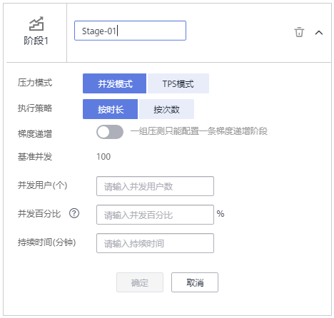

# 创建测试任务

测试任务是指基于已定义的测试模型发起一次性能测试的活动。

## 前提条件

（可选）已添加完事务。

## 操作步骤

1.  登录CPTS控制台，在左侧导航栏中选择“测试工程“。
2.  在待编辑测试工程所在行，单击“编辑测试任务”。
3.  在“测试任务“页签中，单击“添加任务”。
4.  输入测试任务名称，选择压测模式，输入基准并发，单击“确定”。
    -   压测模式：分为时长模式、次数模式和混合模式。
        -   时长模式：根据设置的时间进行压测。
        -   次数模式：根据设置的次数进行压测。
        -   混合模式：该模式下不同事务可以选择时长模式或次数模式。

    -   基准并发：自定义的基准值，供阶段设置的并发用户参考计算比例。

5.  单击展开新添加的“测试任务“，单击“添加用例”，输入用例名称和用例类型，单击“确定”。
    -   常规用例：只能添加常规事务和HTTP/HTTPS/TCP/UDP/WEBSOCKET协议的请求信息。
    -   预置用例：相当于测试任务的提前条件，当和常规用例一起使用时，首先执行预置用例，且只会执行一次，不支持循环执行。

6.  根据实际情况，选择添加请求或者事务。

    常规用例和预置用例支持同时添加请求和事务，也可以只添加其中之一。

    -   添加请求：仅在本任务需要执行的请求，无相关事务模型。添加请求的具体步骤请参考[添加请求信息（报文）](添加请求信息（报文）.md)、[添加请求信息（思考时间）](添加请求信息（思考时间）.md)、[添加请求信息（响应提取）](添加请求信息（响应提取）.md)和[添加请求信息（检查点）](添加请求信息（检查点）.md)。
    -   添加事务：已在事务库中存在事务模型。单击“添加事务”，勾选事务模型的名称，单击“确定”。

7.  请求或者事务添加后，单击“添加阶段”，参照[表1](#table75884531724)设置阶段参数。

    > **说明：**   
    >-   一个常规用例最多添加1000个阶段。  
    >-   预置用例不支持添加阶段。  

    **图 1**  添加阶段  
    

    **表 1**  添加阶段

    
    <table><thead align="left"><tr id="row158619531522"><th class="cellrowborder" valign="top" width="25%" id="mcps1.2.3.1.1">
参数

    </th>
    <th class="cellrowborder" valign="top" width="75%" id="mcps1.2.3.1.2">
参数说明

    </th>
    </tr>
    </thead>
    <tbody><tr id="row18663157193210"><td class="cellrowborder" valign="top" width="25%" headers="mcps1.2.3.1.1 ">
阶段名称

    </td>
    <td class="cellrowborder" valign="top" width="75%" headers="mcps1.2.3.1.2 ">
自定义阶段名称，用于区分不同的阶段，比如首页测试。

    </td>
    </tr>
    <tr id="row12826553111910"><td class="cellrowborder" valign="top" width="25%" headers="mcps1.2.3.1.1 ">
基准并发

    </td>
    <td class="cellrowborder" valign="top" width="75%" headers="mcps1.2.3.1.2 ">
自定义的基准值，供阶段设置的并发用户参考计算比例。

    
添加“任务”时设置，如果需要修改，单击任务名称旁的“基准并发：<em id="i9824721193811">未设置/并发数</em>”，修改基准并发数。

    </td>
    </tr>
    <tr id="row95860531729"><td class="cellrowborder" valign="top" width="25%" headers="mcps1.2.3.1.1 ">
压测模式

    </td>
    <td class="cellrowborder" valign="top" width="75%" headers="mcps1.2.3.1.2 ">
仅在任务为“混合模式”时，支持选择压测模式。“按时长”和“按次数”的压测模式不支持混合使用。

    
任务为“时长模式”或者“次数模式”时，压测模式和任务的压测模式保持一致。

    </td>
    </tr>
    <tr id="row558619531725"><td class="cellrowborder" colspan="2" valign="top" headers="mcps1.2.3.1.1 mcps1.2.3.1.2 ">
当“压测模式”为“按时长”，且“梯度递增”关闭时，需要配置以下参数：

    </td>
    </tr>
    <tr id="row45871530219"><td class="cellrowborder" valign="top" width="25%" headers="mcps1.2.3.1.1 ">
并发用户（个）

    </td>
    <td class="cellrowborder" valign="top" width="75%" headers="mcps1.2.3.1.2 ">
并发用户数指在同一时刻内，对系统进行业务操作的用户数量。

    
在云性能测试服务中为用户在定义测试任务阶段设置的虚拟用户数。

    </td>
    </tr>
    <tr id="row1178161671817"><td class="cellrowborder" valign="top" width="25%" headers="mcps1.2.3.1.1 ">
并发百分比（%）

    </td>
    <td class="cellrowborder" valign="top" width="75%" headers="mcps1.2.3.1.2 ">
并发用户数和基准并发数的比例。并发百分比=并发用户/基准并发。

    </td>
    </tr>
    <tr id="row13560132151812"><td class="cellrowborder" valign="top" width="25%" headers="mcps1.2.3.1.1 ">
持续时间（分钟）

    </td>
    <td class="cellrowborder" valign="top" width="75%" headers="mcps1.2.3.1.2 ">
本阶段压测执行的最长时间。

    </td>
    </tr>
    <tr id="row958715313215"><td class="cellrowborder" colspan="2" valign="top" headers="mcps1.2.3.1.1 mcps1.2.3.1.2 ">
当“压测模式”为“按时长”，且“梯度递增”打开时，需要配置以下参数：

    
 说明： 

一个用例只能设置一个“梯度递增”阶段。

    

    </td>
    </tr>
    <tr id="row119977991810"><td class="cellrowborder" valign="top" width="25%" headers="mcps1.2.3.1.1 ">
起始并发用户（个）

    </td>
    <td class="cellrowborder" valign="top" width="75%" headers="mcps1.2.3.1.2 ">
梯度递增的起始用户数量。

    </td>
    </tr>
    <tr id="row6195154012714"><td class="cellrowborder" valign="top" width="25%" headers="mcps1.2.3.1.1 ">
起始百分比（%）

    </td>
    <td class="cellrowborder" valign="top" width="75%" headers="mcps1.2.3.1.2 ">
起始并发用户数与基准并发数的比例。起始百分比=起始并发用户/基准并发。

    </td>
    </tr>
    <tr id="row135871553424"><td class="cellrowborder" valign="top" width="25%" headers="mcps1.2.3.1.1 ">
递增总并发用户（个）

    </td>
    <td class="cellrowborder" valign="top" width="75%" headers="mcps1.2.3.1.2 ">
并发用户数指在同一时刻内，对系统进行业务操作的用户数量。

    
在云性能测试服务中为用户在定义测试任务阶段设置的虚拟用户总数。

    </td>
    </tr>
    <tr id="row114660519296"><td class="cellrowborder" valign="top" width="25%" headers="mcps1.2.3.1.1 ">
递增百分比（%）

    </td>
    <td class="cellrowborder" valign="top" width="75%" headers="mcps1.2.3.1.2 ">
递增总并发用户数与基准并发数的比例。递增百分比=递增总并发用户/基准并发。

    </td>
    </tr>
    <tr id="row185871531429"><td class="cellrowborder" valign="top" width="25%" headers="mcps1.2.3.1.1 ">
递增量级

    </td>
    <td class="cellrowborder" valign="top" width="75%" headers="mcps1.2.3.1.2 ">
选择合适的递增量级：5%、10%、20%、50%

    </td>
    </tr>
    <tr id="row3588953129"><td class="cellrowborder" valign="top" width="25%" headers="mcps1.2.3.1.1 ">
单量持续时间（分钟）

    </td>
    <td class="cellrowborder" valign="top" width="75%" headers="mcps1.2.3.1.2 ">
本阶段单量压测执行的最长时间。

    </td>
    </tr>
    <tr id="row1659910578192"><td class="cellrowborder" colspan="2" valign="top" headers="mcps1.2.3.1.1 mcps1.2.3.1.2 ">
当“压测模式”为“按次数”时，需要配置以下参数：

    
 说明： 

一个用例只能添加一个“按次数”阶段。

    

    </td>
    </tr>
    <tr id="row1186718572221"><td class="cellrowborder" valign="top" width="25%" headers="mcps1.2.3.1.1 ">
并发用户（个）

    </td>
    <td class="cellrowborder" valign="top" width="75%" headers="mcps1.2.3.1.2 ">
并发用户数指在同一时刻内，对系统进行业务操作的用户数量。

    
在云性能测试服务中为用户在定义测试任务阶段设置的虚拟用户数。

    </td>
    </tr>
    <tr id="row210083215316"><td class="cellrowborder" valign="top" width="25%" headers="mcps1.2.3.1.1 ">
并发百分比（%）

    </td>
    <td class="cellrowborder" valign="top" width="75%" headers="mcps1.2.3.1.2 ">
并发用户数和基准并发数的比例。并发百分比=并发用户/基准并发。

    </td>
    </tr>
    <tr id="row1325180182313"><td class="cellrowborder" valign="top" width="25%" headers="mcps1.2.3.1.1 ">
发送总次数（次）

    </td>
    <td class="cellrowborder" valign="top" width="75%" headers="mcps1.2.3.1.2 ">
该事务在一次任务的运行中，将按照运行次数计算，到达设定数值，该任务下此事务的性能测试将终止。

    
 说明： 

发送总次数不小于并发用户数。

    

    </td>
    </tr>
    </tbody>
    </table>

8.  配置完成后，单击“确定“。

    用例名称旁显示总VUM和总时长。

    **图 2**  查看总VUM和总时长  
    

