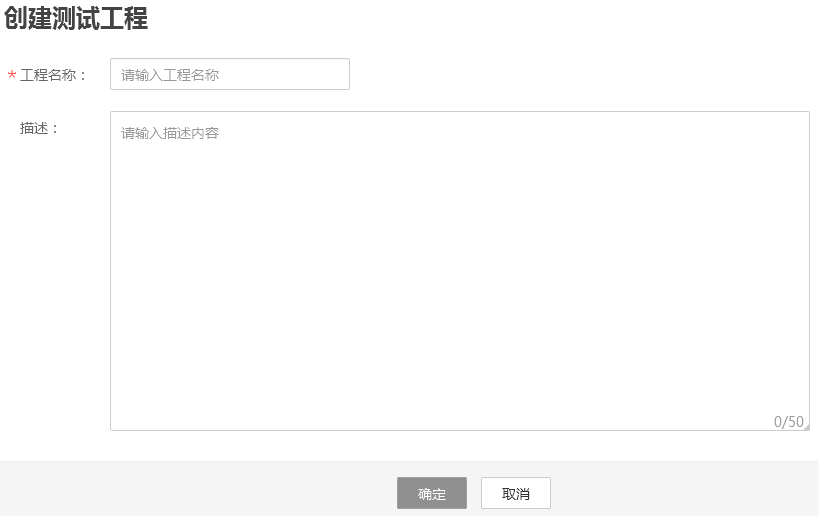

# 创建测试工程

首先，您需要创建一个测试工程。用户的测试事务、测试任务、测试报告的内容在同一个工程内共享。

## 操作步骤

1.  登录CPTS控制台。
2.  选择左侧导航栏的“测试工程“，单击“创建测试工程“。
3.  参照[表1](#table17332010143116)设置基本信息，其中带“\*”标志的参数为必填参数。

    **图 1** 创建测试工程  
    

    **表 1** 创建测试工程

    
    <table><thead align="left"><tr id="row273218105318"><th class="cellrowborder" valign="top" width="16%" id="mcps1.2.3.1.1">
参数

    </th>
    <th class="cellrowborder" valign="top" width="84%" id="mcps1.2.3.1.2">
参数说明

    </th>
    </tr>
    </thead>
    <tbody><tr id="row1873261011312"><td class="cellrowborder" valign="top" width="16%" headers="mcps1.2.3.1.1 ">
*工程名称

    </td>
    <td class="cellrowborder" valign="top" width="84%" headers="mcps1.2.3.1.2 ">
测试工程的名称。

    </td>
    </tr>
    <tr id="row4733610123112"><td class="cellrowborder" valign="top" width="16%" headers="mcps1.2.3.1.1 ">
描述

    </td>
    <td class="cellrowborder" valign="top" width="84%" headers="mcps1.2.3.1.2 ">
测试工程的相关描述。

    </td>
    </tr>
    </tbody>
    </table>

4.  单击“确定“。

    测试工程创建成功后，您可以为测试工程添加事务，具体步骤请参见[添加事务](添加事务.md)。

