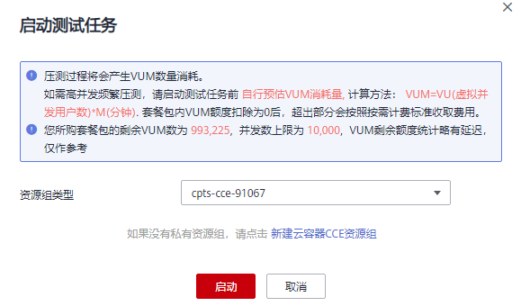

# 启动压测任务

测试任务指通过在不同压测点执行一系列测试任务，持续对系统发起压力测试，通过测试获取并分析系统运行的性能数据。

您可以在一个测试工程中添加多个测试任务。事务可以被多个测试任务复用，针对每个事务可以定义多个测试阶段，并对每个阶段分别定义持续时间和并发用户数，模拟流量波峰波谷的复杂场景。

## 前提条件

-   已添加事务。
-   确保资源组状态为“运行中”。
-   确保资源组的管理节点上的32001和62000端口在安全组被开启。
-   确保资源组的执行节点和被压测的应用之间网络互通。

## 操作步骤

1.  登录CPTS控制台。
2.  选择左侧导航栏的“测试工程“，单击待操作工程后的“编辑测试任务“。
3.  在“测试任务“页签下，单击，选择需要测试的事务，单击。
4.  选择事务后，在已选的事务下单击，可根据业务需求添加多个阶段，参照[表1](#table56691539460)设置基本信息，其中带“\*”标志的参数为必填参数。

    **图 1**  添加阶段  
    

    **表 1**  新增任务阶段

    
    <table><thead align="left"><tr id="row366712320468"><th class="cellrowborder" valign="top" width="25%" id="mcps1.2.3.1.1">
参数

    </th>
    <th class="cellrowborder" valign="top" width="75%" id="mcps1.2.3.1.2">
参数说明

    </th>
    </tr>
    </thead>
    <tbody><tr id="row185011335135217"><td class="cellrowborder" valign="top" width="25%" headers="mcps1.2.3.1.1 ">
*压测模型

    </td>
    <td class="cellrowborder" valign="top" width="75%" headers="mcps1.2.3.1.2 ">
选择压测模型：

    <ul id="ul37331413542"><li>自定义</li><li>递增模型</li></ul>
    </td>
    </tr>
    <tr id="row1244714199546"><td class="cellrowborder" colspan="2" valign="top" headers="mcps1.2.3.1.1 mcps1.2.3.1.2 ">
当压测模型配置为“自定义”时，需要配置以下参数：

    
 说明： 

一个事务可以有多个自定义阶段。

    

    </td>
    </tr>
    <tr id="row566913394613"><td class="cellrowborder" valign="top" width="25%" headers="mcps1.2.3.1.1 ">
*阶段名称

    </td>
    <td class="cellrowborder" valign="top" width="75%" headers="mcps1.2.3.1.2 ">
设置一个符合业务场景的名字，比如首页测试。

    </td>
    </tr>
    <tr id="row1866910364617"><td class="cellrowborder" valign="top" width="25%" headers="mcps1.2.3.1.1 ">
*持续时间（分钟）

    </td>
    <td class="cellrowborder" valign="top" width="75%" headers="mcps1.2.3.1.2 ">
本阶段压测执行的最长时间。

    </td>
    </tr>
    <tr id="row466912313463"><td class="cellrowborder" valign="top" width="25%" headers="mcps1.2.3.1.1 ">
*并发用户（个）

    </td>
    <td class="cellrowborder" valign="top" width="75%" headers="mcps1.2.3.1.2 ">
并发用户数指在同一时刻内，对系统进行业务操作的用户数量，在云性能测试服务中为用户在定义测试任务阶段设置的虚拟用户数。

    </td>
    </tr>
    <tr id="row9362191518562"><td class="cellrowborder" colspan="2" valign="top" headers="mcps1.2.3.1.1 mcps1.2.3.1.2 ">
当压测模型配置为“递增模型”时，需要配置以下参数：

    
 说明： 

一个事务只能有一个梯度递增阶段。

    

    </td>
    </tr>
    <tr id="row126117218568"><td class="cellrowborder" valign="top" width="25%" headers="mcps1.2.3.1.1 ">
梯度阶段名称

    </td>
    <td class="cellrowborder" valign="top" width="75%" headers="mcps1.2.3.1.2 ">
设置一个符合业务场景的名字，比如首页测试。

    </td>
    </tr>
    <tr id="row563151955614"><td class="cellrowborder" valign="top" width="25%" headers="mcps1.2.3.1.1 ">
总并发用户(个)

    </td>
    <td class="cellrowborder" valign="top" width="75%" headers="mcps1.2.3.1.2 ">
并发用户数指在同一时刻内，对系统进行业务操作的用户数量，在云性能测试服务中为用户在定义测试任务阶段设置的虚拟用户总数。

    </td>
    </tr>
    <tr id="row13134231135617"><td class="cellrowborder" valign="top" width="25%" headers="mcps1.2.3.1.1 ">
递增量级

    </td>
    <td class="cellrowborder" valign="top" width="75%" headers="mcps1.2.3.1.2 ">
选择合适的递增量级：

    
5%

    
10%

    
20%

    
50%

    </td>
    </tr>
    <tr id="row4477117125611"><td class="cellrowborder" valign="top" width="25%" headers="mcps1.2.3.1.1 ">
单量持续时间(分钟)

    </td>
    <td class="cellrowborder" valign="top" width="75%" headers="mcps1.2.3.1.2 ">
本阶段单量压测执行的最长时间。

    </td>
    </tr>
    </tbody>
    </table>

5.  单击“确定“。
6.  配置完成后，单击任务后的。
7.  在“启动测试任务”对话框下，选择“资源组”，如[\#cpts\_01\_0016/fig11469242172112](#fig11469242172112)所示。

    **图 2**  选择资源组类型  
    

    -   共享资源组：基于CCE的放置在CPTS的内置租户下的共享资源组，共享资源组不支持内网ELB。
    -   虚拟资源组：本机创建的虚拟机资源组。
    -   实例化资源组：基于CCI的实例化资源组。

8.  单击“启动”，启动测试任务。
9.  （可选）单击“查看报告”，您可以查看实时测试报告。

## 测试任务填写建议

持续时间建议至少300s，并发用户数请根据被压测应用的实际情况填写。通过多次调整压测数据进行反复测试，得到应用所能承受的最大值，进行持续优化和验证。

