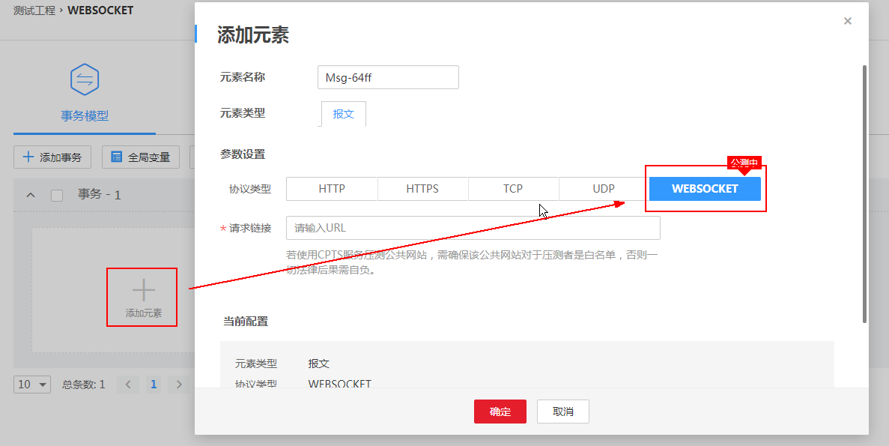
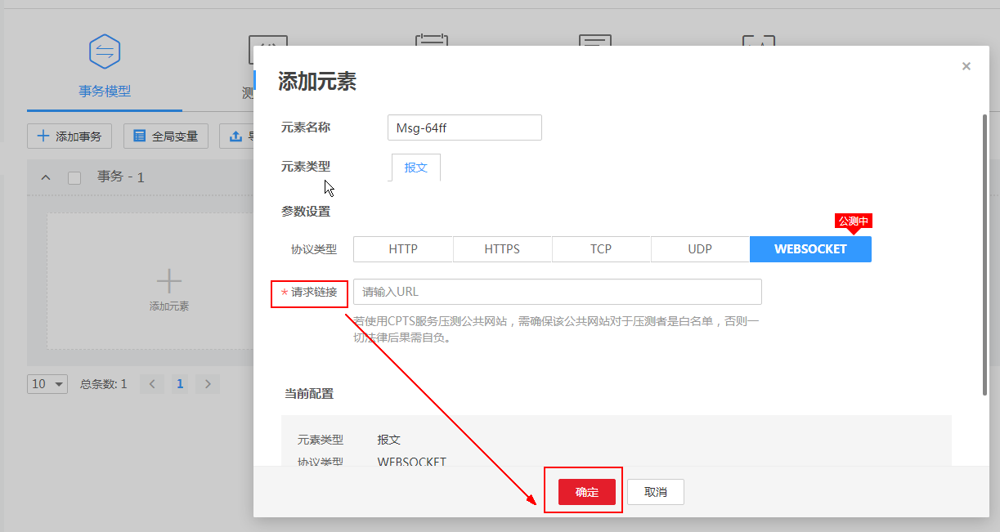
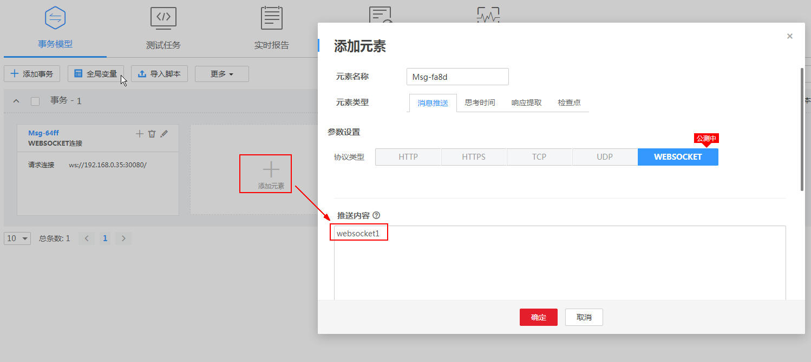
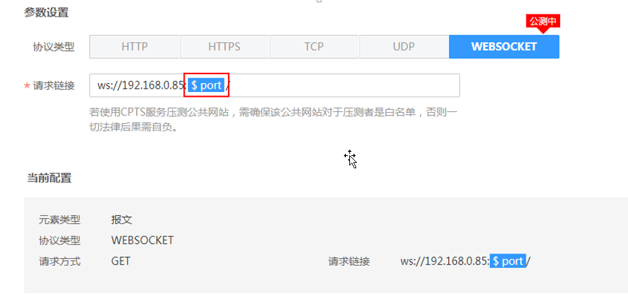
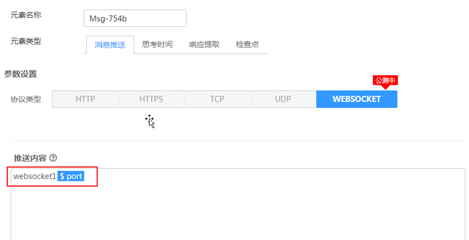
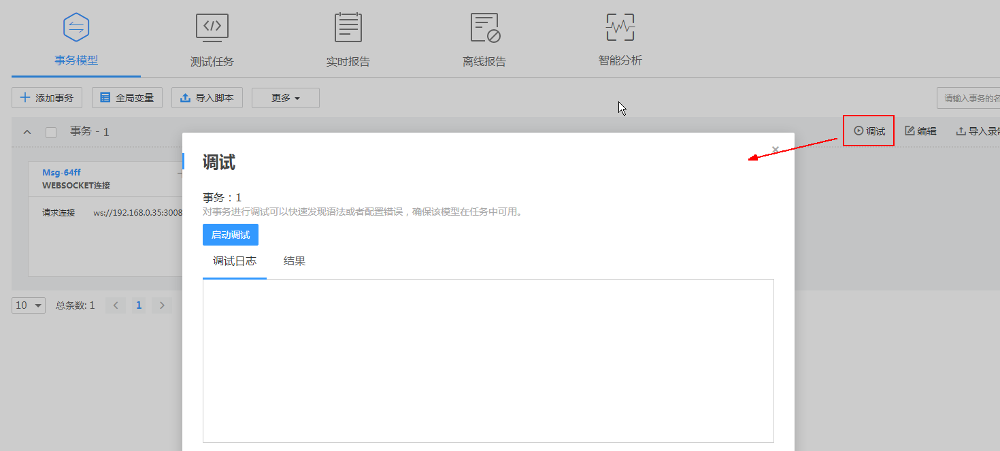
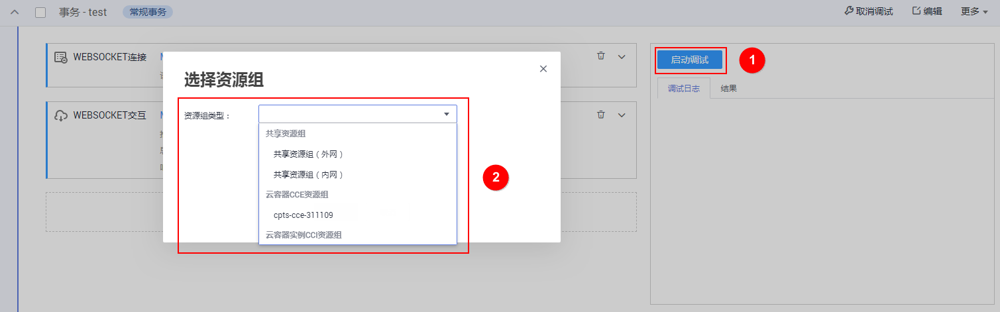
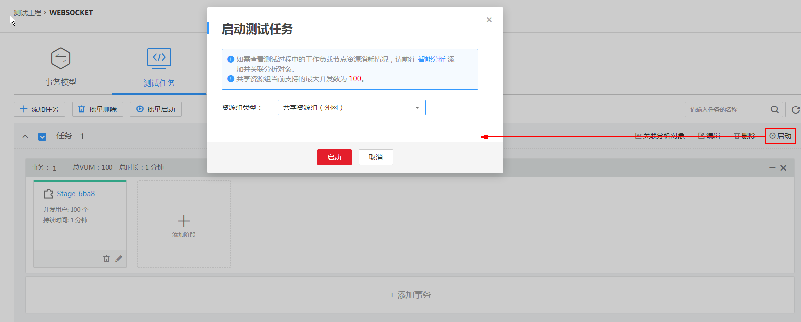
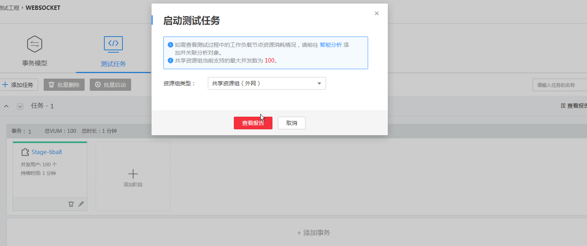
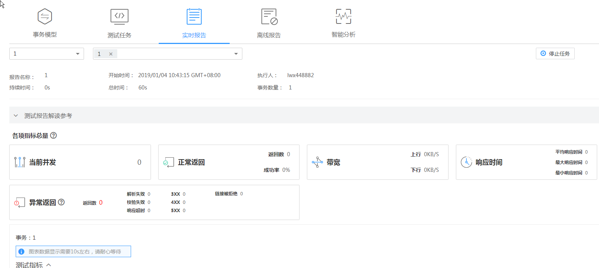

# 如何使用WEBSOCKET协议进行压测？

## 创建事务

1.  登录CPTS控制台，在左侧导航栏中选择“测试工程“，单击待编辑事务模型工程后的“编辑事务模型“。
2.  在“事务模型“页签中，单击待添加元素事务下的。
3.  在“添加元素”页面下“协议类型”选择“WEBSOCKET"。

    **图 1**  添加元素  
    

4.  输入“请求链接”，单击“确定”。

    **图 2**  输入“请求链接”  
    

5.  在“事务模型“页签中，再次点击，输入“推送内容”，单击“确定”。

    **图 3**  输入“推送内容”  
    

> **说明：**   
>WEBSOCKET协议不能与其他协议请求添加在同一事务下。  
>若需添加多条交互信息，可继续添加元素。  

## 支持添加全局变量

-   “请求链接”中添加全局变量。

    **图 4**  “请求链接”中添加全局变量  
    

-   “推送内容”中添加全局变量。

    **图 5**  “推送内容”中添加全局变量。  
    

    > **说明：**   
    >WEBSOCKET协议的交互卡片支持添加思考时间、响应提取和检查点元素。  

## 性能测试

-   支持调试

1.  在“事务模型“页签中，点击“调试”。

    **图 6**  调试  
    

2.  单击“启动调试”，选择资源组进行调试。

    **图 7** 启动调试  
    

3.  在“调试日志”页签，查看调试的操作日志。
4.  调试完成后，在“结果”页签，查看事务调试的具体内容。

-   支持任务下发

1.  在“测试任务”页签中，选择任务，单击“启动”。
2.  选择“资源组类型”，点击“启动”。

    **图 8**  启动测试任务  
    

3.  启动后点击“查看报告”。

    **图 9**  查看报告  
    

4.  查看“实时报告”。

    **图 10**  实时报告  
    

> **说明：**   
>1、WEBSOCKET暂不支持wss加密场景。  
>2、WEBSOCKET暂不支持多用户长连接复用场景（即每个用户事务请求完成后会重新建链）。  

