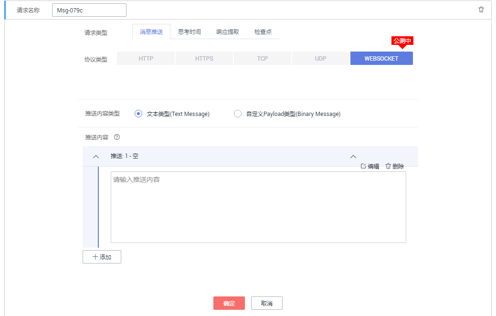
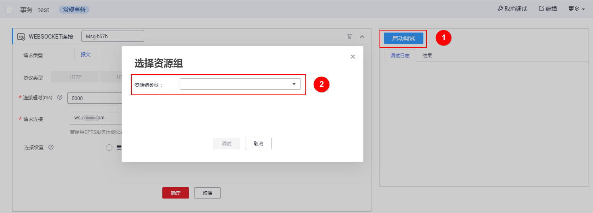

# 如何使用WebSocket协议进行压测？

## 使用限制

WebSocket协议不能与其他协议请求添加在同一事务下。

> **说明：**   
>-   WebSocket支持wss加密场景。  
>-   WebSocket支持多用户长连接复用场景（即每个用户事务请求完成后不断开连接，复用连接）。  

## 创建事务

1.  登录CPTS控制台，在左侧导航栏中选择“测试工程“，单击待编辑事务模型工程后的“编辑事务模型“。
2.  在“事务库“页签中，单击待添加请求信息事务下的“添加请求信息”。
3.  在“添加请求信息”页面下“协议类型”选择“WEBSOCKET”。
4.  设置请求信息，具体请参考[添加请求信息（报文）](添加请求信息（报文）.md)，单击“确定”。
5.  在“事务库“页签中，单击“添加请求信息”。
6.  在“消息推送”页签，选择推送内容类型，并在“推送内容”下单击“添加”，输入推送内容。思考时间、响应提取、检查点设置请参见[添加请求信息（思考时间）](添加请求信息（思考时间）.md)、[添加请求信息（响应提取）](添加请求信息（响应提取）.md)、[添加请求信息（检查点）](添加请求信息（检查点）.md)，单击“确定”。

    **图 1**  输入推送内容  
    

    > **说明：**   
    >-   “推送内容”支持插入全局变量。  
    >-   WebSocket协议的交互卡片支持添加思考时间、响应提取和检查点请求信息，且响应提取和检查点必须有一个为启用状态。  
    >-   若需添加多条交互信息，可继续添加请求信息。  

## 性能测试

**调试事务**

1.  在“事务库“页签中，单击“调试”。
2.  单击“启动调试”，选择资源组进行调试。

    **图 2**  启动调试事务  
    

3.  在“调试日志”页签，查看调试的操作日志。
4.  调试完成后，在“结果”页签，查看事务调试的具体内容。

**任务下发**

1.  在“测试任务”页签中，选择任务，单击“启动”。
2.  选择“资源组类型”，单击“启动”。
3.  启动后单击“查看报告”，可查看实时报告。

