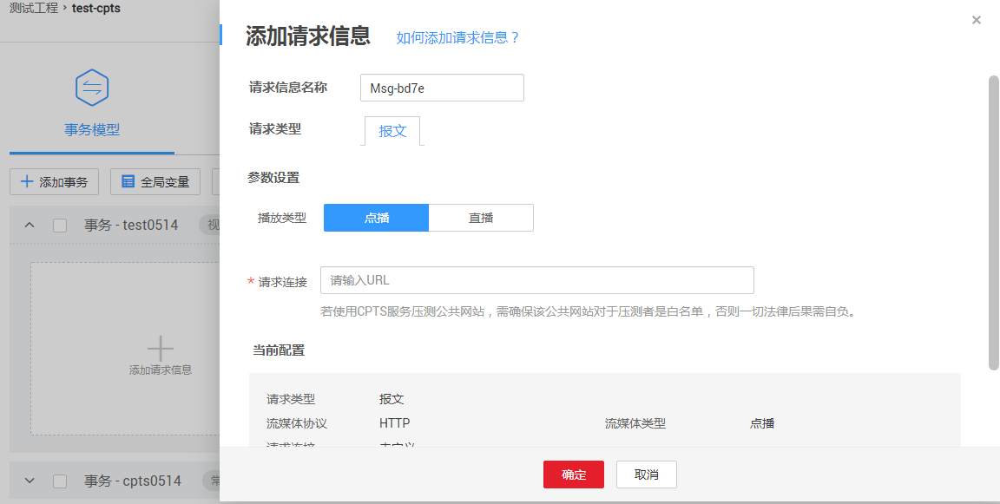
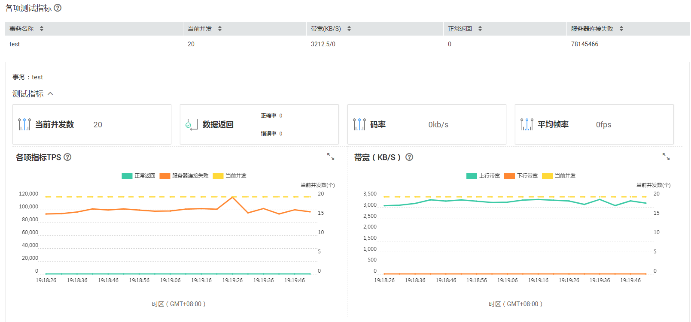

# 如何使用流媒体RTMP/HLS协议进行压测？

视频流事务是定义HLS/RTMP流媒体协议的场景，仅支持定义单张卡片。

## 使用限制

-   视频流事务不能与常规事务添加到同一测试任务下进行压测。
-   次数模式下的测试任务无法关联视频流事务。
-   若测试任务已关联视频流事务，添加阶段时无法选择“按次数”的压测模式。

## 创建事务

1.  登录CPTS控制台，在左侧导航栏中选择“测试工程“，参照[操作步骤](创建测试工程.md#section125951412153517)创建测试工程。
2.  测试工程创建完成后，单击待编辑事务模型工程后的“编辑事务模型“。
3.  在“事务库“页签中，单击“添加事务“，配置以下参数。
    -   事务名称：自定义事务名称。
    -   事务类型：选择视频流事务。

4.  单击事务下“添加请求信息”，配置以下参数。

    **图 1**  添加视频流事务的请求信息  
    

    -   请求信息名称：自定义请求信息名称。
    -   请求类型：当前仅支持报文。
    -   播放类型：
        -   点播：服务端存放多个视频文件，客户端可通过网络点播客户端任意观看其中一个视频。
        -   直播：服务端实时发送直播来源（如系统桌面、摄像头）的数据流，客户端通过支持流媒体协议的播放器实时播放同样的内容。
            -   拉流：指服务器已有直播内容，根据协议类型与服务器建立连接并接收数据，进行拉取的过程。目前仅支持拉流。
            -   推流：把采集阶段封包好的内容传输到服务器的过程。

    -   请求连接：发送请求的URL地址，暂支持RTMP和HLS两种流媒体协议。支持变量输入，详情请参见[支持插入变量](设置全局变量.md#section1869915538268)。

5.  配置完成后，单击“确定”。

    > **说明：**   
    >视频流事务支持绑定域名，详细操作请参见[绑定域名](绑定域名.md)。  

## 添加测试任务

1.  参照[创建测试任务](创建测试任务.md)。
2.  任务创建完成后，单击“启动“按钮开始压测任务，详情请参照[启动压测任务](启动压测任务.md)。
3.  查看测试报告。

## 测试报告说明

测试报告由测试指标、各项指标TPS、带宽（KB/S）构成，以“点播”为例，说明如下：

**图 2**  测试报告  

-   测试指标
    -   当前并发数：当前并发操作的虚拟用户数。
    -   数据返回
        -   正确率：正确的数据包占总传输数据包的百分比。
        -   错误率：错误的数据包占总传输数据包的百分比。

    -   码率：视频文件在单位时间内使用的实时数据流量。
    -   平均帧率：平均每秒显示的帧数。

-   各项指标TPS

    -   正常返回：默认为返回2XX的事务响应数。
    -   服务器连接失败：与服务器连接失败或解析码流失败。
    -   码率：视频文件在单位时间内使用的实时数据流量。

    > **说明：**   
    >当播放类型为“点播”时，各项指标TPS展示为“正常返回”和“服务器连接失败”。  
    >当播放类型为“直播”时，各项指标TPS展示为“码率”。  

-   带宽：记录压测任务运行所消耗的实时带宽变化。
    -   上行带宽：从CPTS测试执行机往外发送出去数据的速度。
    -   下行带宽：CPTS测试执行机接收到数据的速度。

