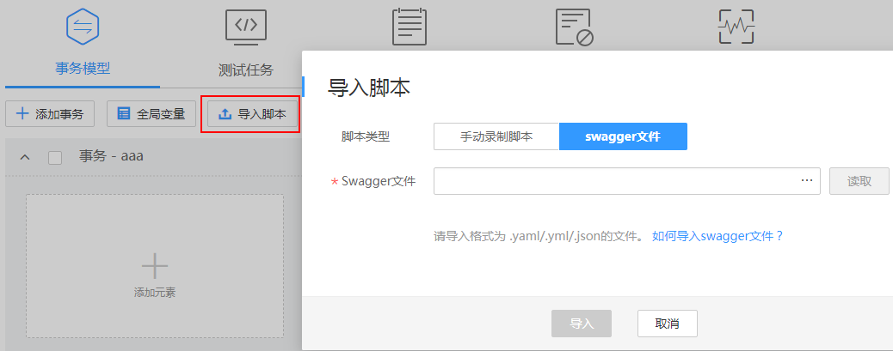

# 导入Swagger文件

1.  登录CPTS控制台，在左侧导航栏中选择“测试工程“，单击待编辑事务模型工程后的“编辑事务模型“。
2.  在“事务模型“页签中，单击“导入脚本”。脚本类型选择“swagger文件”。

    **图 1**  导入 Swagger文件  
    

3.  在弹出的窗口中单击，选择要上传的Swagger文件。

    > **说明：**   
    >仅支持 yaml、yml和json格式的Swagger文件。  

4.  设置完成后，单击“导入”。

