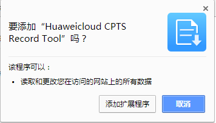
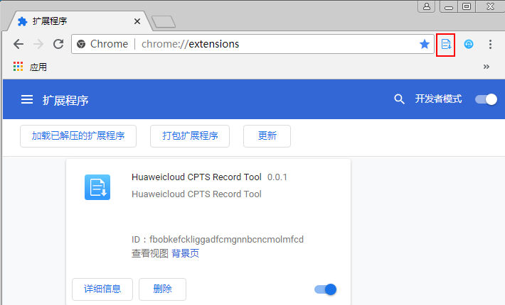
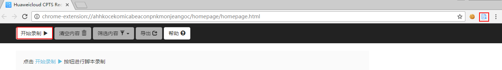
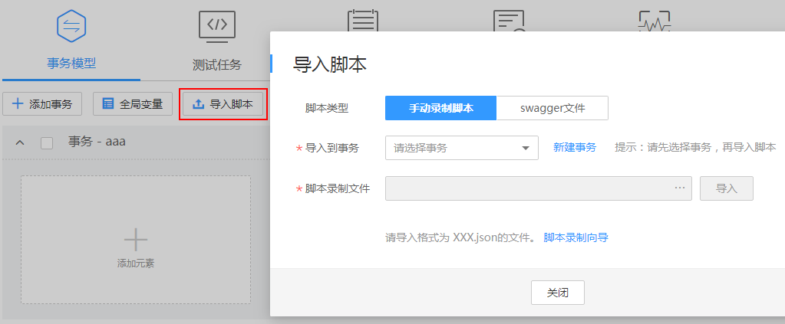
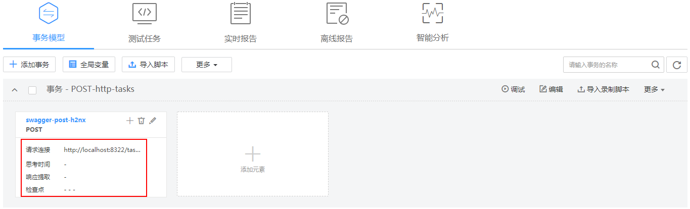

# 导入录制脚本

在性能测试中虚拟用户模拟真实用户使用被测系统，这个“模拟”的过程可通过录制脚本来实现，例如，电商应用中的“登录、商品搜索、购买“等操作。CPTS支持使用基于Chrome浏览器（支持26及以上版本）插件的录制工具，在被压测系统中进行手工操作，捕获请求内容，生成json文件。录制下来的脚本模拟了用户真实的操作行为，减少手工编写报文的工作量，方便用户使用CPTS系统。

## 下载并安装谷歌录制插件

> **说明：**   
>云性能测试录制工具需要Chrome26及以上版本。  

1.  下载Chrome录制工具插件：[下载链接](https://cpts-record-tool.obs.cn-north-1.myhwclouds.com/Huaweicloud-CPTS-Record-Tool_v0.0.1.crx)。
2.  URL框内输入chrome://extensions/，进入扩展程序安装页面。

    **图 1**  扩展程序  
    

3.  将下载文件拖动至Chrome浏览器窗口，浏览器弹出确认新增扩展程序框，单击“添加扩展程序”安装。

    **图 2** 添加扩展程序  
    

    > **说明：**   
    >安装插件时，需要打开开发者模式。打开开发者模式后，建议重新打开Chrome浏览器。  

4.  安装完成后浏览器右上角会出现云性能测试录制工具图标。

    **图 3**  云性能测试录制工具  
    

## 录制脚本

使用CPTS录制工具录制脚本。

**图 4**  录制脚本  

1.  打开Chrome浏览器，单击浏览器右上角的云性能测试录制工具图标，弹出录制框。

    **图 5**  开始录制  
    

2.  单击“开始录制”。
3.  在浏览器新标签页，输入待要压测的 URL 进行访问操作，录制工具会自动记录访问操作过程中的 HTTP 请求。
4.  录制完成后，请切换到录制工具页签，单击“暂停录制”。
5.  录制工具默认显示所有类型的请求。可根据业务需求，单击“筛选内容”复选框选择需求展示的请求类型。
    -   other：其他
    -   script：脚本
    -   xmlhttprequest：XMLHttp请求
    -   main\_frame：主框架
    -   stylesheet：样式表
    -   image：图像
    -   font：字体文件
    -   ping：Ping测试

6.  选中某个请求，可在页面右侧详情展示该请求的内容。

    **图 6**  选择请求  
    

    > **说明：**   
    >如果录制的内容不是您需要的或需要录制新的请求，执行以下步骤重新录制。  
    >1.  单击“清空内容”清空原先录制的请求内容。  
    >2.  单击“开始录制”。  
    >3.  在浏览器待录制的页签中进行操作，重新录制。  

7.  单击“导出”，复选框选择需要导出的请求，单击“确认导出”，弹出“导出内容”对话框。单击“生成json文件”，保存文件到本地。

    **图 7**  生成json文件  
    

    > **说明：**   
    >可根据被压测系统的业务规则在**导出内容**弹框中修改请求内容，或在生成的json文件中修改请求内容，但是需保证修改的内容正确，否则，导入脚本时将会出现错误。  

8.  关闭录制工具所在的页签，即可关闭录制工具。

## 导入录制的脚本

1.  登录CPTS控制台。
2.  选择左侧导航栏的“测试工程“，单击待编辑事务模型工程后的“编辑事务模型“。
3.  在“事务模型“页签下，单击待添加事务后的“导入脚本 \> 手动录制脚本”。

    **图 8**  导入脚本  
    

    > **说明：**   
    >导入录制脚本的内容为一个或多个报文元素，根据被压测业务，和思考时间、响应提取、检查点灵活组合，在合适的位置导入录制的脚本。  

4.  在弹出的窗口中单击，选择要上传的脚本文件。

    **图 9**  脚本录制导入  
    

    > **说明：**   
    >如果需要重新上传脚本，可将鼠标移至，待图标变为，单击，重新上传脚本文件。  

5.  单击“导入”，提示“脚本录制文件导入成功”表示脚本导入成功。
6.  在事务下，查看到导入成功的报文。

    **图 10**  查看导入的报文  
    

    > **说明：**   
    >导入成功的报文个数和上传的脚本文件中请求个数一致。  

7.  （可选）您可以根据业务需要，单击，参照[添加元素（报文）](添加元素（报文）.md)修改已导入的脚本。

