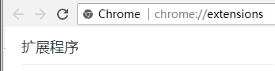
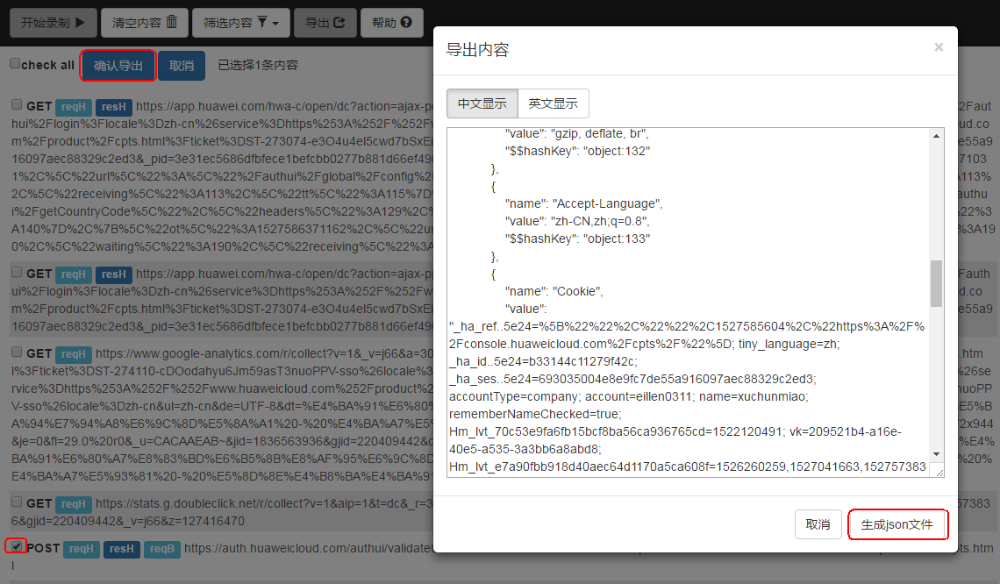
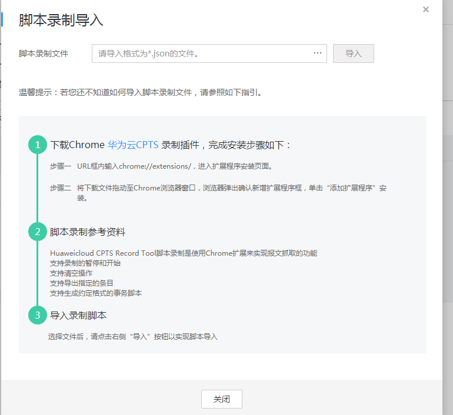

# 导入录制脚本

在性能测试中虚拟用户模拟真实用户使用被测系统，这个“模拟”的过程可通过录制脚本来实现，例如，电商应用中的“登录、商品搜索、购买“等操作。CPTS支持使用基于Chrome浏览器（支持26及以上版本）插件的录制工具，在被压测系统中进行手工操作，捕获请求内容，生成json文件。录制下来的脚本模拟了用户真实的操作行为，减少手工编写报文的工作量，方便用户使用CPTS系统。

## 使用限制

云性能测试录制工具需要使用版本为26及以上的Chrome浏览器。

> **说明：**   
>单击浏览器右上角，选择“帮助 \> 关于chrome”即可查看当前浏览器版本。  

## 下载并安装谷歌录制插件

1.  下载Chrome录制工具插件：[下载链接](https://cpts-record-tool.obs.cn-north-1.myhwclouds.com/Huaweicloud-CPTS-Record-Tool_v0.0.1.crx)。

    > **须知：**   
    >使用版本为73及以上的Chrome浏览器安装第三方扩展程序时可能会出现程序包无效：“CRX\_HEADER\_INVALID”错误，如下图所示，  
    >**图 1**  “CRX\_HEADER\_INVALID”错误    
    >  
    >此时请进行以下操作：  
    >1.  右击下载链接将插件安装包另存，将插件安装包的后缀名由.crx改为.rar或.zip。  
    >2.  使用解压工具对安装包进行解压。  
    >3.  打开浏览器的扩展程序，开启开发者模式，单击“加载已解压的扩展程序”，加载[2](#li5289123732519)中解压得到的文件夹，即可完成安装。  

2.  URL框内输入chrome://extensions/，进入扩展程序安装页面。

    **图 2**  扩展程序  
    

3.  将下载文件拖动至Chrome浏览器窗口，浏览器弹出确认新增扩展程序框，单击“添加扩展程序”安装。

    > **说明：**   
    >安装插件时，需要打开开发者模式。打开开发者模式后，建议重新打开Chrome浏览器。  

4.  安装完成后浏览器右上角会出现云性能测试录制工具图标。

## 录制脚本

使用CPTS录制工具录制脚本。

**图 3**  录制脚本  

1.  打开Chrome浏览器，单击浏览器右上角的云性能测试录制工具图标，弹出录制框。
2.  单击“开始录制”。
3.  在浏览器新标签页，输入待要压测的URL进行访问操作，录制工具会自动记录访问操作过程中的HTTP请求。
4.  录制完成后，请切换到录制工具页签，单击“暂停录制”。
5.  录制工具默认显示所有类型的请求。可根据业务需求，单击“筛选内容”复选框选择需求展示的请求类型。
    -   other：其他
    -   script：脚本
    -   xmlhttprequest：XMLHttp请求
    -   main\_frame：主框架
    -   stylesheet：样式表
    -   image：图像
    -   font：字体文件
    -   ping：Ping测试

6.  选中某个请求，可在页面右侧详情展示该请求的内容。

    **图 4**  选择请求  
    

    > **说明：**   
    >如果录制的内容不是您需要的或需要录制新的请求，执行以下步骤重新录制。  
    >1.  单击“清空内容”清空原先录制的请求内容。  
    >2.  单击“开始录制”。  
    >3.  在浏览器待录制的页签中进行操作，重新录制。  

7.  单击“导出”，复选框选择需要导出的请求，单击“确认导出”，弹出“导出内容”对话框。单击“生成json文件”，保存文件到本地。

    **图 5**  生成json文件  
    

    > **说明：**   
    >插件录制的脚本，body体类型暂不支持payload格式。  

8.  关闭录制工具所在的页签，即可关闭录制工具。

## 导入录制的脚本

1.  登录CPTS控制台，在左侧导航栏中选择“测试工程“，单击待编辑事务模型工程后的“编辑事务模型“。
2.  **方法一**：

    在“事务库“页签中，单击“导入脚本”。脚本类型选择“手动录制脚本”。选择事务和脚本录制文件。

    > **说明：**   
    >录制脚本的内容为一个或多个报文请求信息，可以导入到对应的事务模型中。  

    **方法二**：

    在事务名称右侧单击“更多 \> 导入录制脚本”，选择要上传的脚本文件。

    **图 6**  脚本录制导入  
    

    > **说明：**   
    >如果需要重新上传脚本，可将鼠标移至，待图标变为，单击，重新上传脚本文件。  

3.  单击“导入”，提示“脚本录制文件导入成功”表示脚本导入成功。
4.  在事务下，查看到导入成功的报文。

    > **说明：**   
    >导入成功的报文个数和上传的脚本文件中请求个数一致。  

5.  （可选）您可以根据业务需要，单击，参照[添加请求信息（思考时间）](添加请求信息（思考时间）.md)修改已导入的脚本。

