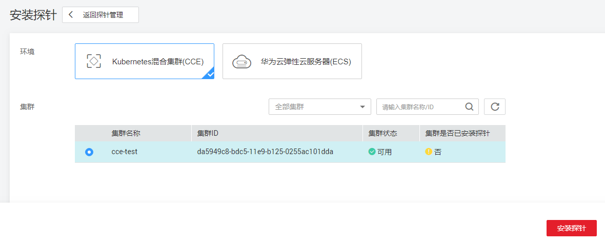
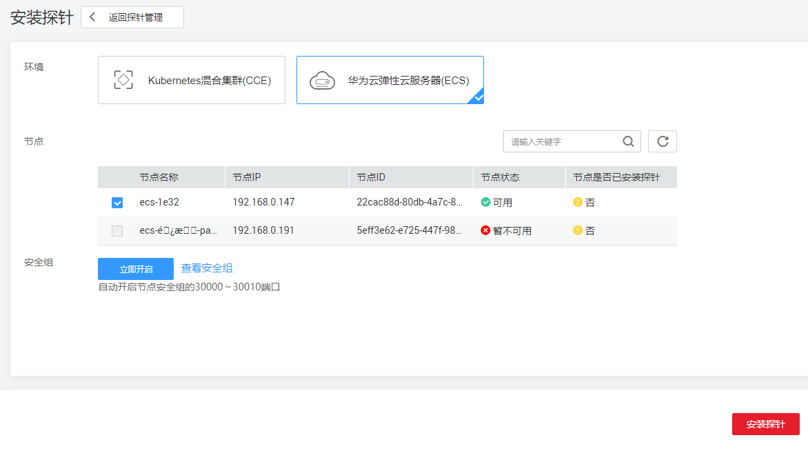
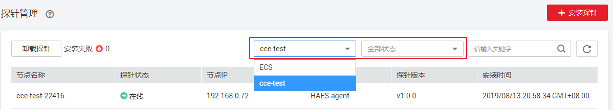
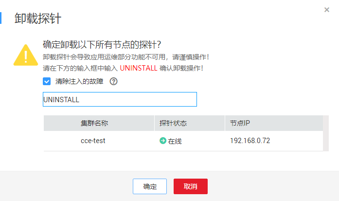

# 探针管理

## 探针概述

探针是混沌工程用来进行故障注入、系统资源使用情况监控的载体，探针需要安装在混合集群或弹性云服务器上。如果您要使用混沌工程的故障注入能力来对您的服务进行可靠性评估，需要您先在节点安装探针。

通过探针您可以：

-   对服务实例进行故障注入来模拟服务故障。
-   收集服务实例的系统资源信息（CPU、内存、网络、磁盘IO），用来检查故障对系统的影响。

## 前提条件

-   已在云容器引擎中创建混合集群，集群的状态为可用，且集群下存在可用节点。如未创建，可根据弹框提示跳转到云容器引擎创建，创建方法请参见[创建混合集群](https://support.huaweicloud.com/usermanual-cce/cce_01_0028.html)。

    > **说明：**   
    >集群安装探针时会将集群下所有节点安装探针，新增节点或不可用节点恢复后会自动安装探针。  

-   已创建弹性云服务器（ECS），且ECS状态为可用。如未创建，可根据弹框提示跳转到弹性云服务器创建，创建方法请参见[购买弹性云服务器](https://support.huaweicloud.com/usermanual-ecs/zh-cn_topic_0176394304.html)。

## 安装探针

1.  登录CPTS控制台，在左侧导航栏中选择“混沌工程“。
2.  在新打开的混沌工程控制台中，单击“探针管理\>安装探针“，在安装探针页面中选择环境类型，目前支持对“Kubernetes混合集群\(CCE\)“和“华为云弹性云服务器\(ECS\)“做故障注入。

    **Kubernetes混合集群\(CCE\)：**

    集群：选择待安装探针的集群。

    **图 1**  选择集群  
    

    **华为云弹性云服务器\(ECS\)：**

    -   节点：选择待安装探针的节点。
    -   安全组：默认选择“立即开启“，将自动开启节点安全组的30000～30010端口。

    **图 2**  选择节点  
    

3.  配置完成，单击“安装探针”。
4.  返回探针管理页面，选择探针列表上方的类型和状态，可以查看已安装的探针。

    **图 3**  查看已安装的探针  
    

## 卸载探针

如果不需要使用该探针，可以在“探针管理“页面卸载探针，步骤如下：

1.  登录混沌工程控制台，单击“探针管理”，选择探针列表上方的类型和状态。
2.  选择待卸载探针的节点，单击“卸载探针“，在弹出的卸载探针页面中确认卸载信息，并在输入框中输入**UNINSTALL**确认卸载操作。

    > **须知：**   
    >-   此操作会卸载集群下所有节点的探针，请谨慎操作，如果测评报告比较重要，建议将报告下载到本地。  
    >-   卸载探针会导致应用运维部分功能不可用，请谨慎操作。  

    **图 4**  卸载探针  
    

3.  单击“确定“，完成卸载。

