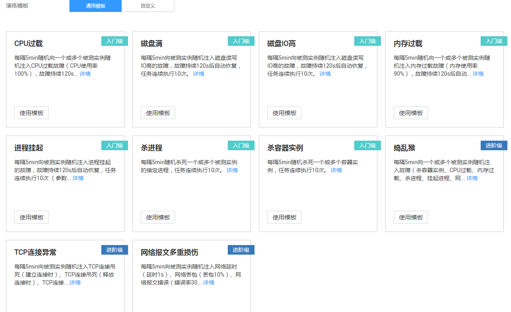
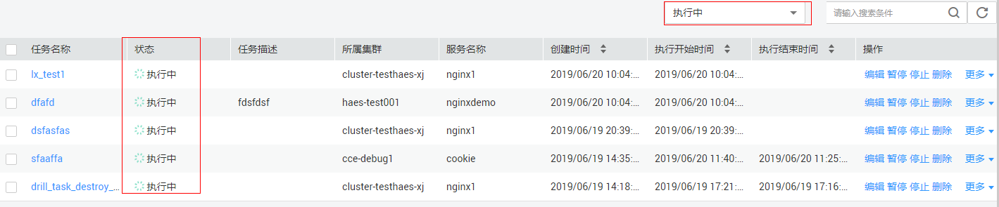
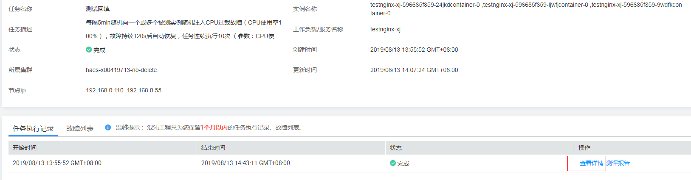
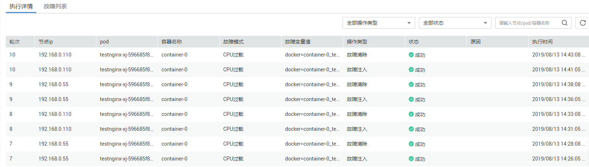

# 故障演练

故障演练旨在通过对业务进行多轮次服务级的随机故障注入以及检查故障注入后对业务的影响，方便用户对业务的可靠性、稳定性做出快速评估。

## 创建演练任务

**前提条件**

服务已经在Kubernetse集群部署，并且服务可以正常访问。

> **须知：**   
>故障演练开始后可能会导致服务不可用，请在故障演练开始前确认服务是否有用户在使用。  

**操作步骤**

1.  登录华为云控制台。
2.  在服务列表中，选择“应用服务\>云性能测试服务 CPTS”。
3.  单击左侧导航栏中的“混沌工程”，在新打开的混沌工程控制台中，单击左侧导航中的“故障演练“。
4.  单击故障演练列表页右上角的“创建演练任务”进入创建演练任务页面，在“通用模板“页签中选择模板。

    **图 1**  通用模板  
    

5.  单击模板下方的“使用模板“，进入“创建演练任务”页面，参照[表1](#table8638121213265)设置服务选型参数，其中带“\*”的参数为必填参数。

    **表 1**  创建演练任务参数配置

    
    <table><thead align="left"><tr id="row10638181262612"><th class="cellrowborder" valign="top" width="20.02%" id="mcps1.2.3.1.1">
参数

    </th>
    <th class="cellrowborder" valign="top" width="79.97999999999999%" id="mcps1.2.3.1.2">
参数说明

    </th>
    </tr>
    </thead>
    <tbody><tr id="row2364184416228"><td class="cellrowborder" colspan="2" valign="top" headers="mcps1.2.3.1.1 mcps1.2.3.1.2 ">
<strong id="b143271182310">基本信息</strong>

    </td>
    </tr>
    <tr id="row1922964644615"><td class="cellrowborder" valign="top" width="20.02%" headers="mcps1.2.3.1.1 ">
* 演练模板

    </td>
    <td class="cellrowborder" valign="top" width="79.97999999999999%" headers="mcps1.2.3.1.2 ">
当前使用的演练模板，单击“选择其他模板”进行更换。

    </td>
    </tr>
    <tr id="row42961494311"><td class="cellrowborder" valign="top" width="20.02%" headers="mcps1.2.3.1.1 ">
* 任务名称

    </td>
    <td class="cellrowborder" valign="top" width="79.97999999999999%" headers="mcps1.2.3.1.2 ">
新建演练任务的名称。

    
建议您按照一定的命名规则修改任务名称。当创建的任务多达数十个、上百个时，按照一定的规则填写任务名称，能帮助您更方便地识别和检索任务。

    </td>
    </tr>
    <tr id="row12321131519262"><td class="cellrowborder" valign="top" width="20.02%" headers="mcps1.2.3.1.1 ">
任务描述

    </td>
    <td class="cellrowborder" valign="top" width="79.97999999999999%" headers="mcps1.2.3.1.2 ">
当前演练任务的描述信息，建议按照任务的实际用途补充任务描述，方便区分不同任务。

    </td>
    </tr>
    <tr id="row1063812126263"><td class="cellrowborder" colspan="2" valign="top" headers="mcps1.2.3.1.1 mcps1.2.3.1.2 ">
<strong id="b1068064342911">对象策略</strong>

    </td>
    </tr>
    <tr id="row6649879161231"><td class="cellrowborder" valign="top" width="20.02%" headers="mcps1.2.3.1.1 ">
* 集群

    </td>
    <td class="cellrowborder" valign="top" width="79.97999999999999%" headers="mcps1.2.3.1.2 ">
选择被测实例所在的集群。

    </td>
    </tr>
    <tr id="row572593234714"><td class="cellrowborder" valign="top" width="20.02%" headers="mcps1.2.3.1.1 ">
* 命名空间

    </td>
    <td class="cellrowborder" valign="top" width="79.97999999999999%" headers="mcps1.2.3.1.2 ">
选择被测实例所属的命名空间。

    </td>
    </tr>
    <tr id="row680585841419"><td class="cellrowborder" valign="top" width="20.02%" headers="mcps1.2.3.1.1 ">
* 故障注入维度

    </td>
    <td class="cellrowborder" valign="top" width="79.97999999999999%" headers="mcps1.2.3.1.2 "><ul id="ul47924509324"><li>工作负载：选择被测实例所绑定的工作负载。</li><li>服务：选择被测实例所绑定的服务。</li></ul>
    </td>
    </tr>
    <tr id="row15639412132615"><td class="cellrowborder" valign="top" width="20.02%" headers="mcps1.2.3.1.1 ">
* 实例

    </td>
    <td class="cellrowborder" valign="top" width="79.97999999999999%" headers="mcps1.2.3.1.2 ">
选择被测实例。

    </td>
    </tr>
    <tr id="row482955911270"><td class="cellrowborder" valign="top" width="20.02%" headers="mcps1.2.3.1.1 ">
* 对象覆盖策略

    </td>
    <td class="cellrowborder" valign="top" width="79.97999999999999%" headers="mcps1.2.3.1.2 "><ul id="ul1518813516361"><li>单实例故障：是指每一轮次在用户选择的实例中随机选择一个实例进行故障注入。</li><li>多实例故障：是指每一轮次在用户选择的实例中随机选择用户配置的故障实例数同时进行故障注入。
例如：用户选择2个实例，调度策略为多实例故障，故障实例数为1，则每次随机选择1个实例进行故障。

    </li></ul>
    
 须知： 

如果选择故障实例数的比例/服务实例数&gt;50%可能导致服务不可用。

    

    </td>
    </tr>
    <tr id="row64648564171234"><td class="cellrowborder" colspan="2" valign="top" headers="mcps1.2.3.1.1 mcps1.2.3.1.2 ">
<strong id="b10373131412434">故障策略</strong>：进行故障设置，选择故障类型，并选择/填写故障变量值。

    
通用模板中故障是预置的（如捣乱猴注入杀容器实例、CPU过载、内存过载、杀进程、挂起进程、网络报文延迟、网络报文丢失、磁盘满等多个故障，网络亚健康注入网络延时和网络丢包故障）。

    
自定义模板中故障由用户选择，用户可同时选择多个故障进行演练，演练执行时每一轮次随机注入一个故障

    </td>
    </tr>
    <tr id="row6775143217241"><td class="cellrowborder" valign="top" width="20.02%" headers="mcps1.2.3.1.1 ">
* 故障取值

    </td>
    <td class="cellrowborder" valign="top" width="79.97999999999999%" headers="mcps1.2.3.1.2 ">
填写故障变量值。

    </td>
    </tr>
    <tr id="row773511171567"><td class="cellrowborder" valign="top" width="20.02%" headers="mcps1.2.3.1.1 ">
* 故障清除方式

    </td>
    <td class="cellrowborder" valign="top" width="79.97999999999999%" headers="mcps1.2.3.1.2 "><ul id="ul585912685411"><li>自动清除：是指故障注入后将会在指定的时间内，由系统自动清除故障。
故障持续时长：取值范围1-3600秒。若选择了执行方式为“自动清除”则需配置故障持续时长，系统将会在配置的时间内自动清除故障。

    </li><li>手动清除：故障注入后，故障会一直存在，需要在故障列表执行“清除故障”，才可以将故障清除。
进行多轮次演练任务时若不清除故障则可能导致后续演练任务执行失败。

    </li></ul>
    </td>
    </tr>
    <tr id="row1610917221609"><td class="cellrowborder" colspan="2" valign="top" headers="mcps1.2.3.1.1 mcps1.2.3.1.2 ">
<strong id="b380572275812">调度策略</strong>

    </td>
    </tr>
    <tr id="row463941216264"><td class="cellrowborder" valign="top" width="20.02%" headers="mcps1.2.3.1.1 ">
* 调度周期

    </td>
    <td class="cellrowborder" valign="top" width="79.97999999999999%" headers="mcps1.2.3.1.2 ">
任务调度的时间周期，例如“分钟”。

    </td>
    </tr>
    <tr id="row96582533813"><td class="cellrowborder" valign="top" width="20.02%" headers="mcps1.2.3.1.1 ">
* 开始执行时间

    </td>
    <td class="cellrowborder" valign="top" width="79.97999999999999%" headers="mcps1.2.3.1.2 ">
任务的开始执行时间。默认为立即执行（任务创建完成后便开始执行任务），您可以自行调整。

    </td>
    </tr>
    <tr id="row1352595610592"><td class="cellrowborder" valign="top" width="20.02%" headers="mcps1.2.3.1.1 ">
* 任务执行次数

    </td>
    <td class="cellrowborder" valign="top" width="79.97999999999999%" headers="mcps1.2.3.1.2 ">
任务执行的次数，每执行一次任务从所选择的故障模式和故障实例数中选择指定故障实例数的实例，对齐进行一个随机故障注入。

    </td>
    </tr>
    <tr id="row28744189314"><td class="cellrowborder" colspan="2" valign="top" headers="mcps1.2.3.1.1 mcps1.2.3.1.2 ">
<strong id="b0588836042">结果检查策略</strong>

    
 须知： 

如果不配置结果检查策略，则在故障演练报告中相应的检查数据为空，无法自动评估服务的可靠性。

    

    </td>
    </tr>
    <tr id="row1177413152038"><td class="cellrowborder" valign="top" width="20.02%" headers="mcps1.2.3.1.1 ">
服务监控告警（建议）

    </td>
    <td class="cellrowborder" valign="top" width="79.97999999999999%" headers="mcps1.2.3.1.2 ">
点击“设置”跳转到AOM设置服务的阈值告警。您可以在应用运维管理的“告警中心 &gt; 阈值规则”页面自定义服务阈值规则，通过阈值规则可对测试服务资源的指标设置阈值条件，当指标数据满足阈值条件时，会产生阈值告警，辅助对测试过程进行监控。

    </td>
    </tr>
    <tr id="row76532194177"><td class="cellrowborder" valign="top" width="20.02%" headers="mcps1.2.3.1.1 ">
CPTS测试任务

    </td>
    <td class="cellrowborder" valign="top" width="79.97999999999999%" headers="mcps1.2.3.1.2 ">
通过选择CPTS测试任务，在进行故障注入的同时，进行业务性能压测，辅助可靠性测试。

    </td>
    </tr>
    </tbody>
    </table>

6.  单击“确定”则任务创建完成，您可单击“返回故障演练页面”返回到故障演练列表查看任务的详细执行情况。

## 查询演练任务

您可以根据查询条件，查找演练任务。

**操作步骤**

1.  登录华为云控制台。
2.  在服务列表中，选择“应用服务\>云性能测试服务 CPTS”。
3.  单击左侧导航栏中的“混沌工程”，在新打开的混沌工程控制台中，单击左侧导航中的“故障演练“。
4.  在故障演练列表页右上角的搜索框中输入查询条件。

    > **说明：**   
    >支持的查询条件有：任务名称。  
    >例如，搜索名称为“drill\_task\_destroy\_round100”的任务。  

5.  单击即可获取查询结果。

## 管理演练任务

**编辑任务**

1.  登录华为云控制台。
2.  在服务列表中，选择“应用服务\>云性能测试服务 CPTS”。
3.  单击左侧导航栏中的“混沌工程”，在新打开的混沌工程控制台中，单击左侧导航中的“故障演练“。
4.  在故障演练列表中对应任务的“操作”列，单击“编辑”。
5.  修改任务信息。详情请参见[创建演练任务](#section51326503220)。

> **须知：**   
>-   使用通用模板的任务无法通过编辑转换为自定义模板的任务。  
>-   状态为“执行中”的任务编辑时信息不会立即生效，需等到再一次重新启动任务时才按照新的配置执行任务。  

**删除任务**

1.  登录华为云控制台。
2.  在服务列表中，选择“应用服务\>云性能测试服务 CPTS”。
3.  单击左侧导航栏中的“混沌工程”，在新打开的混沌工程控制台中，单击左侧导航中的“故障演练“。
4.  在故障演练列表中对应任务的“操作”列，单击“删除”。
5.  按照界面提示完成删除操作。

**停止调度任务**

1.  登录华为云控制台。
2.  在服务列表中，选择“应用服务\>云性能测试服务 CPTS”。
3.  单击左侧导航栏中的“混沌工程”，在新打开的混沌工程控制台中，单击左侧导航中的“故障演练“。
4.  按任务运行状态搜索任务，在状态选择框点击下拉按钮，选择“执行中”，如[图2](#fig396754626)。

    **图 2**  运行状态搜索  
    

5.  在对应任务的“操作”列，单击“停止”。

**启动调度任务**

1.  登录华为云控制台。
2.  在服务列表中，选择“应用服务\>云性能测试服务 CPTS”。
3.  单击左侧导航栏中的“混沌工程”，在新打开的混沌工程控制台中，单击左侧导航中的“故障演练“。
4.  按任务运行状态搜索任务，在状态选择框点击下拉按钮，选择“停止”。
5.  在对应任务的“操作”列，单击“启动”。

**查询任务详情**

1.  登录华为云控制台。
2.  在服务列表中，选择“应用服务\>云性能测试服务 CPTS”。
3.  单击左侧导航栏中的“混沌工程”，在新打开的混沌工程控制台中，单击左侧导航中的“故障演练“。
4.  在故障演练列表中单击对应任务的任务名称，进入任务详情页面。

****

**查询任务执行详情**

1.  登录华为云控制台。
2.  在服务列表中，选择“应用服务\>云性能测试服务 CPTS”。
3.  单击左侧导航栏中的“混沌工程”，在新打开的混沌工程控制台中，单击左侧导航中的“故障演练“。
4.  在故障演练列表中单击对应任务的任务名称，进入任务详情页面。
5.  在任务执行列表，在对应任务执行记录的“操作”列，单击“查看详情”，进入“执行记录详情”页面。

    **图 3**  选择查看详情  
    

    **图 4**  执行详情  
    

## 查看演练报告

1.  登录华为云控制台。
2.  在服务列表中，选择“应用服务\>云性能测试服务 CPTS”。
3.  单击左侧导航栏中的“混沌工程”，在新打开的混沌工程控制台中，单击左侧导航中的“故障演练“。
4.  在故障演练列表中单击对应任务的任务名称，进入任务详情页面。
5.  在任务执行列表，在对应任务执行记录的“操作”列，单击“查看报告”。

    **图 5**  查看报告  
    

> **须知：**   
>演练报告和执行记录的保存时间为30天，过期后系统将会自动删除。  

