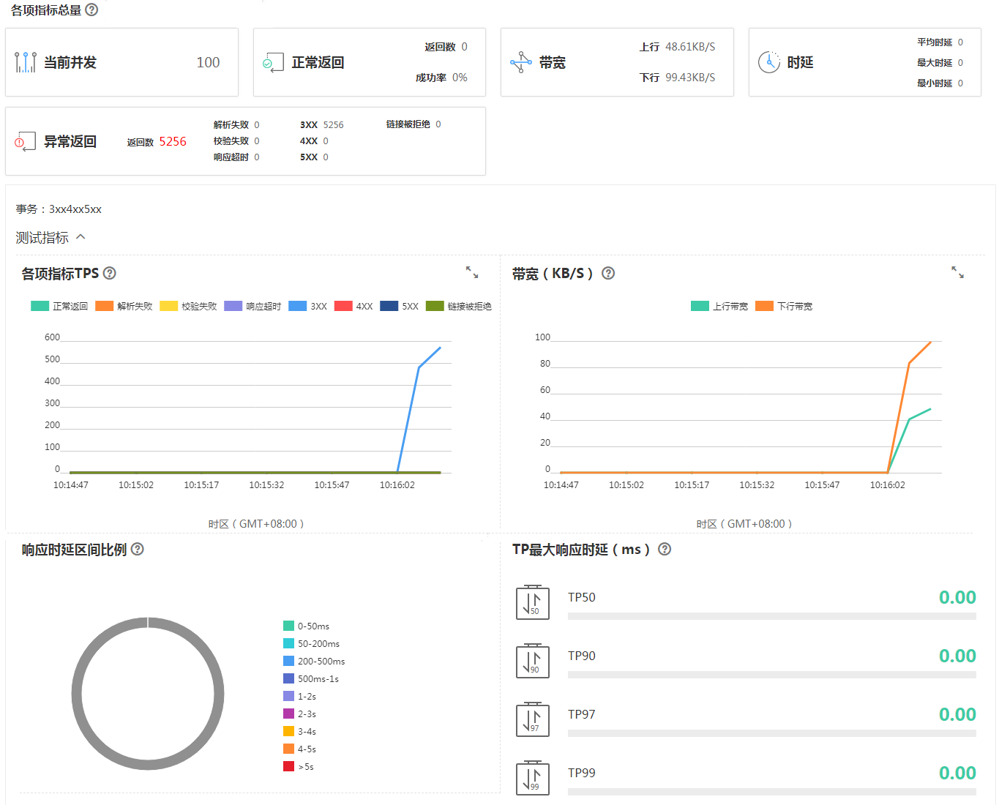

# 查看实时测试报告

压测过程中，可以通过实时测试报告查看压测过程中各项指标的监控数据。

## 前提条件

测试任务已启动。

## 操作步骤

1.  登录CPTS控制台。
2.  选择左侧导航栏的“测试工程“，单击待操作工程后的“查看实时报告“。
3.  在“实时报告”下选择需要查看测试报告的任务。

    单击“停止任务”按钮，可以停止查看实时报告任务。

4.  选择任务下的事务，查看报告。

    > **说明：**   
    >默认显示第一个事务的报告，若下拉框中未选中事务，则显示全部事务的报告。  
    >您也可以复选框选择该任务下的多个事务，查看多个事务的报告。  

    **图 1**  查看事务报告  
    

5.  （可选）您可以单击，放大查看各项指标TPS和带宽的数据。
6.  您可以查看该测试任务的测试指标、并对该测试任务进行调用分析、抓包分析。
    -   监控指标：支持监控CPU、内存、磁盘读取、磁盘写入指标。

        **表 1**  支持监控的主要指标

        
        <table><thead align="left"><tr id="row1423675212110"><th class="cellrowborder" valign="top" width="30%" id="mcps1.2.3.1.1">
监控指标

        </th>
        <th class="cellrowborder" valign="top" width="70%" id="mcps1.2.3.1.2">
含义

        </th>
        </tr>
        </thead>
        <tbody><tr id="row181501940204313"><td class="cellrowborder" valign="top" width="30%" headers="mcps1.2.3.1.1 ">
CPU（%）

        </td>
        <td class="cellrowborder" valign="top" width="70%" headers="mcps1.2.3.1.2 ">
该指标用于统计测试对象的CPU使用率。

        </td>
        </tr>
        <tr id="row323217429247"><td class="cellrowborder" valign="top" width="30%" headers="mcps1.2.3.1.1 ">
内存（G）

        </td>
        <td class="cellrowborder" valign="top" width="70%" headers="mcps1.2.3.1.2 ">
该指标用于统计测试对象的内存利用率。

        </td>
        </tr>
        <tr id="row161501040174310"><td class="cellrowborder" valign="top" width="30%" headers="mcps1.2.3.1.1 ">
磁盘读取（KB/S）

        </td>
        <td class="cellrowborder" valign="top" width="70%" headers="mcps1.2.3.1.2 ">
该指标用于统计每秒从测试对象读出的数据量。

        </td>
        </tr>
        <tr id="row15150240124320"><td class="cellrowborder" valign="top" width="30%" headers="mcps1.2.3.1.1 ">
磁盘写入（KB/S）

        </td>
        <td class="cellrowborder" valign="top" width="70%" headers="mcps1.2.3.1.2 ">
该指标用于统计每秒写到测试对象的数据量。

        </td>
        </tr>
        </tbody>
        </table>

    -   调用分析：支持失败调用链、拓扑关系分析的功能，用于定位测试过程中的问题。

        **表 2**  支持调用分析的类别

        
        <table><thead align="left"><tr id="row1198193012319"><th class="cellrowborder" valign="top" width="30%" id="mcps1.2.3.1.1">
调用分析类别

        </th>
        <th class="cellrowborder" valign="top" width="70%" id="mcps1.2.3.1.2">
含义

        </th>
        </tr>
        </thead>
        <tbody><tr id="row17981130162311"><td class="cellrowborder" valign="top" width="30%" headers="mcps1.2.3.1.1 ">
失败调用链

        </td>
        <td class="cellrowborder" valign="top" width="70%" headers="mcps1.2.3.1.2 ">
失败调用链只有在调用失败时候显示，单击“查看调用关系”，以弹窗形式显示调用关系。

        </td>
        </tr>
        <tr id="row119811030172314"><td class="cellrowborder" valign="top" width="30%" headers="mcps1.2.3.1.1 ">
拓扑关系

        </td>
        <td class="cellrowborder" valign="top" width="70%" headers="mcps1.2.3.1.2 ">
拓扑关系是调用关系的一种，可查看应用之间的关系、调用次数、延时情况。

        </td>
        </tr>
        </tbody>
        </table>

    -   抓包分析：支持请求、响应的采样抓包功能，用于定位测试过程中的问题，每个事务每次最多抓取100个。

        -   您需先选择类别，单击“开始分析”后才显示分析结果。如果您没有选择类别，则“开始分析”为灰化。
        -   单击“删除数据”，您可以删除抓包分析数据。

        **表 3**  支持抓包分析的类别

        
        <table><thead align="left"><tr id="row483614510205"><th class="cellrowborder" valign="top" width="31%" id="mcps1.2.3.1.1">
抓包类别

        </th>
        <th class="cellrowborder" valign="top" width="69%" id="mcps1.2.3.1.2">
含义

        </th>
        </tr>
        </thead>
        <tbody><tr id="row15836115117209"><td class="cellrowborder" valign="top" width="31%" headers="mcps1.2.3.1.1 ">
正常返回

        </td>
        <td class="cellrowborder" valign="top" width="69%" headers="mcps1.2.3.1.2 ">
HTTP返回码为2开头的请求。

        </td>
        </tr>
        <tr id="row1283665112206"><td class="cellrowborder" valign="top" width="31%" headers="mcps1.2.3.1.1 ">
解析失败

        </td>
        <td class="cellrowborder" valign="top" width="69%" headers="mcps1.2.3.1.2 ">
对请求返回的内容(body)解析失败。

        </td>
        </tr>
        <tr id="row158361651182013"><td class="cellrowborder" valign="top" width="31%" headers="mcps1.2.3.1.1 ">
校验失败

        </td>
        <td class="cellrowborder" valign="top" width="69%" headers="mcps1.2.3.1.2 ">
请求正常返回，但与检查点不匹配。

        </td>
        </tr>
        <tr id="row118367517205"><td class="cellrowborder" valign="top" width="31%" headers="mcps1.2.3.1.1 ">
响应超时

        </td>
        <td class="cellrowborder" valign="top" width="69%" headers="mcps1.2.3.1.2 ">
访问测试URL响应超时。

        </td>
        </tr>
        </tbody>
        </table>

