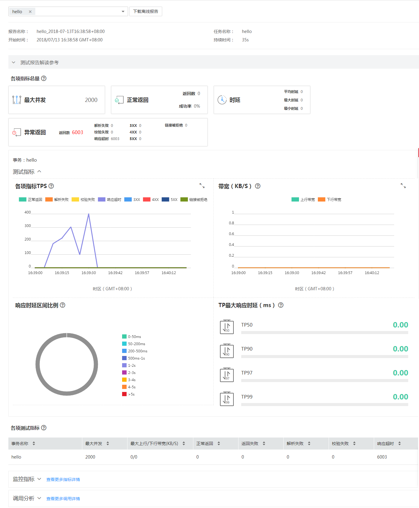

# 查看离线测试报告

压测结束后，系统会生成离线测试结果报告。

## 前提条件

测试任务已结束。

## 操作步骤

1.  登录CPTS控制台。
2.  选择左侧导航栏的“测试工程“，单击待操作工程后的“查看离线报告“。
3.  在“离线报告”下，选择需要查看报告的任务。
4.  （可选）单击报告名称前的，您可以查看到事务定义和任务定义。
5.  单击需要查看报告后的“查看报告”，下拉框选择事务，查看测试报告结果。

    > **说明：**   
    >默认显示第一个事务的报告，若下拉框中未选中事务，则显示全部事务的报告。  
    >您也可以复选框选择该任务下的多个事务，查看多个事务的报告。  
    >您可以选择下载离线报告（PDF格式）到本地进行看。  

    **图 1**  查看测试报告结果  
    

6.  您可以查看该测试任务的监控指标、并对该测试任务进行调用分析。

    > **说明：**   
    >离线报告中的监控数据保存期限为30天，失败调用链、拓扑关系保存期限为7天。  

    -   监控指标：支持监控CPU、内存、磁盘读取、磁盘写入指标。

        **表 1**  支持监控的主要指标

        
        <table><thead align="left"><tr id="cpts_01_0018_row1423675212110"><th class="cellrowborder" valign="top" width="30%" id="mcps1.2.3.1.1">
监控指标

        </th>
        <th class="cellrowborder" valign="top" width="70%" id="mcps1.2.3.1.2">
含义

        </th>
        </tr>
        </thead>
        <tbody><tr id="cpts_01_0018_row181501940204313"><td class="cellrowborder" valign="top" width="30%" headers="mcps1.2.3.1.1 ">
CPU（%）

        </td>
        <td class="cellrowborder" valign="top" width="70%" headers="mcps1.2.3.1.2 ">
该指标用于统计测试对象的CPU使用率。

        </td>
        </tr>
        <tr id="cpts_01_0018_row323217429247"><td class="cellrowborder" valign="top" width="30%" headers="mcps1.2.3.1.1 ">
内存（G）

        </td>
        <td class="cellrowborder" valign="top" width="70%" headers="mcps1.2.3.1.2 ">
该指标用于统计测试对象的内存利用率。

        </td>
        </tr>
        <tr id="cpts_01_0018_row161501040174310"><td class="cellrowborder" valign="top" width="30%" headers="mcps1.2.3.1.1 ">
磁盘读取（KB/S）

        </td>
        <td class="cellrowborder" valign="top" width="70%" headers="mcps1.2.3.1.2 ">
该指标用于统计每秒从测试对象读出的数据量。

        </td>
        </tr>
        <tr id="cpts_01_0018_row15150240124320"><td class="cellrowborder" valign="top" width="30%" headers="mcps1.2.3.1.1 ">
磁盘写入（KB/S）

        </td>
        <td class="cellrowborder" valign="top" width="70%" headers="mcps1.2.3.1.2 ">
该指标用于统计每秒写到测试对象的数据量。

        </td>
        </tr>
        </tbody>
        </table>

    -   调用分析：支持失败调用链、拓扑关系分析的功能，用于定位测试过程中的问题。

        **表 2**  支持调用分析的类别

        
        <table><thead align="left"><tr id="cpts_01_0018_row1198193012319"><th class="cellrowborder" valign="top" width="30%" id="mcps1.2.3.1.1">
调用分析类别

        </th>
        <th class="cellrowborder" valign="top" width="70%" id="mcps1.2.3.1.2">
含义

        </th>
        </tr>
        </thead>
        <tbody><tr id="cpts_01_0018_row17981130162311"><td class="cellrowborder" valign="top" width="30%" headers="mcps1.2.3.1.1 ">
失败调用链

        </td>
        <td class="cellrowborder" valign="top" width="70%" headers="mcps1.2.3.1.2 ">
失败调用链只有在调用失败时候显示，单击“查看调用关系”，以弹窗形式显示调用关系。

        </td>
        </tr>
        <tr id="cpts_01_0018_row119811030172314"><td class="cellrowborder" valign="top" width="30%" headers="mcps1.2.3.1.1 ">
拓扑关系

        </td>
        <td class="cellrowborder" valign="top" width="70%" headers="mcps1.2.3.1.2 ">
拓扑关系是调用关系的一种，可查看应用之间的关系、调用次数、延时情况。

        </td>
        </tr>
        </tbody>
        </table>

