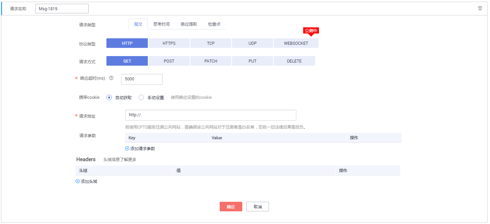
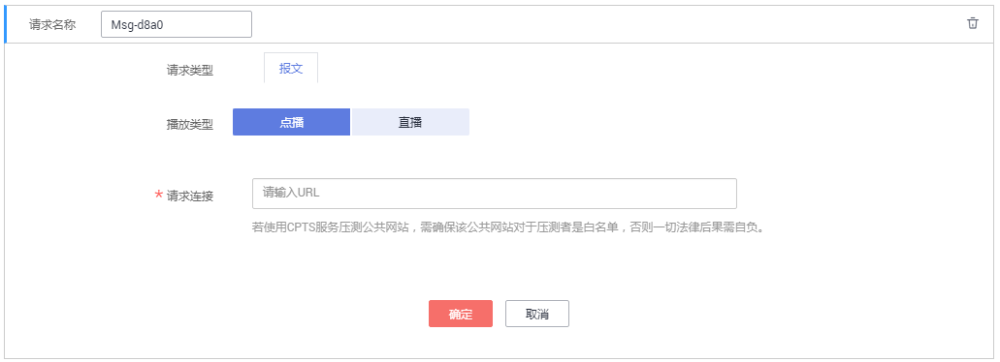

# 添加事务

事务指的是从端到端，一个完整的操作过程，比如一次登录、一次筛选条件查询，一次支付等。

云性能测试服务支持多事务的灵活组合，您可以在一个测试工程中添加多个事务。

## 前提条件

已创建一个测试工程，创建测试工程操作请参见[创建测试工程](创建测试工程.md)。

## 操作步骤

1.  登录CPTS控制台，在左侧导航栏中选择“测试工程“。单击待编辑事务模型工程后的“编辑事务模型“。
2.  在“事务库“页签中，单击“添加事务“，配置以下参数。
    -   事务名称：自定义事务名称。
    -   事务类型：分为常规事务和视频流事务。

        -   常规事务：常规场景下的性能测试事务，支持HTTP/HTTPS/TCP/UDP/WEBSOCKET协议的接口测试，支持多个事务请求信息串联。
        -   视频流事务：视频流场景下的性能测试事务，支持HLS/RTMP流媒体协议的场景，仅支持定义单个事务请求信息。

        **图 1**  添加事务  
        

        > **说明：**   
        >-   一个常规事务下最多可添加40个请求信息，一个视频流事务下只可添加1个请求信息。  
        >-   视频流事务不支持添加思考时间、响应提取和检查点。  

3.  单击“确定“。
4.  为事务添加请求信息，添加完成后，单击“确定”。
    -   当“事务类型”为“常规事务”时，可以同时添加报文、思考时间、响应提取、检查点四个请求信息类型。其中，报文为必选项。

        -   请求信息类型为“报文“：报文是HTTP应用程序之间发送的数据块。详细步骤请参见[添加请求信息（报文）](添加请求信息（报文）.md)。
        -   请求信息类型为“思考时间“：设置执行下一个动作之间停留的持续时间。详细步骤请参见[添加请求信息（思考时间）](添加请求信息（思考时间）.md)。
        -   请求信息类型为“响应提取”：如果同一事务中存在多个报文，通过正则表达式把前一个报文的输出提取出来，做后一个报文的输入。详细步骤请参见[添加请求信息（响应提取）](添加请求信息（响应提取）.md)。
        -   请求信息类型为“检查点“：通过自定义校验信息来验证服务端的返回内容是否正确。详细步骤请参见[添加请求信息（检查点）](添加请求信息（检查点）.md)。

        **图 2**  添加请求信息  
        

    -   当“事务类型”为“视频流事务”时，请求信息类型为“报文“：报文是HTTP应用程序之间发送的数据块。详细步骤请参见[添加请求信息（报文）](添加请求信息（报文）.md)。

        **图 3**  视频流事务添加请求信息  
        

5.  （可选）一个事务包含1个或多个请求信息。若您的事务包含多个请求信息，请单击“添加请求信息”，再执行添加请求信息的相关操作。
6.  事务创建成功后，您可以对事务进行修改、删除和复制。
    -   修改事务名称：在“事务库“页签中，单击待修改事务后的“编辑”，修改事务名称后，单击“确定”。
    -   删除事务：在“事务库“页签中，单击待删除事务后的“更多 \> 删除”，根据系统提示执行删除事务的操作。

        > **说明：**   
        >若事务被测试任务所引用，则不可删除该事务。  

    -   复制事务：在“事务库“页签中，单击待复制事务后的“更多 \> 复制”，单击“确定”。

