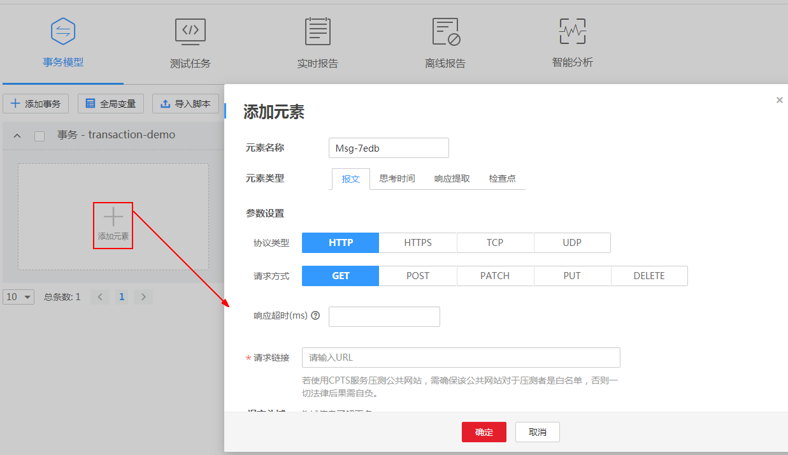

# 添加事务

事务指的是从端到端，一个完整的操作过程，比如一次登录、一次筛选条件查询，一次支付等。

云性能测试服务支持多事务的灵活组合，您可以在一个测试工程中添加多个事务。

## 前提条件

已创建一个测试工程，创建测试工程操作请参见[创建测试工程](创建测试工程.md)。

## 操作步骤

1.  登录CPTS控制台，在左侧导航栏中选择“测试工程“。单击待编辑事务模型工程后的“编辑事务模型“。
2.  在“事务模型“页签中，单击“添加事务“。

    **图 1**  添加事务  
    

3.  输入“事务名称“，单击“确定“。
4.  为事务添加元素。

    > **说明：**   
    >添加事务元素时，可以同时添加报文、思考时间、响应提取、检查点四个元素类型。其中，报文为必选项。  

    -   元素类型为“报文“：报文是HTTP应用程序之间发送的数据块。详细步骤请参见[添加元素（报文）](添加元素（报文）.md)。
    -   元素类型为“思考时间“：设置执行下一个动作之间停留的持续时间。详细步骤请参见[添加元素（思考时间）](添加元素（思考时间）.md)。
    -   元素类型为“响应提取”：如果同一事务中存在多个报文，通过正则表达式把前一个报文的输出提取出来，做后一个报文的输入。详细步骤请参见[添加元素（响应提取）](添加元素（响应提取）.md)。
    -   元素类型为“检查点“：通过自定义校验信息来验证服务端的返回内容是否正确。详细步骤请参见[添加元素（检查点）](添加元素（检查点）.md)。

    **图 2**  添加元素  
    

5.  （可选）一个事务包含1个或多个元素。若您的事务包含多个元素，请单击，再执行添加元素的相关操作。

