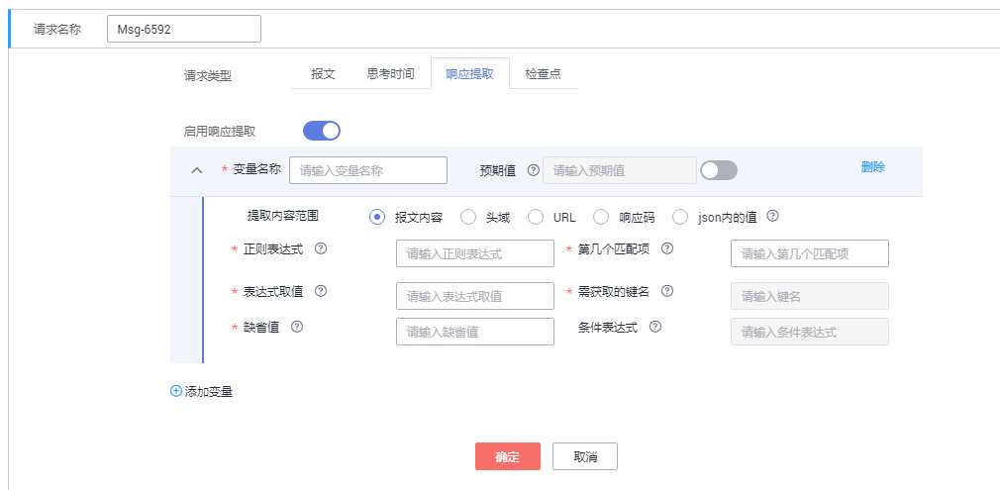
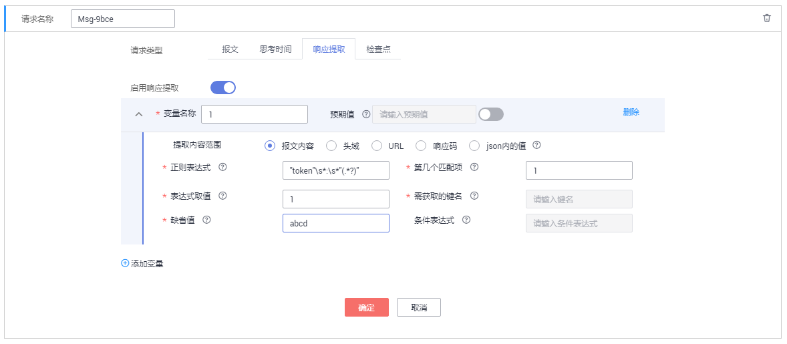
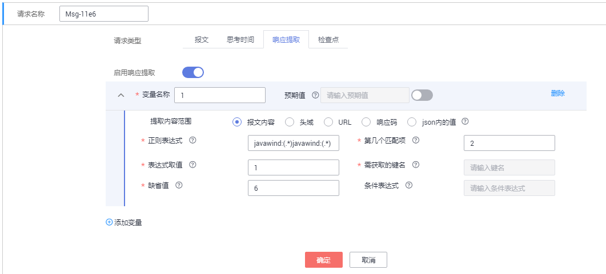

# 添加元素（响应提取）<a name="cpts_01_0035"></a>

如果同一事务中存在多个报文，通过正则表达式把前一个报文的输出提取出来，作后一个报文的输入。

例如，在电商抢购场景中，您搜索对应的商品之后购买该产品，可使用响应提取功能，提取“搜索”报文得到的商品id作为下一个“购买”报文的输入参数。

> **说明：**   
>-   响应提取不支持事务中仅一个报文的情况。  
>-   响应提取不支持跨事务提取，即从事务A的报文的响应中提取值作为事务B报文的输入。  
>-   响应提取的变量为局部变量。  

## 操作步骤<a name="section124871244417"></a>

1.  登录CPTS控制台，在左侧导航栏中选择“测试工程“。单击待编辑事务模型工程后的“编辑事务模型“。
2.  在“事务模型“页签中，单击待添加元素事务下的。
3.  设置元素类型为“响应提取“。参照[表1](#table738524254311)设置基本信息，其中带“\*”标志的参数为必填参数。

    **图 1**  响应提取<a name="fig219365614810"></a>  
    

    **表 1**  元素类型为响应提取

    <a name="table738524254311"></a>
    <table><thead align="left"><tr id="row7383124244320"><th class="cellrowborder" valign="top" width="23%" id="mcps1.2.3.1.1"><p id="p93836427431"><a name="p93836427431"></a><a name="p93836427431"></a>参数</p>
    </th>
    <th class="cellrowborder" valign="top" width="77%" id="mcps1.2.3.1.2"><p id="p1138354211436"><a name="p1138354211436"></a><a name="p1138354211436"></a>参数说明</p>
    </th>
    </tr>
    </thead>
    <tbody><tr id="row19383842134319"><td class="cellrowborder" valign="top" width="23%" headers="mcps1.2.3.1.1 "><p id="p13383742184313"><a name="p13383742184313"></a><a name="p13383742184313"></a>* 变量名称</p>
    </td>
    <td class="cellrowborder" valign="top" width="77%" headers="mcps1.2.3.1.2 "><p id="p16383164211431"><a name="p16383164211431"></a><a name="p16383164211431"></a>变量的名称，命名必须唯一，响应提取的值赋予此变量。</p>
    </td>
    </tr>
    <tr id="row13841542154318"><td class="cellrowborder" valign="top" width="23%" headers="mcps1.2.3.1.1 "><p id="p138316426434"><a name="p138316426434"></a><a name="p138316426434"></a><span class="keyword" id="keyword1380210115220"><a name="keyword1380210115220"></a><a name="keyword1380210115220"></a>提取内容范围</span></p>
    </td>
    <td class="cellrowborder" valign="top" width="77%" headers="mcps1.2.3.1.2 "><p id="p0383124215436"><a name="p0383124215436"></a><a name="p0383124215436"></a>响应提取内容的范围。</p>
    <p id="p19923132982615"><a name="p19923132982615"></a><a name="p19923132982615"></a>其中，“报文内容”、“头域”和“URL”可通过正则表达式进行内容提取。</p>
    </td>
    </tr>
    <tr id="row18384164234320"><td class="cellrowborder" valign="top" width="23%" headers="mcps1.2.3.1.1 "><p id="p238434219435"><a name="p238434219435"></a><a name="p238434219435"></a>* <span class="keyword" id="keyword107304184229"><a name="keyword107304184229"></a><a name="keyword107304184229"></a>正则表达式</span></p>
    </td>
    <td class="cellrowborder" valign="top" width="77%" headers="mcps1.2.3.1.2 "><p id="p153849424437"><a name="p153849424437"></a><a name="p153849424437"></a>正则表达式是对字符串操作的一种逻辑公式，就是用事先定义好的一些特定字符、及这些特定字符的组合，组成一个“规则字符串”，这个“规则字符串”用来表达对字符串的一种过滤逻辑。</p>
    <p id="p15384842154311"><a name="p15384842154311"></a><a name="p15384842154311"></a>完整的正则表达式由两种字符构成：特殊字符(special characters)称为“元字符”(meta characters)；其它为“文字”(literal)，或者是普通文本字符(normal text characters，如字母、数字、汉字、下划线)。元字符的说明请参见<a href="正则表达式元字符.md">正则表达式元字符</a>。</p>
    <div class="note" id="note20384184284314"><a name="note20384184284314"></a><a name="note20384184284314"></a><span class="notetitle"> 说明： </span><div class="notebody"><p id="p8384134217436"><a name="p8384134217436"></a><a name="p8384134217436"></a>“()”表示提取，对于您要提取的内容需要用小括号括起来，每个‘()’之间的内容表示一个子表达式。</p>
    </div></div>
    </td>
    </tr>
    <tr id="row203841942204318"><td class="cellrowborder" valign="top" width="23%" headers="mcps1.2.3.1.1 "><p id="p4384194274311"><a name="p4384194274311"></a><a name="p4384194274311"></a>* 第几个匹配项</p>
    </td>
    <td class="cellrowborder" valign="top" width="77%" headers="mcps1.2.3.1.2 "><p id="p11384144216438"><a name="p11384144216438"></a><a name="p11384144216438"></a>在正则表达式已提取的内容中，获取第几个匹配的内容。</p>
    <p id="p438424214312"><a name="p438424214312"></a><a name="p438424214312"></a>取值范围：正整数。</p>
    <div class="note" id="note8384104217432"><a name="note8384104217432"></a><a name="note8384104217432"></a><span class="notetitle"> 说明： </span><div class="notebody"><p id="p153846422432"><a name="p153846422432"></a><a name="p153846422432"></a>该参数值不可设置为0。</p>
    </div></div>
    </td>
    </tr>
    <tr id="row15385174211433"><td class="cellrowborder" valign="top" width="23%" headers="mcps1.2.3.1.1 "><p id="p33847426432"><a name="p33847426432"></a><a name="p33847426432"></a>* 表达式取值</p>
    </td>
    <td class="cellrowborder" valign="top" width="77%" headers="mcps1.2.3.1.2 "><p id="p17384194274312"><a name="p17384194274312"></a><a name="p17384194274312"></a>表示解析到的第几个子表达式的值。</p>
    <p id="p133841742144313"><a name="p133841742144313"></a><a name="p133841742144313"></a>取值范围：自然数。</p>
    <div class="note" id="note738412424433"><a name="note738412424433"></a><a name="note738412424433"></a><span class="notetitle"> 说明： </span><div class="notebody"><p id="p193847423434"><a name="p193847423434"></a><a name="p193847423434"></a>取值为0表示匹配整个正则表达式。</p>
    <p id="p16384144274317"><a name="p16384144274317"></a><a name="p16384144274317"></a>取值为1表示匹配正则表达式的第一个子表达式即第一个“()”提取的内容。</p>
    </div></div>
    <p id="p738416428435"><a name="p738416428435"></a><a name="p738416428435"></a>通过“正则表达式”和“第几个匹配项”提取出内容后，再通过“表达式取值”获得最终的提取内容。</p>
    </td>
    </tr>
    <tr id="row1380192194711"><td class="cellrowborder" valign="top" width="23%" headers="mcps1.2.3.1.1 "><p id="p08162144718"><a name="p08162144718"></a><a name="p08162144718"></a>* 需获取的键名</p>
    </td>
    <td class="cellrowborder" valign="top" width="77%" headers="mcps1.2.3.1.2 "><p id="p29360596477"><a name="p29360596477"></a><a name="p29360596477"></a>输入需要获取的键名。</p>
    <p id="p581821194718"><a name="p581821194718"></a><a name="p581821194718"></a>例如，{key:{"key1":"v1","key2":["v2","v3"]}}，若想取出”v2“，则输入key.key2[0]。</p>
    </td>
    </tr>
    <tr id="row1938524214313"><td class="cellrowborder" valign="top" width="23%" headers="mcps1.2.3.1.1 "><p id="p15385342194319"><a name="p15385342194319"></a><a name="p15385342194319"></a>*  缺省值</p>
    </td>
    <td class="cellrowborder" valign="top" width="77%" headers="mcps1.2.3.1.2 "><p id="p11385184224317"><a name="p11385184224317"></a><a name="p11385184224317"></a>正则匹配失败时，取的值。</p>
    </td>
    </tr>
    </tbody>
    </table>

    **表 2**  常用正则表达式介绍

    <a name="table114090117494"></a>
    <table><thead align="left"><tr id="row14409918497"><th class="cellrowborder" valign="top" width="25%" id="mcps1.2.4.1.1"><p id="p74090114913"><a name="p74090114913"></a><a name="p74090114913"></a>正则表达式</p>
    </th>
    <th class="cellrowborder" valign="top" width="26%" id="mcps1.2.4.1.2"><p id="p134107119492"><a name="p134107119492"></a><a name="p134107119492"></a>说明</p>
    </th>
    <th class="cellrowborder" valign="top" width="49%" id="mcps1.2.4.1.3"><p id="p1941011124920"><a name="p1941011124920"></a><a name="p1941011124920"></a>示例</p>
    </th>
    </tr>
    </thead>
    <tbody><tr id="row14104114912"><td class="cellrowborder" rowspan="2" valign="top" width="25%" headers="mcps1.2.4.1.1 "><p id="p2256125155011"><a name="p2256125155011"></a><a name="p2256125155011"></a>(\d+)</p>
    </td>
    <td class="cellrowborder" rowspan="2" valign="top" width="26%" headers="mcps1.2.4.1.2 "><p id="p325617257506"><a name="p325617257506"></a><a name="p325617257506"></a>匹配非负整数</p>
    </td>
    <td class="cellrowborder" valign="top" width="49%" headers="mcps1.2.4.1.3 "><p id="p11931644527"><a name="p11931644527"></a><a name="p11931644527"></a>字符串：</p>
    <pre class="screen" id="screen8607173695210"><a name="screen8607173695210"></a><a name="screen8607173695210"></a>bTivm2wu9jih1LBKR4osZGrjjl</pre>
    </td>
    </tr>
    <tr id="row10478552514"><td class="cellrowborder" valign="top" headers="mcps1.2.4.1.1 "><p id="p14815514511"><a name="p14815514511"></a><a name="p14815514511"></a>匹配结果：</p>
    <pre class="screen" id="screen1359618451144"><a name="screen1359618451144"></a><a name="screen1359618451144"></a>2
    9
    1
    4</pre>
    </td>
    </tr>
    <tr id="row1841011194913"><td class="cellrowborder" rowspan="2" valign="top" width="25%" headers="mcps1.2.4.1.1 "><p id="p152561525165012"><a name="p152561525165012"></a><a name="p152561525165012"></a>([A-Za-z]+)</p>
    </td>
    <td class="cellrowborder" rowspan="2" valign="top" width="26%" headers="mcps1.2.4.1.2 "><p id="p82561925185014"><a name="p82561925185014"></a><a name="p82561925185014"></a>匹配由26个英文字母组成的字符串</p>
    </td>
    <td class="cellrowborder" valign="top" width="49%" headers="mcps1.2.4.1.3 "><p id="p1593010612575"><a name="p1593010612575"></a><a name="p1593010612575"></a>字符串：</p>
    <pre class="screen" id="screen3934115545913"><a name="screen3934115545913"></a><a name="screen3934115545913"></a>bTivm2wu9jih1LBKR4osZGrjjl</pre>
    </td>
    </tr>
    <tr id="row467062615537"><td class="cellrowborder" valign="top" headers="mcps1.2.4.1.1 "><p id="p15499173214534"><a name="p15499173214534"></a><a name="p15499173214534"></a>匹配结果：</p>
    <pre class="screen" id="screen12160755740"><a name="screen12160755740"></a><a name="screen12160755740"></a>bTivm
    wu
    jih
    LBKR
    osZGrjjl</pre>
    </td>
    </tr>
    <tr id="row54101514497"><td class="cellrowborder" rowspan="2" valign="top" width="25%" headers="mcps1.2.4.1.1 "><p id="p10257162545019"><a name="p10257162545019"></a><a name="p10257162545019"></a>([A-Za-z0-9]+)</p>
    </td>
    <td class="cellrowborder" rowspan="2" valign="top" width="26%" headers="mcps1.2.4.1.2 "><p id="p122571125185016"><a name="p122571125185016"></a><a name="p122571125185016"></a>匹配由数字和26个英文字母组成的字符串</p>
    </td>
    <td class="cellrowborder" valign="top" width="49%" headers="mcps1.2.4.1.3 "><p id="p2029183716010"><a name="p2029183716010"></a><a name="p2029183716010"></a>字符串：</p>
    <pre class="screen" id="screen48184014120"><a name="screen48184014120"></a><a name="screen48184014120"></a>bTivm2wu9jih1LBKR4osZGrjjl:asdasd22</pre>
    </td>
    </tr>
    <tr id="row1414940195315"><td class="cellrowborder" valign="top" headers="mcps1.2.4.1.1 "><p id="p1767904625320"><a name="p1767904625320"></a><a name="p1767904625320"></a>匹配结果：</p>
    <pre class="screen" id="screen1353152353"><a name="screen1353152353"></a><a name="screen1353152353"></a>bTivm2wu9jih1LBKR4osZGrjjl
    asdasd22</pre>
    </td>
    </tr>
    <tr id="row741011174915"><td class="cellrowborder" rowspan="2" valign="top" width="25%" headers="mcps1.2.4.1.1 "><p id="p22571325115011"><a name="p22571325115011"></a><a name="p22571325115011"></a>(\w+)</p>
    </td>
    <td class="cellrowborder" rowspan="2" valign="top" width="26%" headers="mcps1.2.4.1.2 "><p id="p725742518506"><a name="p725742518506"></a><a name="p725742518506"></a>匹配由数字、26个英文字母或者下划线组成的字符串</p>
    </td>
    <td class="cellrowborder" valign="top" width="49%" headers="mcps1.2.4.1.3 "><p id="p10971853717"><a name="p10971853717"></a><a name="p10971853717"></a>字符串：</p>
    <pre class="screen" id="screen4320248212"><a name="screen4320248212"></a><a name="screen4320248212"></a>bTivm2wu9jih1LBKR4osZGrjjl:asdasd22</pre>
    </td>
    </tr>
    <tr id="row14276153105310"><td class="cellrowborder" valign="top" headers="mcps1.2.4.1.1 "><p id="p95515112545"><a name="p95515112545"></a><a name="p95515112545"></a>匹配结果：</p>
    <pre class="screen" id="screen1159919118518"><a name="screen1159919118518"></a><a name="screen1159919118518"></a>bTivm2wu9jih1LBKR4osZGrjjl
    asdasd22</pre>
    </td>
    </tr>
    <tr id="row10410161164918"><td class="cellrowborder" rowspan="2" valign="top" width="25%" headers="mcps1.2.4.1.1 "><p id="p1325892516505"><a name="p1325892516505"></a><a name="p1325892516505"></a>([\w-]+(\.[\w-]+)*@[\w-]+(\.[\w-]+)+)</p>
    </td>
    <td class="cellrowborder" rowspan="2" valign="top" width="26%" headers="mcps1.2.4.1.2 "><p id="p1425815253500"><a name="p1425815253500"></a><a name="p1425815253500"></a>匹配email地址</p>
    </td>
    <td class="cellrowborder" valign="top" width="49%" headers="mcps1.2.4.1.3 "><p id="p857374011217"><a name="p857374011217"></a><a name="p857374011217"></a>字符串：</p>
    <pre class="screen" id="screen490619491831"><a name="screen490619491831"></a><a name="screen490619491831"></a>bTivm2wu9jih1LBKR4osZGrjjl:china@china.com</pre>
    </td>
    </tr>
    <tr id="row20371135135411"><td class="cellrowborder" valign="top" headers="mcps1.2.4.1.1 "><p id="p36652115544"><a name="p36652115544"></a><a name="p36652115544"></a>匹配结果：</p>
    <pre class="screen" id="screen1323418201752"><a name="screen1323418201752"></a><a name="screen1323418201752"></a>china@china.com</pre>
    </td>
    </tr>
    </tbody>
    </table>

4.  （可选）一个元素可包含1个或多个变量，若您的元素需要添加多个变量，请单击“添加变量”，再设置变量的相关参数。
5.  配置完成后，单击“确定“。

## 响应提取示例<a name="section1815938134117"></a>

-   示例一

    例如，前一个报文响应的报文内容如下图所示：

    **图 2**  报文内容<a name="fig1331319185718"></a>  
    

    如果想要获取token值的，可通过正则表达式**"token"\\s\*:\\s\*"\(.\*?\)"**提取，响应提取的设置如[图3](#fig3763135273513)所示。

    **图 3**  提取token值<a name="fig3763135273513"></a>  
    

-   示例二

    例如：前一个报文响应的报文内容为：

    ```
    javawind:9javawind:12 
    javawind:16javawind:17 
    javawind:46javawind:22
    ```

    如果想要提取数值16，响应提取的设置如[图4](#fig3129104113610)所示。

    **图 4**  响应提取示例<a name="fig3129104113610"></a>  
    

    1.  通过正则表达式**javawind:\(.\*\)javawind:\(.\*\)**，提取数据如下：

        ```
        9 12
        16 17
        46 22
        ```

    2.  通过第2个匹配项，提取数据如下：

        ```
        16 17
        ```

    3.  通过第1个表达式，提取数据如下：

        ```
        16
        ```


