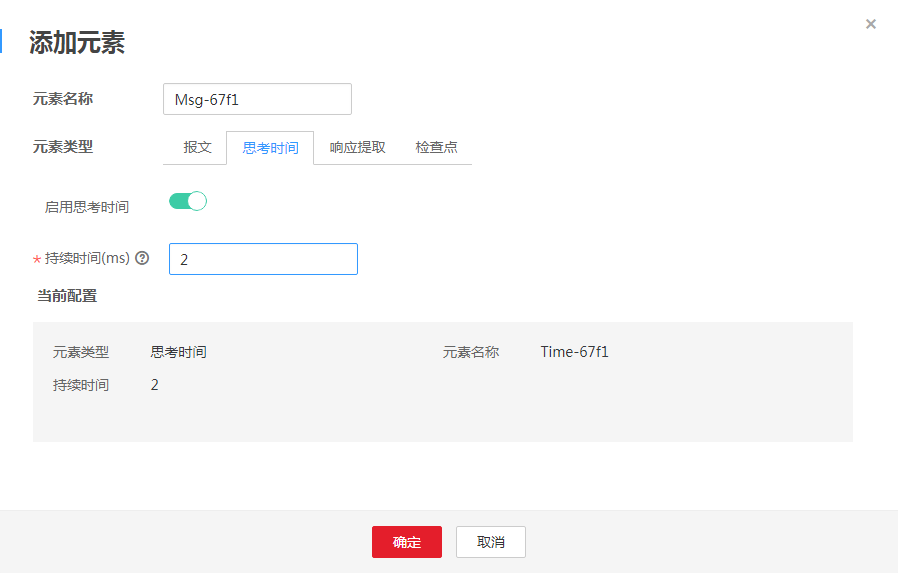

# 添加元素（思考时间）

为了更好的模拟用户的行为，需要模拟用户在不同操作之间等待的时间，例如，当用户收到来自服务器的数据时，可能要等待几秒查看数据，然后再做出响应，这种延迟，就称为思考时间。

## 操作步骤

1.  登录CPTS控制台，在左侧导航栏中选择“测试工程“，单击待编辑事务模型工程后的“编辑事务模型“。
2.  在“事务模型“页签中，单击待添加元素事务下的。
3.  元素类型设置为“思考时间“。参照[表1](#table187806288414)设置基本信息，其中带“\*”标志的参数为必填参数。

    **图 1**  元素类型为思考时间  
    

    **表 1**  元素类型为思考时间

    
    <table><thead align="left"><tr id="row1779728174111"><th class="cellrowborder" valign="top" width="17%" id="mcps1.2.3.1.1">
参数

    </th>
    <th class="cellrowborder" valign="top" width="83%" id="mcps1.2.3.1.2">
参数说明

    </th>
    </tr>
    </thead>
    <tbody><tr id="row2084617312393"><td class="cellrowborder" valign="top" width="17%" headers="mcps1.2.3.1.1 ">
元素名称

    </td>
    <td class="cellrowborder" valign="top" width="83%" headers="mcps1.2.3.1.2 ">
新建元素的名称。

    </td>
    </tr>
    <tr id="row117979336328"><td class="cellrowborder" valign="top" width="17%" headers="mcps1.2.3.1.1 ">
启用思考时间

    </td>
    <td class="cellrowborder" valign="top" width="83%" headers="mcps1.2.3.1.2 ">
启用思考时间后，当用户接收到来自服务器的数据时，可能要等待几秒查看数据，然后再做出响应。

    </td>
    </tr>
    <tr id="row0780228144112"><td class="cellrowborder" valign="top" width="17%" headers="mcps1.2.3.1.1 ">
* 持续时间（ms）

    </td>
    <td class="cellrowborder" valign="top" width="83%" headers="mcps1.2.3.1.2 ">
思考时间是指用户在执行两个连续操作期间的等待时间。如用户在登录和搜索之间停留的时间。

    
例如，某事务每运行一次响应时间为 0.5 秒。

    <ul id="ul177803282419"><li>若希望每秒执行两次事务请求，则不添加元素类型为“思考时间”的事务元素。</li><li>若希望每秒只执行一次事务请求，思考时间调整为1秒。如果思考时间设置为1秒而响应时间大于1秒，则思考时间不会生效，按响应时间发送压测请求。</li></ul>
    </td>
    </tr>
    </tbody>
    </table>

4.  配置完成后，单击“确定“。

