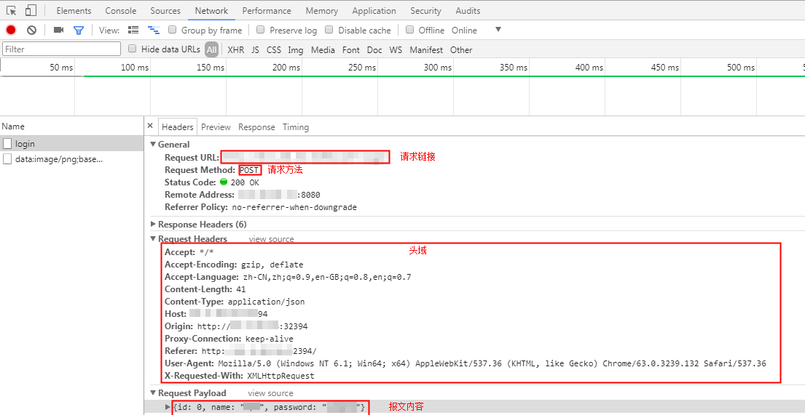

# 添加元素（报文）

报文是HTTP/HTTPS/TCP/UDP应用程序之间发送的数据块。这些数据块以一些文本形式的元信息开头，这些信息描述了报文的内容及含义，后面跟着可选的数据部分。这些报文都是在客户端、服务器和代理之间流动。

## 操作步骤

1.  登录CPTS控制台，在左侧导航栏中选择“测试工程“。单击待编辑事务模型工程后的“编辑事务模型“。
2.  在“事务模型“页签中，单击待添加元素事务下的。
3.  元素类型设置为“报文“。参照[表1](#table178291225164211)设置基本信息，其中带“\*”标志的参数为必填参数。

    **图 1**  元素类型为报文  
    

    **表 1**  元素类型为报文

    
    <table><thead align="left"><tr id="row108261025124213"><th class="cellrowborder" valign="top" width="32%" id="mcps1.2.3.1.1">
参数

    </th>
    <th class="cellrowborder" valign="top" width="68%" id="mcps1.2.3.1.2">
参数说明

    </th>
    </tr>
    </thead>
    <tbody><tr id="row682611256424"><td class="cellrowborder" valign="top" width="32%" headers="mcps1.2.3.1.1 ">
协议类型

    </td>
    <td class="cellrowborder" valign="top" width="68%" headers="mcps1.2.3.1.2 ">
请根据业务的协议类型选择。

    </td>
    </tr>
    <tr id="row68261425174218"><td class="cellrowborder" colspan="2" valign="top" headers="mcps1.2.3.1.1 mcps1.2.3.1.2 ">
当请求类型为HTTP和HTTPS时，设置以下参数。

    </td>
    </tr>
    <tr id="row20473194816538"><td class="cellrowborder" valign="top" width="32%" headers="mcps1.2.3.1.1 ">
HTTP版本

    </td>
    <td class="cellrowborder" valign="top" width="68%" headers="mcps1.2.3.1.2 ">
无需配置，默认为HTTP1.1版本。

    </td>
    </tr>
    <tr id="row12827122511422"><td class="cellrowborder" valign="top" width="32%" headers="mcps1.2.3.1.1 ">
请求方式

    </td>
    <td class="cellrowborder" valign="top" width="68%" headers="mcps1.2.3.1.2 "><ul id="ul19827725194214"><li>GET：最常见的一种请求方式，当客户端要从服务器中读取文档时，当点击网页上的链接或者通过在浏览器的地址栏输入网址来浏览网页的，使用的都是GET方式。GET方法要求服务器将URL定位的资源放在响应报文的数据部分，回送给客户端。使用GET方法时，请求参数和对应的值附加在URL后面，利用一个问号（“?”）代表URL的结尾与请求参数的开始，传递参数长度受限制。GET类型不适合传送私密数据，也不适合需要传送大量数据的场景。</li><li>POST：对于不适合GET类型的场景，可考虑POST。POST方法可以允许客户端给服务器提供信息较多。POST方法将请求参数封装在HTTP请求数据中，以名称/值的形式出现，可以传输大量数据，这样POST方式对传送的数据大小没有限制，而且也不会显示在URL中。</li><li>PATCH：是对PUT方法的补充，用来对服务器已有资源进行局部更新。</li><li>PUT：将来自客户端的数据存储到一个命名的服务器资源中去。</li><li>DELETE：从服务器中删除命名资源。</li></ul>
    </td>
    </tr>
    <tr id="row48058504405"><td class="cellrowborder" valign="top" width="32%" headers="mcps1.2.3.1.1 ">
响应超时(ms)

    </td>
    <td class="cellrowborder" valign="top" width="68%" headers="mcps1.2.3.1.2 ">
发送请求，等待服务器响应的超时时间。

    
若不设置此参数，默认响应超时时间为5000ms。

    </td>
    </tr>
    <tr id="row1182782517423"><td class="cellrowborder" valign="top" width="32%" headers="mcps1.2.3.1.1 ">
* 请求链接

    </td>
    <td class="cellrowborder" valign="top" width="68%" headers="mcps1.2.3.1.2 ">
发送请求的URL地址，比如“http://域名/路径”，也可以包含参数的部分“http://域名/路径?key1=value1&amp;key2=value2”。

    </td>
    </tr>
    <tr id="row1382792510421"><td class="cellrowborder" valign="top" width="32%" headers="mcps1.2.3.1.1 ">
报文头域

    </td>
    <td class="cellrowborder" valign="top" width="68%" headers="mcps1.2.3.1.2 ">
请根据压测服务器需要校验或者使用的头域来添加相关头域及内容。CPTS服务没有对必填头域作要求，仅透传用户定义的头域到压测服务器。“头域”的说明请参见<a href="头域说明.md">头域说明</a>。

    
单击，设置“头域”和“值”，若您不需要添加头域信息，可以单击“删除”按钮删除报文头域。

    
 说明： 

请求方式为POST或PUT，且“头域”为“Content-Type”时，“值”有三种类型：

    <ul id="ul16234350419"><li>自定义：直接在输入框中输入值。</li><li>application/x-www-form-urlencoded：请求体为可添加的键值对形式，值为文本。</li><li>multipart/form-data：请求体为可添加的键值对形式，值可为文本或文件。</li></ul>
    

    </td>
    </tr>
    <tr id="row19828142584211"><td class="cellrowborder" valign="top" width="32%" headers="mcps1.2.3.1.1 ">
报文内容

    </td>
    <td class="cellrowborder" valign="top" width="68%" headers="mcps1.2.3.1.2 ">
实体的主体部分包含一个由任意数据组成的数据块，并不是所有的报文都包含实体的主体部分，有时，报文只是以一个CRLF结束。

    
如果已设置全局变量或响应提取的局部变量，可在报文内容部分引用变量，执行压测任务过程会将报文内容中的变量值动态替换为指定的值。

    <ol id="ol7827102534219"><li>在报文内容输入框内输入“$”。</li><li>在“插入变量”对话框中，设置对应的“变量名称”和“变量范围”。</li><li>单击“选择”。</li></ol>
    
 说明： 

请求方式为GET时，不支持报文内容。

    

    </td>
    </tr>
    <tr id="row78281525144218"><td class="cellrowborder" colspan="2" valign="top" headers="mcps1.2.3.1.1 mcps1.2.3.1.2 ">
当请求类型为TCP时，设置以下参数。

    </td>
    </tr>
    <tr id="row08281025114210"><td class="cellrowborder" valign="top" width="32%" headers="mcps1.2.3.1.1 ">
* IP

    </td>
    <td class="cellrowborder" valign="top" width="68%" headers="mcps1.2.3.1.2 ">
发送请求到被测服务器的IP地址。

    </td>
    </tr>
    <tr id="row15828102504217"><td class="cellrowborder" valign="top" width="32%" headers="mcps1.2.3.1.1 ">
* 端口号

    </td>
    <td class="cellrowborder" valign="top" width="68%" headers="mcps1.2.3.1.2 ">
发送请求到被测服务器的端口号。

    </td>
    </tr>
    <tr id="row982815259422"><td class="cellrowborder" valign="top" width="32%" headers="mcps1.2.3.1.1 ">
* 链接超时(ms)

    </td>
    <td class="cellrowborder" valign="top" width="68%" headers="mcps1.2.3.1.2 ">
发起连接，服务器无响应的超时时间。

    </td>
    </tr>
    <tr id="row78281225124216"><td class="cellrowborder" valign="top" width="32%" headers="mcps1.2.3.1.1 ">
* 返回超时(ms)

    </td>
    <td class="cellrowborder" valign="top" width="68%" headers="mcps1.2.3.1.2 ">
连接建立成功，等待响应返回的超时时间。

    </td>
    </tr>
    <tr id="row20828192574218"><td class="cellrowborder" valign="top" width="32%" headers="mcps1.2.3.1.1 ">
连接设置

    </td>
    <td class="cellrowborder" valign="top" width="68%" headers="mcps1.2.3.1.2 "><ul id="ul1082872534212"><li>重复使用连接：请求响应完成后，不断开连接，复用连接发送接收下一次请求响应。</li><li>关闭连接：每次完成请求响应完成后，断开连接，下一次重新建立连接。</li></ul>
    </td>
    </tr>
    <tr id="row9829425104212"><td class="cellrowborder" valign="top" width="32%" headers="mcps1.2.3.1.1 ">
返回结束设置

    </td>
    <td class="cellrowborder" valign="top" width="68%" headers="mcps1.2.3.1.2 ">
通过返回结束设置，来判断本次请求的响应内容是否已经接收完成。

    <ul id="ul78286257421"><li>返回数据长度：设置返回数据的长度，单位字节。当接收到此长度的响应内容时，数据接收完成。</li><li>结束符：设置返回数据的结束标记。当接收到结束符时，数据接收完成 。
 说明： 

结束符建议设置一个唯一的结束标记，若设置的结束符在响应内容中存在多个，当接收到第一个结束符时，就认为响应内容已经接收完成，这样接收的响应数据就不完整。

    

    </li></ul>
    </td>
    </tr>
    <tr id="row982982515428"><td class="cellrowborder" valign="top" width="32%" headers="mcps1.2.3.1.1 ">
报文内容

    </td>
    <td class="cellrowborder" valign="top" width="68%" headers="mcps1.2.3.1.2 ">
实体的主体部分包含一个由任意数据组成的数据块，并不是所有的报文都包含实体的主体部分，有时，报文只是以一个CRLF结束。

    
内容格式：请根据被测服务器的业务请求内容，选择“字符串”或“16进制码流”。

    
如果已设置全局变量或响应提取的局部变量，可在报文内容部分引用变量，执行压测任务过程会将报文内容中的变量值动态替换为指定的值。

    <ol id="ol1982992524219"><li>在报文内容输入框内输入“$”。</li><li>在“插入变量”对话框中，设置对应的“变量名称”和“变量范围”。</li><li>单击“选择”。</li></ol>
    </td>
    </tr>
    <tr id="row1442153264416"><td class="cellrowborder" colspan="2" valign="top" headers="mcps1.2.3.1.1 mcps1.2.3.1.2 ">
当请求类型为UDP时，设置以下参数。

    
 说明： 

思考时间、报文、响应提取、检查点功能都支持UDP协议类型。

    

    </td>
    </tr>
    <tr id="row61201535134415"><td class="cellrowborder" valign="top" width="32%" headers="mcps1.2.3.1.1 ">
* IP

    </td>
    <td class="cellrowborder" valign="top" width="68%" headers="mcps1.2.3.1.2 ">
发送请求到被测服务器的IP地址。

    </td>
    </tr>
    <tr id="row181450378449"><td class="cellrowborder" valign="top" width="32%" headers="mcps1.2.3.1.1 ">
* 端口号

    </td>
    <td class="cellrowborder" valign="top" width="68%" headers="mcps1.2.3.1.2 ">
发送请求到被测服务器的端口号。

    </td>
    </tr>
    <tr id="row354239204412"><td class="cellrowborder" valign="top" width="32%" headers="mcps1.2.3.1.1 ">
返回结束设置

    </td>
    <td class="cellrowborder" valign="top" width="68%" headers="mcps1.2.3.1.2 ">
通过返回结束设置，来判断本次请求的响应内容是否已经接收完成。

    <ul id="ul238944312461"><li>返回数据长度：设置返回数据的长度，单位字节。当接收到此长度的响应内容时，数据接收完成。</li><li>结束符：设置返回数据的结束标记。当接收到结束符时，数据接收完成 。
 说明： 

结束符建议设置一个唯一的结束标记，若设置的结束符在响应内容中存在多个，当接收到第一个结束符时，就认为响应内容已经接收完成，这样接收的响应数据就不完整。

    

    </li></ul>
    </td>
    </tr>
    <tr id="row18718194214456"><td class="cellrowborder" valign="top" width="32%" headers="mcps1.2.3.1.1 ">
报文内容

    </td>
    <td class="cellrowborder" valign="top" width="68%" headers="mcps1.2.3.1.2 ">
实体的主体部分包含一个由任意数据组成的数据块，并不是所有的报文都包含实体的主体部分，有时，报文只是以一个CRLF结束。

    
内容格式：请根据被测服务器的业务请求内容，选择“字符串”或“16进制码流”。

    
如果已设置全局变量或响应提取的局部变量，可在报文内容部分引用变量，执行压测任务过程会将报文内容中的变量值动态替换为指定的值。

    <ol id="ol1316782564615"><li>在报文内容输入框内输入“$”。</li><li>在“插入变量”对话框中，设置对应的“变量名称”和“变量范围”。</li><li>单击“选择”。</li></ol>
    </td>
    </tr>
    </tbody>
    </table>

4.  配置完成后，单击“确定“。

## 报文如何填写

报文通俗的解释就是说平时我们在网站上面的所有点击操作，都是通过编辑成，满足协议规范带有用户请求内容格式的码流传送给不同的第三方，最后得到一个正确或者失败响应的一个过程。可以通过在操作时按“F12”，或抓包工具（例如wireshark）查看报文是怎么请求的，然后根据实际业务在压测的报文中填写。

例如，模拟登录请求的POST方法，对应的请求链接、请求方法、头域、报文内容如下图所示。

**图 2**  模拟登录请求的POST方法  

