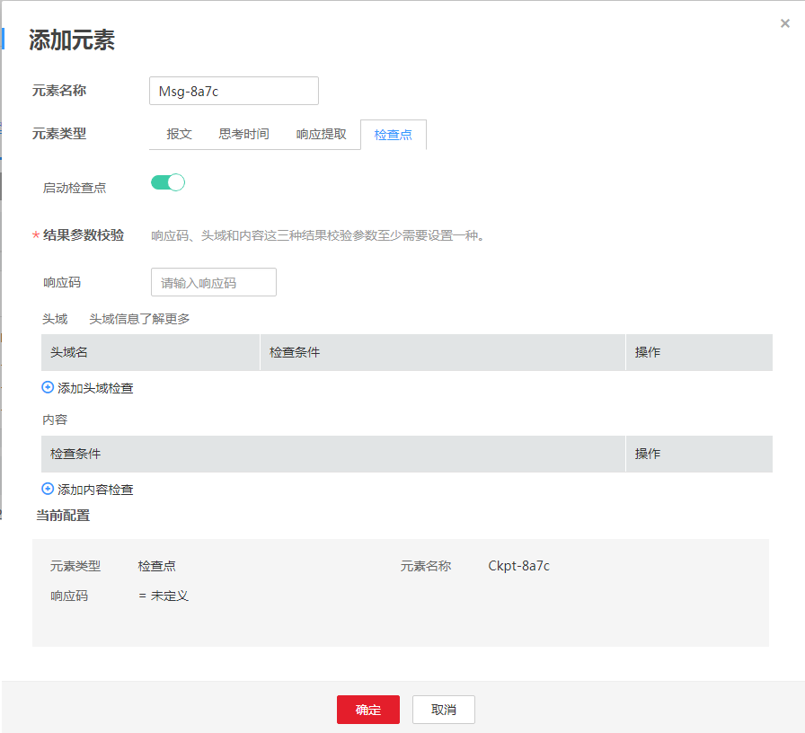

# 添加元素（检查点）

检查点是指通过自定义校验信息来验证服务端的返回内容是否正确。当前仅支持内容比对。

> **说明：**   
>请根据被测应用的实际返回值填写。若不设置，默认检查点为响应码200。  

## 操作步骤

1.  登录CPTS控制台，在左侧导航栏中选择“测试工程“。单击待编辑事务模型工程后的“编辑事务模型“。
2.  在“事务模型“页签中，单击待添加元素事务下的。
3.  元素类型设置为“检查点“。参照[表1](#table5736173244417)设置基本信息，其中带“\*”标志的参数为必填参数。

    **图 1**  元素类型为检查点  
    

    **表 1**  元素类型为检查点

    
    <table><thead align="left"><tr id="row13735932174410"><th class="cellrowborder" valign="top" width="21.34%" id="mcps1.2.3.1.1">
参数

    </th>
    <th class="cellrowborder" valign="top" width="78.66%" id="mcps1.2.3.1.2">
参数说明

    </th>
    </tr>
    </thead>
    <tbody><tr id="row37362325445"><td class="cellrowborder" colspan="2" valign="top" headers="mcps1.2.3.1.1 mcps1.2.3.1.2 ">
* 结果校验参数

    
 说明： 

响应码、头域和内容这三种结果校验参数至少需要设置一种。

    

    </td>
    </tr>
    <tr id="row2736123219447"><td class="cellrowborder" valign="top" width="21.34%" headers="mcps1.2.3.1.1 ">
响应码

    </td>
    <td class="cellrowborder" valign="top" width="78.66%" headers="mcps1.2.3.1.2 ">
响应报文携带的HTTP/HTTPS/TCP/UDP协议响应状态码，通常包括1XX，2XX，3XX，4XX，5XX。具体含义详见各协议规范。

    </td>
    </tr>
    <tr id="row9736132124413"><td class="cellrowborder" valign="top" width="21.34%" headers="mcps1.2.3.1.1 ">
头域

    </td>
    <td class="cellrowborder" valign="top" width="78.66%" headers="mcps1.2.3.1.2 ">
HTTP/HTTPS/TCP/UDP协议的Header部分，具体可以支持的Header详见各协议规范。

    <ol id="ol1273643214441"><li>单击“添加头域检查”。</li><li>设置“头域名”，详情请参见<a href="头域说明.md">头域说明</a>。</li><li>设置检查条件。</li></ol>
    </td>
    </tr>
    <tr id="row18736203234411"><td class="cellrowborder" valign="top" width="21.34%" headers="mcps1.2.3.1.1 ">
内容

    </td>
    <td class="cellrowborder" valign="top" width="78.66%" headers="mcps1.2.3.1.2 ">
HTTP/HTTPS/TCP/UDP协议的Body部分，为HTTP/HTTPS/TCP/UDP协议请求、响应的负载部分。

    <ol id="ol1873617327447"><li>单击“添加内容检查”。</li><li>设置检查条件。</li></ol>
    </td>
    </tr>
    </tbody>
    </table>

4.  配置完成后，单击“确定“。

