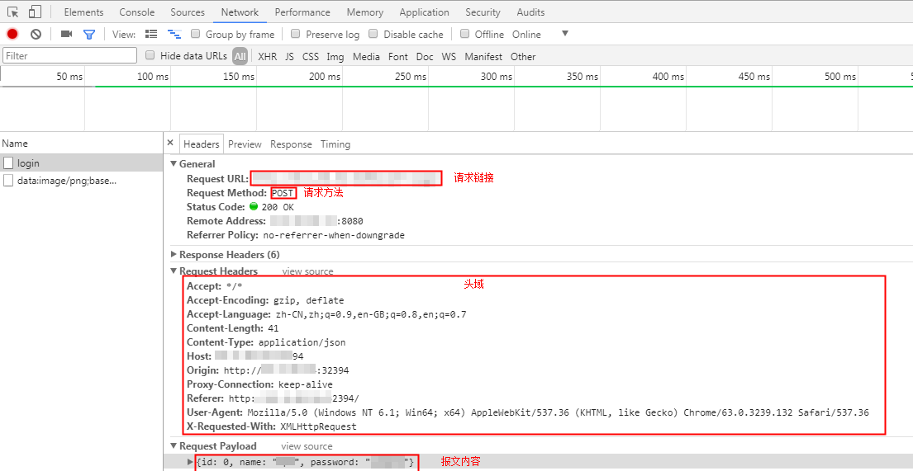

# 添加请求信息（报文）

报文是HTTP/HTTPS/TCP/UDP/WEBSOCKET/RTMP/HLS应用程序之间发送的数据块。这些数据块以一些文本形式的元信息开头，这些信息描述了报文的内容及含义，后面跟着可选的数据部分。这些报文都是在客户端、服务器和代理之间流动。

## 操作步骤

1.  登录CPTS控制台，在左侧导航栏中选择“测试工程“。单击待编辑事务模型工程后的“编辑事务模型“。
2.  在“事务库“页签中，单击待添加请求信息事务下的“添加请求信息”。
3.  请求类型设置为“报文“。
    -   当事务模型为常规事务时，参照[表1](#table178291225164211)设置基本信息。

        **表 1**  请求类型为报文

        
        <table><thead align="left"><tr id="row108261025124213"><th class="cellrowborder" valign="top" width="31.97%" id="mcps1.2.3.1.1">
参数

        </th>
        <th class="cellrowborder" valign="top" width="68.03%" id="mcps1.2.3.1.2">
参数说明

        </th>
        </tr>
        </thead>
        <tbody><tr id="row682611256424"><td class="cellrowborder" valign="top" width="31.97%" headers="mcps1.2.3.1.1 ">
协议类型

        </td>
        <td class="cellrowborder" valign="top" width="68.03%" headers="mcps1.2.3.1.2 ">
请根据业务的协议类型选择。

        </td>
        </tr>
        <tr id="row68261425174218"><td class="cellrowborder" colspan="2" valign="top" headers="mcps1.2.3.1.1 mcps1.2.3.1.2 ">
当协议类型为HTTP和HTTPS时，设置以下参数。

        </td>
        </tr>
        <tr id="row12827122511422"><td class="cellrowborder" valign="top" width="31.97%" headers="mcps1.2.3.1.1 ">
请求方式

        </td>
        <td class="cellrowborder" valign="top" width="68.03%" headers="mcps1.2.3.1.2 ">
GET/POST/PATCH/PUT/DELETE

        </td>
        </tr>
        <tr id="row48058504405"><td class="cellrowborder" valign="top" width="31.97%" headers="mcps1.2.3.1.1 ">
响应超时（ms）

        </td>
        <td class="cellrowborder" valign="top" width="68.03%" headers="mcps1.2.3.1.2 ">
发送请求，等待服务器响应的超时时间。

        
若不设置此参数，默认响应超时时间为5000ms。

        
支持变量输入。

        
 说明： 

变量输入有以下限制：

        <ol id="ol1454285414318"><li>为枚举型变量。</li><li>只能有一个值，且为数字的字符串。</li><li>该数字的范围为20ms到60s。</li></ol>
        

        </td>
        </tr>
        <tr id="row10859152675816"><td class="cellrowborder" valign="top" width="31.97%" headers="mcps1.2.3.1.1 ">
携带cookie

        </td>
        <td class="cellrowborder" valign="top" width="68.03%" headers="mcps1.2.3.1.2 ">
 说明： 

事务下至少已有一个请求信息，添加新的请求信息时进行设置。

        

        <ul id="ul054012286437"><li>自动获取：使用响应设置的cookie。</li><li>手动设置：只使用当前请求信息设置在头域中的cookie。</li></ul>
        </td>
        </tr>
        <tr id="row1182782517423"><td class="cellrowborder" valign="top" width="31.97%" headers="mcps1.2.3.1.1 ">
请求地址

        </td>
        <td class="cellrowborder" valign="top" width="68.03%" headers="mcps1.2.3.1.2 ">
发送请求的URL地址，比如“http://域名/路径”，也可以包含参数的部分“http://域名/路径?key1=value1&amp;key2=value2”。

        
支持变量输入，详情请参见<a href="设置全局变量.md#section1869915538268">支持插入变量</a>。

        </td>
        </tr>
        <tr id="row391514402160"><td class="cellrowborder" valign="top" width="31.97%" headers="mcps1.2.3.1.1 ">
请求参数

        </td>
        <td class="cellrowborder" valign="top" width="68.03%" headers="mcps1.2.3.1.2 ">
请求地址中的参数设置。

        
单击“添加请求参数”，设置“Key”和“Value”，若您不需要添加请求参数，可以单击“删除”，删除请求参数。

        </td>
        </tr>
        <tr id="row1382792510421"><td class="cellrowborder" valign="top" width="31.97%" headers="mcps1.2.3.1.1 ">
头域

        </td>
        <td class="cellrowborder" valign="top" width="68.03%" headers="mcps1.2.3.1.2 ">
请根据压测服务器需要校验或者使用的头域来添加相关头域及内容。CPTS服务没有对必填头域作要求，仅透传用户定义的头域到压测服务器。“头域”的说明请参见<a href="头域说明.md">头域说明</a>。

        
单击“添加头域”，设置“头域”和“值”，若您不需要添加头域信息，单击“删除”，删除报文头域。

        
 说明： 

“请求方式”为“POST”或“PUT”，且“头域”为“Content-Type”时，“值”有三种类型，且支持插入变量：

        <ul id="ul16234350419"><li>自定义：直接在输入框中输入值。</li><li>application/x-www-form-urlencoded：请求体为可添加的键值对形式，值为文本。</li><li>multipart/form-data：请求体为可添加的键值对形式，值可为文本或文件。值为文件时，支持body体导入。</li></ul>
        

        </td>
        </tr>
        <tr id="row19828142584211"><td class="cellrowborder" valign="top" width="31.97%" headers="mcps1.2.3.1.1 ">
报文内容

        </td>
        <td class="cellrowborder" valign="top" width="68.03%" headers="mcps1.2.3.1.2 ">
实体的主体部分包含一个由任意数据组成的数据块，并不是所有的报文都包含实体的主体部分，有时，报文只是以一个CRLF结束。

        
如果已设置全局变量或响应提取的局部变量，可在报文内容部分引用变量，执行压测任务过程会将报文内容中的变量值动态替换为指定的值。

        <ol id="ol7827102534219"><li>在报文内容输入框内输入“$”。</li><li>在“插入变量”对话框中，配置参数。详情请参见<a href="设置全局变量.md#section1869915538268">支持插入变量</a>。</li><li>单击“选择”。</li></ol>
        
 说明： 

请求方式为GET时，不支持报文内容。

        

        </td>
        </tr>
        <tr id="row78281525144218"><td class="cellrowborder" colspan="2" valign="top" headers="mcps1.2.3.1.1 mcps1.2.3.1.2 ">
当协议类型为TCP时，设置以下参数。

        </td>
        </tr>
        <tr id="row08281025114210"><td class="cellrowborder" valign="top" width="31.97%" headers="mcps1.2.3.1.1 ">
IP

        </td>
        <td class="cellrowborder" valign="top" width="68.03%" headers="mcps1.2.3.1.2 ">
发送请求到被测服务器的IP地址。

        </td>
        </tr>
        <tr id="row15828102504217"><td class="cellrowborder" valign="top" width="31.97%" headers="mcps1.2.3.1.1 ">
端口号

        </td>
        <td class="cellrowborder" valign="top" width="68.03%" headers="mcps1.2.3.1.2 ">
发送请求到被测服务器的端口号。

        </td>
        </tr>
        <tr id="row982815259422"><td class="cellrowborder" valign="top" width="31.97%" headers="mcps1.2.3.1.1 ">
连接超时（ms）

        </td>
        <td class="cellrowborder" valign="top" width="68.03%" headers="mcps1.2.3.1.2 ">
发起连接，服务器无响应的超时时间。

        </td>
        </tr>
        <tr id="row78281225124216"><td class="cellrowborder" valign="top" width="31.97%" headers="mcps1.2.3.1.1 ">
返回超时（ms）

        </td>
        <td class="cellrowborder" valign="top" width="68.03%" headers="mcps1.2.3.1.2 ">
连接建立成功，等待响应返回的超时时间。

        </td>
        </tr>
        <tr id="row20828192574218"><td class="cellrowborder" valign="top" width="31.97%" headers="mcps1.2.3.1.1 ">
连接设置

        </td>
        <td class="cellrowborder" valign="top" width="68.03%" headers="mcps1.2.3.1.2 "><ul id="ul1082872534212"><li>重复使用连接：请求响应完成后，不断开连接，复用连接发送接收下一次请求响应。</li><li>关闭连接：每次完成请求响应完成后，断开连接，下一次重新建立连接。</li></ul>
        </td>
        </tr>
        <tr id="row9829425104212"><td class="cellrowborder" valign="top" width="31.97%" headers="mcps1.2.3.1.1 ">
返回结束设置

        </td>
        <td class="cellrowborder" valign="top" width="68.03%" headers="mcps1.2.3.1.2 ">
通过返回结束设置，来判断本次请求的响应内容是否已经接收完成。

        <ul id="ul78286257421"><li>返回数据长度：设置返回数据的长度，单位字节。当接收到此长度的响应内容时，数据接收完成。</li><li>结束符：设置返回数据的结束标记。当接收到结束符时，数据接收完成 。
 说明： 

结束符建议设置一个唯一的结束标记，若设置的结束符在响应内容中存在多个，当接收到第一个结束符时，就认为响应内容已经接收完成，这样接收的响应数据就不完整。

        

        </li></ul>
        </td>
        </tr>
        <tr id="row982982515428"><td class="cellrowborder" valign="top" width="31.97%" headers="mcps1.2.3.1.1 ">
报文内容

        </td>
        <td class="cellrowborder" valign="top" width="68.03%" headers="mcps1.2.3.1.2 ">
实体的主体部分包含一个由任意数据组成的数据块，并不是所有的报文都包含实体的主体部分，有时，报文只是以一个CRLF结束。

        
内容格式：请根据被测服务器的业务请求内容，选择“字符串”或“16进制码流”。

        
如果已设置全局变量或响应提取的局部变量，可在报文内容部分引用变量，执行压测任务过程会将报文内容中的变量值动态替换为指定的值。

        <ol id="ol1982992524219"><li>在报文内容输入框内输入“$”。</li><li>在“插入变量”对话框中，配置参数。详情请参见<a href="设置全局变量.md#section1869915538268">支持插入变量</a>。</li><li>单击“选择”。</li></ol>
        </td>
        </tr>
        <tr id="row1442153264416"><td class="cellrowborder" colspan="2" valign="top" headers="mcps1.2.3.1.1 mcps1.2.3.1.2 ">
当协议类型为UDP时，设置以下参数。

        </td>
        </tr>
        <tr id="row61201535134415"><td class="cellrowborder" valign="top" width="31.97%" headers="mcps1.2.3.1.1 ">
IP

        </td>
        <td class="cellrowborder" valign="top" width="68.03%" headers="mcps1.2.3.1.2 ">
发送请求到被测服务器的IP地址。

        </td>
        </tr>
        <tr id="row181450378449"><td class="cellrowborder" valign="top" width="31.97%" headers="mcps1.2.3.1.1 ">
端口号

        </td>
        <td class="cellrowborder" valign="top" width="68.03%" headers="mcps1.2.3.1.2 ">
发送请求到被测服务器的端口号。

        </td>
        </tr>
        <tr id="row354239204412"><td class="cellrowborder" valign="top" width="31.97%" headers="mcps1.2.3.1.1 ">
返回结束设置

        </td>
        <td class="cellrowborder" valign="top" width="68.03%" headers="mcps1.2.3.1.2 ">
通过返回结束设置，来判断本次请求的响应内容是否已经接收完成。

        <ul id="ul238944312461"><li>返回数据长度：设置返回数据的长度，单位字节。当接收到此长度的响应内容时，数据接收完成。</li><li>结束符：设置返回数据的结束标记。当接收到结束符时，数据接收完成 。
 说明： 

结束符建议设置一个唯一的结束标记，若设置的结束符在响应内容中存在多个，当接收到第一个结束符时，就认为响应内容已经接收完成，这样接收的响应数据就不完整。

        

        </li></ul>
        </td>
        </tr>
        <tr id="row18718194214456"><td class="cellrowborder" valign="top" width="31.97%" headers="mcps1.2.3.1.1 ">
报文内容

        </td>
        <td class="cellrowborder" valign="top" width="68.03%" headers="mcps1.2.3.1.2 ">
实体的主体部分包含一个由任意数据组成的数据块，并不是所有的报文都包含实体的主体部分，有时，报文只是以一个CRLF结束。

        
内容格式：请根据被测服务器的业务请求内容，选择“字符串”或“16进制码流”。

        
如果已设置全局变量或响应提取的局部变量，可在报文内容部分引用变量，执行压测任务过程会将报文内容中的变量值动态替换为指定的值。

        <ol id="ol1316782564615"><li>在报文内容输入框内输入“$”。</li><li>在“插入变量”对话框中，配置参数。详情请参见<a href="设置全局变量.md#section1869915538268">支持插入变量</a>。</li><li>单击“选择”。</li></ol>
        </td>
        </tr>
        <tr id="row48302532017"><td class="cellrowborder" colspan="2" valign="top" headers="mcps1.2.3.1.1 mcps1.2.3.1.2 ">
当协议类型为WEBSOCKET时，设置以下参数。

        
 说明： 

“请求类型”仅支持“报文”。

        

        </td>
        </tr>
        <tr id="row19573145114118"><td class="cellrowborder" valign="top" width="31.97%" headers="mcps1.2.3.1.1 ">
连接超时（ms）

        </td>
        <td class="cellrowborder" valign="top" width="68.03%" headers="mcps1.2.3.1.2 ">
发起连接，服务器无响应的超时时间。

        </td>
        </tr>
        <tr id="row930617571316"><td class="cellrowborder" valign="top" width="31.97%" headers="mcps1.2.3.1.1 ">
返回超时（ms）

        </td>
        <td class="cellrowborder" valign="top" width="68.03%" headers="mcps1.2.3.1.2 ">
连接建立成功，等待响应返回的超时时间。

        </td>
        </tr>
        <tr id="row165113561408"><td class="cellrowborder" valign="top" width="31.97%" headers="mcps1.2.3.1.1 ">
请求连接

        </td>
        <td class="cellrowborder" valign="top" width="68.03%" headers="mcps1.2.3.1.2 ">
发送请求的URL地址，比如“ws://域名/路径”，支持加密请求，即“wss://域名/路径”。

        </td>
        </tr>
        <tr id="row911917318351"><td class="cellrowborder" valign="top" width="31.97%" headers="mcps1.2.3.1.1 ">
连接设置

        </td>
        <td class="cellrowborder" valign="top" width="68.03%" headers="mcps1.2.3.1.2 "><ul id="ul930762210357"><li>重复使用连接：请求响应完成后，不断开连接，复用连接发送接收下一次请求响应。</li><li>关闭连接：每次完成请求响应完成后，断开连接，下一次重新建立连接。</li></ul>
        </td>
        </tr>
        <tr id="row147041320133919"><td class="cellrowborder" valign="top" width="31.97%" headers="mcps1.2.3.1.1 ">
调试

        </td>
        <td class="cellrowborder" valign="top" width="68.03%" headers="mcps1.2.3.1.2 ">
更多内容请参见<a href="如何使用WebSocket协议进行压测.md">如何使用WebSocket协议进行压测？</a>

        </td>
        </tr>
        </tbody>
        </table>

    -   当事务类型为视频流事务时，设置以下参数。

        **表 2**  添加请求信息

        
        <table><thead align="left"><tr id="row9737418153817"><th class="cellrowborder" valign="top" width="50%" id="mcps1.2.3.1.1">
参数

        </th>
        <th class="cellrowborder" valign="top" width="50%" id="mcps1.2.3.1.2">
参数说明

        </th>
        </tr>
        </thead>
        <tbody><tr id="row92681038123918"><td class="cellrowborder" valign="top" width="50%" headers="mcps1.2.3.1.1 ">
播放类型

        </td>
        <td class="cellrowborder" valign="top" width="50%" headers="mcps1.2.3.1.2 "><ul id="ul299311461407"><li>点播</li><li>直播</li></ul>
        </td>
        </tr>
        <tr id="row1738151863820"><td class="cellrowborder" valign="top" width="50%" headers="mcps1.2.3.1.1 ">
视频流模式

        </td>
        <td class="cellrowborder" valign="top" width="50%" headers="mcps1.2.3.1.2 ">
仅当“播放类型”为<strong id="b4610153812446">“</strong>直播<strong id="b1161043816449">”</strong>时需要设置，目前仅支持“拉流”测试。

        </td>
        </tr>
        <tr id="row16738718153816"><td class="cellrowborder" valign="top" width="50%" headers="mcps1.2.3.1.1 ">
请求连接

        </td>
        <td class="cellrowborder" valign="top" width="50%" headers="mcps1.2.3.1.2 ">
发送请求的URL地址，暂支持RTMP和HLS两种流媒体协议的拉流地址。

        
支持变量输入，详情请参见<a href="设置全局变量.md#section1869915538268">支持插入变量</a>。

        </td>
        </tr>
        </tbody>
        </table>

4.  配置完成后，单击“确定“。

## 报文如何填写

报文通俗的解释就是说平时我们在网站上面的所有单击操作，都是通过编辑成满足协议规范带有用户请求内容格式的码流传送给不同的第三方，最后得到一个正确或者失败响应的一个过程。可以通过在操作时按“F12”，或抓包工具（例如wireshark）查看报文是怎么请求的，然后根据实际业务在压测的报文中填写。

例如，模拟登录请求的POST方法，对应的请求连接、请求方法、头域、报文内容如下图所示。

**图 1**  模拟登录请求的POST方法  

