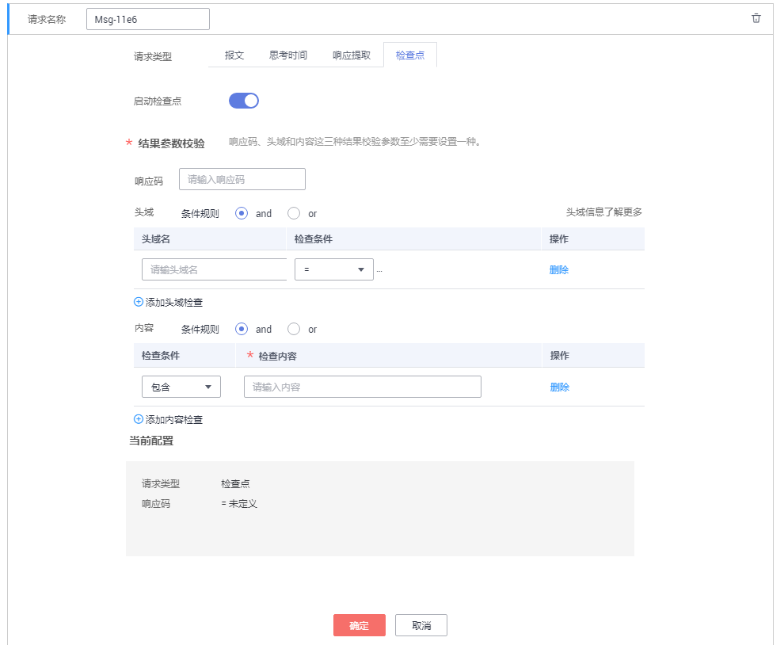

# 添加请求信息（检查点）

检查点是指通过自定义校验信息来验证服务端的返回内容是否正确。针对不同的协议类型，检查点支持比对的内容不同，HTTP/HTTPS支持响应码、头域和内容校验，TCP/UDP仅支持内容校验。

> **说明：** 
>请根据被测应用的实际返回值填写。若不设置，默认检查点为响应码2_xx_。

## 操作步骤

1.  登录CPTS控制台，在左侧导航栏中选择“CPTS测试工程“。
2.  在待编辑CPTS测试工程所在行，单击“编辑测试任务”。
3.  在“测试任务”页签中，选择待添加请求信息的用例，单击“添加请求”。
4.  请求组成设置为“检查点“，参照[表1](#table5736173244417)设置基本信息。

    **图 1**  检查点  
    

    **表 1**  检查点参数

    
    <table><thead align="left"><tr id="row13735932174410"><th class="cellrowborder" valign="top" width="21.33%" id="mcps1.2.3.1.1">
参数

    </th>
    <th class="cellrowborder" valign="top" width="78.67%" id="mcps1.2.3.1.2">
参数说明

    </th>
    </tr>
    </thead>
    <tbody><tr id="row2990106202419"><td class="cellrowborder" valign="top" width="21.33%" headers="mcps1.2.3.1.1 ">
启动检查点

    </td>
    <td class="cellrowborder" valign="top" width="78.67%" headers="mcps1.2.3.1.2 ">
启用检查点后，通过自定义校验信息来验证服务端的返回内容是否正确。

    </td>
    </tr>
    <tr id="row2736123219447"><td class="cellrowborder" valign="top" width="21.33%" headers="mcps1.2.3.1.1 ">
响应码

    </td>
    <td class="cellrowborder" valign="top" width="78.67%" headers="mcps1.2.3.1.2 ">
仅在“报文”页签中“协议类型”为“HTTP”或者“HTTPS”时，需要设置。

    
响应报文携带的HTTP/HTTPS协议响应状态码，通常包括1XX，2XX，3XX，4XX和5XX。具体含义详见各协议规范。

    </td>
    </tr>
    <tr id="row9736132124413"><td class="cellrowborder" valign="top" width="21.33%" headers="mcps1.2.3.1.1 ">
头域

    </td>
    <td class="cellrowborder" valign="top" width="78.67%" headers="mcps1.2.3.1.2 ">
仅在“报文”页签中“协议类型”为“HTTP”或者“HTTPS”时，需要设置。

    
HTTP/HTTPS协议的Header部分，具体可以支持的Header详见各协议规范。

    <ol id="ol1273643214441"><li>单击“添加头域检查”。</li><li>设置“头域名”，详情请参见<a href="头域说明.md">头域说明</a>。</li><li>设置检查条件。</li></ol>
    </td>
    </tr>
    <tr id="row18736203234411"><td class="cellrowborder" valign="top" width="21.33%" headers="mcps1.2.3.1.1 ">
内容

    </td>
    <td class="cellrowborder" valign="top" width="78.67%" headers="mcps1.2.3.1.2 ">
HTTP/HTTPS/TCP/UDP协议的Body部分，为HTTP/HTTPS/TCP/UDP协议请求、响应的负载部分。

    <ol id="ol1873617327447"><li>单击“添加内容检查”。</li><li>设置检查条件。</li></ol>
    </td>
    </tr>
    <tr id="row163031322144620"><td class="cellrowborder" valign="top" width="21.33%" headers="mcps1.2.3.1.1 ">
条件规则

    </td>
    <td class="cellrowborder" valign="top" width="78.67%" headers="mcps1.2.3.1.2 "><ul id="ul14825538174618"><li>and：需要全部符合才能检查通过。</li><li>or：只需一条符合即可检查通过。</li></ul>
    </td>
    </tr>
    </tbody>
    </table>

5.  配置完成后，单击“确定“。

