# 电商测试方案

本教程指导您通过“电商测试方案“一键式购买测试方案，快速体验云性能测试服务，不必从零开始，一键式创建压测所需资源和测试工程，简化压测的操作。

## 购买测试方案

1.  登录CPTS控制台，在“总览”页面，单击“**一键式购买测试方案 \> 电商测试方案**”后的“开始部署”。
2.  在“电商测试方案”页面，单击“优惠券”后的“领取并部署”。

    代金券每个用户只能领取一次。领取的代金券可抵扣由CPTS创建节点的费用和云性能测试服务的费用。

    -   CPTS代金券：用于抵扣云性能测试服务产生的费用，超出代金券部分由**云性能测试服务**以套餐包和按需付费两种计费方式进行结算。
    -   通用代金券：用于抵扣管理节点、执行节点和部署待压测应用的节点资源所使用的费用，超出代金券部分由对应的**弹性云服务器**服务以按需付费的方式进行结算，计费信息请参见[产品价格详情](http://support.huaweicloud.com/pro_price/index.html)。

3.  一键式部署电商测试方案需要一段时间，请耐心等待。状态为“运行中”，表明部署成功。

    **图 1**  电商测试方案  
    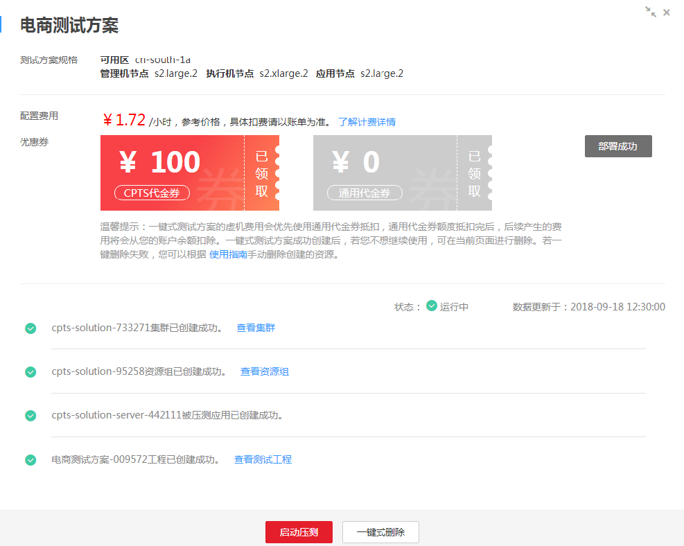

## 查看部署结果

-   **查看集群**

    部署性能测试服务的执行集群，预计需要15分钟。集群创建成功后，可查看到如下信息：

    在**AOS控制台**，可查看到以“cpts-k8scluster-_序列号_”命名的堆栈。

    **图 2**  查看执行集群  
    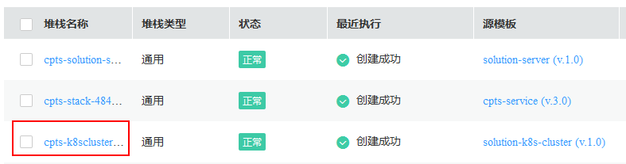

    在**CCE控制台**，可查看到以“cpts-solution-_序列号_”命名的虚拟机集群。集群中包含管理节点、执行节点和部署待压测应用的节点，且节点的规格为页面中**测试方案规格**展示的规格。

    **图 3**  查看已创建的虚拟机集群  
    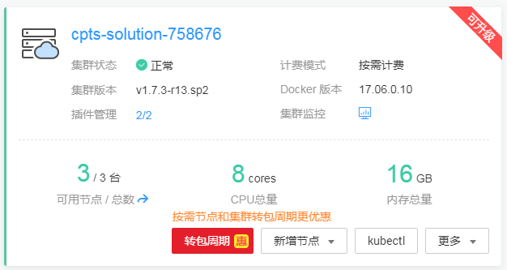

    **图 4**  查看集群中节点  
    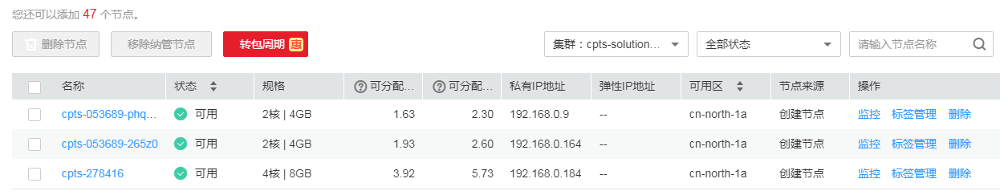

    > **说明：**   
    >CPTS会根据CCE中可用的节点资源来选择可用区和节点规格，节点规格的选择范围为：s2.large.2（2U4G）、s2.xlarge.2（4U8G）、s3.large.2（2U4G）和s3.xlarge.2（4U8G）。  

-   **查看资源组**

    创建用于执行压测任务的资源组，预计需要3分钟。创建成功后，可查看到如下信息：

    在**CPTS控制台**，进入“测试资源”，可查看到已创建好的资源组，且包含管理节点和执行节点。

    **图 5**  查看资源组  
    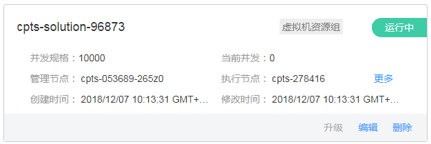

    在**AOS控制台**，可查看到以“cpts-stack-_序列号_”命名的堆栈。

    **图 6**  查看cpts-stack堆栈  
    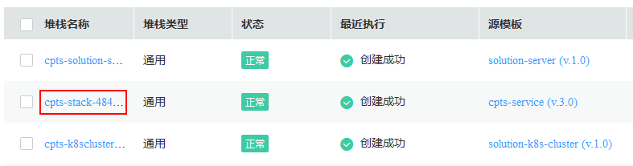

-   **查看应用**

    创建应用，预计需要2分钟，应用创建成功后，可查看到如下信息：

    在**AOS控制台**，可查看到以cpts-solution-server-_序列号_命名的堆栈。

    **图 7**  查看cpts-solution-server堆栈  
    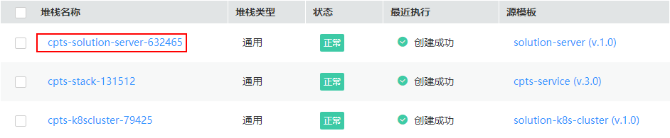

    在**CCE控制台**，可查看到一个已创建好的应用（该示例中为shoppingmall），且该应用已部署到被压测应用的节点中。

    **图 8**  查看应用  
    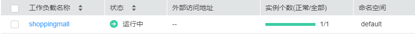

-   **查看测试工程**

    执行压测的测试工程包含测试工程、事务和测试任务。创建成功后，可查看到如下信息：

    在**CPTS控制台**，进入“测试工程 \> 事务模型”，可查看到对应的事务模型。

    **图 9**  事务模型  
    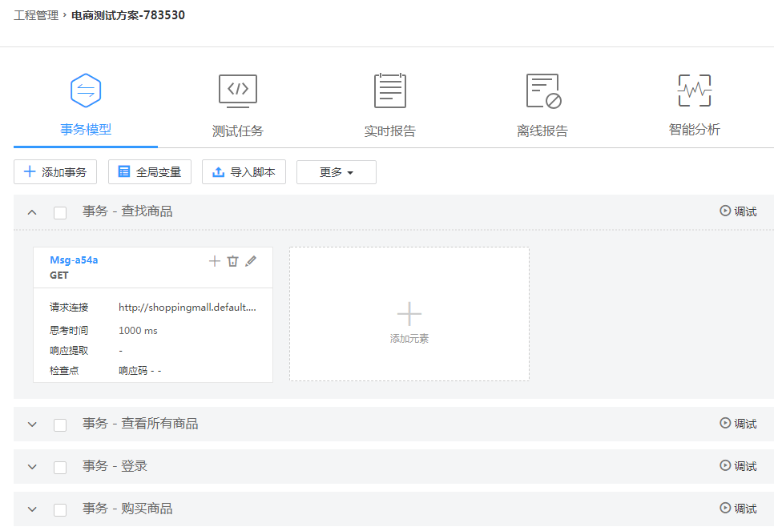

    在**CPTS控制台**，进入“测试工程 \> 测试任务”，可查看到对应的测试任务。

    **图 10**  测试任务  
    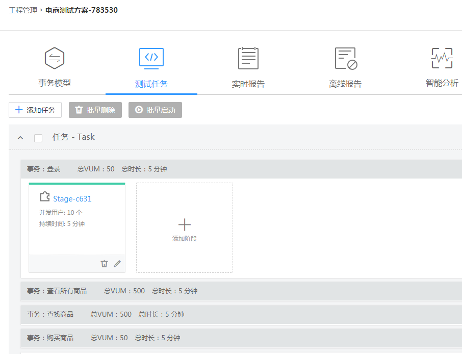

## 启动压力测试

1.  [购买测试方案](#section10359212142610)执行成功后，单击“启动压测”。
2.  单击“查看报告”，在“测试工程 \> 实时报告”中可以查看实时测试报告。

    **图 11**  查看实时测试报告  
    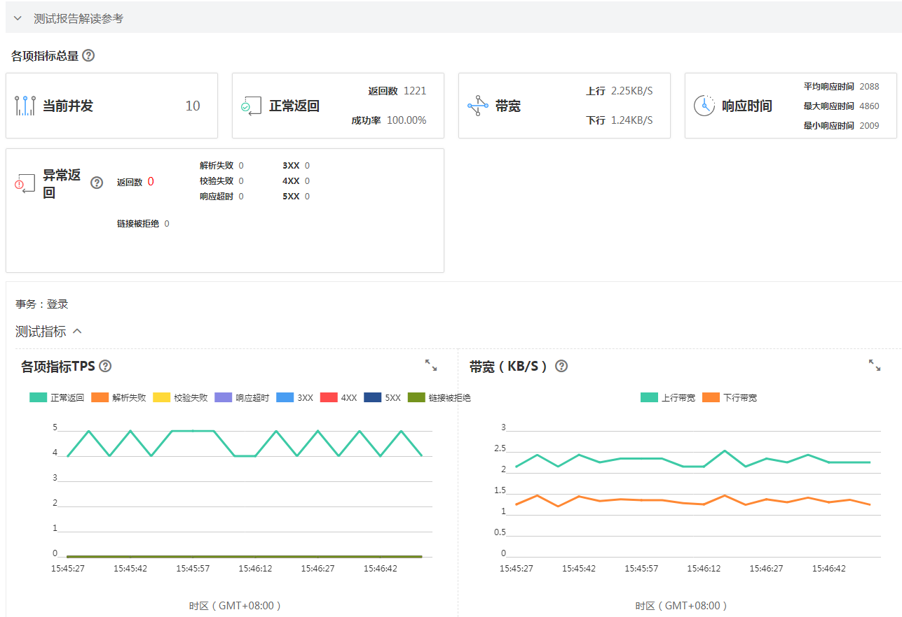

## 一键式删除

体验一键式创建测试方案后，如果您不想继续使用此测试方案，建议您进行一键式删除，清理资源。

1.  登录CPTS控制台，在“总览”页面，单击“**一键式购买测试方案 \> 电商测试方案**”后的“查询进度”。
2.  在“电商测试方案”页面，单击“一键式删除”。
3.  单击“确定”，删除已部署的测试方案。

    删除顺序如下：删除资源组  \> 删除被压测应用 \> 删除集群。

    > **说明：**   
    >测试工程不产生费用，所以**一键式删除**不会删除测试工程。如果需要删除测试工程，请参照[管理测试工程](管理测试工程.md)进行删除。  

## 删除资源组

一键式删除测试方案时，若删除资源组失败，可手动进行删除。

1.  登录CPTS控制台，在左侧导航栏中选择“测试资源”。
2.  在测试资源列表中，单击名称为“cpts-solution-_序列号_”资源组中的“删除”。
3.  根据系统提示执行删除操作。

## 删除压测应用

一键式删除测试方案时，若删除压测应用失败，可手动进行删除。

1.  登录AOS控制台，在左侧导航栏中选择“我的堆栈”。
2.  在堆栈列表中，选中一键式创建成功的堆栈（以cpts-solution-server-_序列号_命名的堆栈），单击“删除堆栈”。
3.  根据系统提示执行删除操作。
4.  （可选）若堆栈状态一直显示为“删除中”，最后提示超时，且堆栈状态显示为“异常”时，可尝试通过“强制删除”来删除该堆栈。

    强制删除后，执行以下步骤查看是否删除成功。

    1.  登录CCE控制台，在左侧导航栏中选择“工作负载 \> 无状态（Deployment）”。
    2.  查看是否存在一键式创建成功的工作负载（shoppingmall）。
        -   若不存在，表明删除成功。
        -   若存在，请选中该工作负载，单击“更多 \> 删除”。根据系统提示进行删除操作。

## 删除集群

一键式删除测试方案时，若删除集群失败，可手动进行删除。

1.  登录AOS控制台，在左侧导航栏中选择“我的堆栈”。
2.  在堆栈列表中，选中一键式创建成功的堆栈（以cpts-k8scluster-_序列号_命名的堆栈），单击“删除堆栈”。
3.  根据系统提示执行删除操作。
4.  （可选）若堆栈状态一直显示为“删除中”，最后提示超时，且堆栈状态显示为“异常”时，可尝试通过“强制删除”来删除该堆栈。

    强制删除后，执行以下步骤查看是否删除成功。

    1.  登录CCE控制台。
    2.  在左侧导航栏中，单击“资源管理 \> 集群管理“。
    3.  查看是否存在一键式创建成功的集群（名称为cpts-solution-_序列号_）。
        -   若不存在，表明删除成功。
        -   若存在，请单击该集群后的“更多 \> 删除集群“。根据系统提示进行删除操作。

