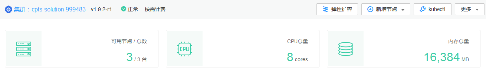
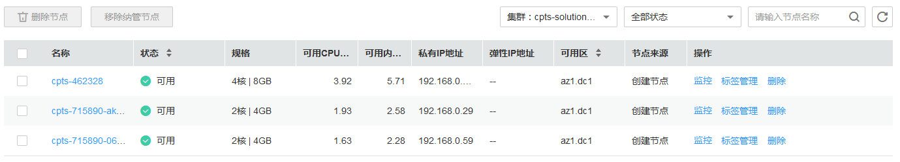
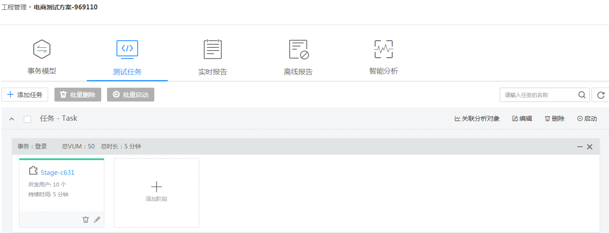

# 电商测试方案

本教程指导您通过“电商测试方案“一键式购买测试方案，快速体验云性能测试服务，不必从零开始，一键式创建压测所需资源和测试工程，简化压测的操作。

## 前提条件

-   确保已对AOS（应用编排服务）和CCE（云容器引擎）进行授权。

    登录[AOS控制台](https://console.huaweicloud.com/aos)和[CCE控制台](https://console.huaweicloud.com/cce2.0)，根据界面提示进行授权。

-   确保已创建秘钥对。若无秘钥对，按照以下步骤创建。
    1.  登录华为云控制台https://console.huaweicloud.com。
    2.  选择“计算 \> 弹性云服务器”。
    3.  选择左侧导航中的“密钥对”，单击“创建密钥对”。
    4.  输入密钥对名称后，单击“确定”。
    5.  在弹出的对话框中，单击“确定”。

        请根据提示信息，查看并保存私钥。为保证安全，私钥只能下载一次，请妥善保管，否则将无法登录节点。

-   确保VPC配额足够。
-   确保CCE集群配额足够 。

## 购买测试方案

1.  登录CPTS控制台，单击左侧导航栏的“总览”，进入总览页面。
2.  在**电商测试方案**后单击“开始部署”，进入**电商测试方案**窗口。
3.  单击优惠券后的“领取并部署”，领取的代金券可抵扣由CPTS创建的节点的费用和云性能测试服务的费用。

    -   CPTS代金券：用于抵扣云性能测试服务产生的费用，超出代金券部分由**云性能测试服务**以套餐包和按需付费两种计费方式进行结算，具体计费信息，参见[计费说明](https://support.huaweicloud.com/pg-cpts/cpts_pg_0001.html)。
    -   通用代金券：用于抵扣管理节点、执行节点和部署待压测应用的节点资源所使用的费用，超出代金券部分由对应的**弹性云服务器**服务以按需付费的方式进行结算，具体计费信息，参见[产品价格详情](http://support.huaweicloud.com/pro_price/index.html)。

    > **说明：**   
    >代金券，每个用户只能领取一次。  

4.  CPTS系统一键式部署电商测试方案。

    > **说明：**   
    >-   创建过程中，如果单击窗口右上角的，电商测试方案继续部署，单击**电商测试方案**后单击“查看进度”，查看部署详情。  
    >-   创建过程中，如果单击窗口右上角的，会在CPTS系统页面右下角以小窗口的形式展示部署详情，查看部署详情的同时您可继续使用CPTS服务。  
    >-   一键式创建成功的集群、资源组、应用和测试工程为启动压测需要的一个完整的结构体，删除任一资源均会导致启动压测失败。您可以根据业务需要修改结构体中的资源。  
    >-   如果一键式部署电商测试方案失败，需一键式删除测试方案后，方可重新部署电商测试方案。  

    **图 1**  电商测试方案  
    

    创建部署性能测试服务的执行集群，预计需要15分钟，请耐心等待。

    1.  创建用于执行压测任务的资源组，预计需要3分钟，请耐心等待。

        创建成功后，可在CPTS测试资源中查看到一个已创建好的资源组，包含[\#cpts\_01\_0042/li1872134171320](#li1872134171320)中的管理节点和执行节点。

        **图 2**  查看资源组  
        

        并在**AOS控制台**可查看到以cpts-stack-_序列号_命名的堆栈。

        **图 3**  查看cpts-stack堆栈  
        

    2.  创建应用，预计需要2分钟，请耐心等待。

        应用创建成功后，在**AOS控制台**可查看到以cpts-solution-server-_序列号_命名的堆栈。

        **图 4**  查看cpts-solution-server堆栈  
        

        且在**CCE控制台**中可查看到一个已创建好的应用（该示例中为nginx应用），且该应用部署到[\#cpts\_01\_0042/li1872134171320](#li1872134171320)中被压测应用节点中

        **图 5**  查看应用  
        

    3.  创建执行压测的测试工程，包含测试工程、事务和测试任务。预计需要1分钟，请耐心等待。

        **图 6**  事务模型  
        

        **图 7**  测试任务  
        

    集群创建成功后，在**AOS控制台**可查看到以cpts-k8scluster-_序列号_命名的堆栈。

    **图 8**  查看cpts-k8scluster堆栈  
    

    在**CCE控制台**中可查看到一个已创建好的虚拟机集群（以cpts-solution-_序列号_命名的虚拟机集群），并包含管理节点、执行节点和部署待压测应用的节点，节点的规格为页面中**测试方案规格**展示的规格。

    **图 9**  查看集群信息  
    

    **图 10**  查看节点信息  
    

    > **说明：**   
    >CPTS会根据CCE中可用的节点资源来选择可用区和节点规格，节点规格的选择范围为：s2.large.2（2U4G）、s2.xlarge.2（4U8G）、s3.large.2（2U4G）和s3.xlarge.2（4U8G）。  

    1.  创建用于执行压测任务的资源组，预计需要3分钟，请耐心等待。

        创建成功后，可在CPTS测试资源中查看到一个已创建好的资源组，包含[\#cpts\_01\_0042/li1872134171320](#li1872134171320)中的管理节点和执行节点。

        **图 11**  查看资源组  
        

        并在**AOS控制台**可查看到以cpts-stack-_序列号_命名的堆栈。

        **图 12**  查看cpts-stack堆栈  
        

    2.  创建应用，预计需要2分钟，请耐心等待。

        应用创建成功后，在**AOS控制台**可查看到以cpts-solution-server-_序列号_命名的堆栈。

        **图 13**  查看cpts-solution-server堆栈  
        

        且在**CCE控制台**中可查看到一个已创建好的应用（该示例中为nginx应用），且该应用部署到[\#cpts\_01\_0042/li1872134171320](#li1872134171320)中被压测应用节点中

        **图 14**  查看应用  
        

    3.  创建执行压测的测试工程，包含测试工程、事务和测试任务。预计需要1分钟，请耐心等待。

        **图 15**  新建事务模型  
        

        **图 16**  新建测试任务  
        

5.  单击“启动”。

    单击“查看报告”，您可以查看实时测试报告。

    **图 17**  查看实时测试报告  
    

## 一键式删除

体验一键式创建测试方案后，如果您不想继续使用此测试方案，建议您进行一键式删除，清理资源。

1.  登录CPTS控制台，单击左侧导航栏的“总览”，进入总览页面。
2.  在**电商测试方案**后单击“查询进度”，进入电商测试方案页面。
3.  单击“一键式删除”，一键式删除测试方案，删除顺序如下：

    1.  删除资源组。
    2.  删除被压测应用。
    3.  删除集群。

    > **说明：**   
    >因测试工程不产生费用，所以**一键式删除**不删除测试工程。如果您想删除测试工程，请参照[管理测试工程](管理测试工程.md)进行删除。  

4.  （可选）如果一键式删除测试方案，删除资源组失败，执行以下步骤手动删除。
    1.  登录CPTS控制台。
    2.  选择左侧导航栏的“测试资源“，查询到一键式创建的资源组（例如：cpts-solution-_序列号_），参照[删除资源组](删除资源组.md)手动删除资源组。

5.  （可选）如果一键式删除测试方案，删除压测应用失败，执行以下步骤手动删除。
    1.  登录**AOS控制台**。
    2.  在左侧导航栏中，单击“我的堆栈”。
    3.  在堆栈列表中，选中一键式创建成功的的堆栈（以cpts-solution-server-_序列号_命名的堆栈），单击“删除堆栈”。
    4.  在出现的对话框中，单击“确定”。
    5.  （可选）若堆栈状态一直显示为“删除中”，最后提示超时，且堆栈状态显示为“异常”时，可尝试通过“强制删除”来删除该堆栈。

        强制删除后，执行以下步骤查看是否删除成功。

        1.  登录**CCE控制台**。
        2.  单击左侧导航栏的“工作负载”。
        3.  查看是否存在一键式创建成功的工作负载（例如，cpts-server），

            若不存在，则删除成功。

            若存在，则选中该工作负载，单击“删除工作负载”。根据系统提示进行删除操作。

6.  （可选）如果一键式删除测试方案，删除集群失败，执行以下步骤手动删除。
    1.  登录**AOS控制台**。
    2.  在左侧导航栏中，单击“我的堆栈”。
    3.  在堆栈列表中，选中一键式创建成功的的堆栈（以cpts-k8scluster-_序列号_命名的堆栈），单击“删除堆栈”。
    4.  在出现的对话框中，单击“确定”。
    5.  （可选）若堆栈状态一直显示为“删除中”，最后提示超时，且堆栈状态显示为“异常”时，可尝试通过“强制删除”来删除该堆栈。

        强制删除后，执行以下步骤查看是否删除成功。

        1.  登录**CCE控制台**。
        2.  单击左侧导航栏的“资源管理 \> 虚拟机集群“。
        3.  查看是否存在一键式创建成功的集群（cpts-solution-_序列号_命名的虚拟机集群）。

            若不存在，则删除成功。

            若存在，则单击该集群后的“更多 \> 删除集群“。根据系统提示进行删除操作。

