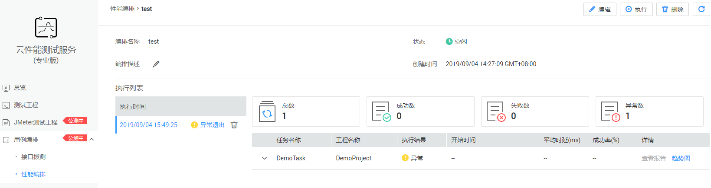

# 管理性能编排

## 修改性能编排信息

1.  登录CPTS控制台，在左侧导航栏中选择“用例编排 \> 性能编排“，单击待修改信息的性能编排后操作栏中的“更多 \> 编辑“。
2.  在打开的“编辑性能编排“页面中可修改性能编排配置。配置方法和步骤与创建性能编排一致，具体请参见[创建性能编排](创建性能编排.md)。
3.  修改配置后单击“完成“即可。

## 查看报告

1.  登录CPTS控制台，在左侧导航栏中选择“用例编排 \> 性能编排“，单击待查看信息的性能编排名称或单击操作栏中的“查看报告“。
2.  在打开的性能编排工程详情页中，可查看性能编排执行详情。

    **图 1**  性能编排工程详情  
    

3.  性能编排详情页信息如下：
    -   单击“编排描述“后的，可修改该性能编排的描述信息。
    -   在执行列表中可查看本性能编排执行过的时间、执行状态，也可删除执行结果，删除后无法恢复，请谨慎操作。
    -   单击右上角的“编辑“、“执行“、“删除“，可对本性能编排进行编辑、执行和删除操作。
    -   可查看本性能编排工程的执行总数、成功数、失败数、异常数和总延时情况，单击任务后的“查看报告“可查看任务执行详情，执行异常的任务无法查看报告。单击任务后的“趋势图“可查看平均时延趋势图和成功率趋势图。

