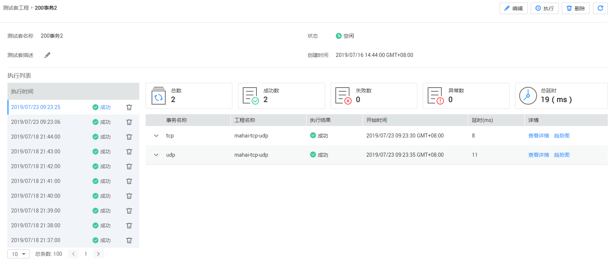

# 管理接口拨测

## 编辑接口拨测

1.  登录CPTS控制台，在左侧导航栏中选择“用例编排\>接口拨测“，单击待修改信息的测试套后操作栏中的“更多 \> 编辑“。
2.  在打开的“编辑接口拨测“页面中可修改接口拨测配置。配置方法和步骤与创建接口拨测一致，详细请参见[创建接口拨测](创建接口拨测.md)。
3.  修改配置后单击“完成“即可。

## 查看报告

1.  登录CPTS控制台，在左侧导航栏中选择“用例编排 \> 接口拨测“，单击待查看信息的测试套名称或单击操作栏中的“查看报告“。
2.  在打开的测试套工程详情页中，可查看测试套执行详情。

    **图 1**  测试套工程详情  
    

3.  测试套详情页信息如下：
    -   单击“测试套描述“后的，可修改该测试套的描述信息。
    -   在执行列表中可查看本测试套执行过的时间、执行状态，也可删除执行结果，删除后无法恢复，请谨慎操作。
    -   单击右上角的“编辑“、“执行“、“删除“，可对本测试套进行编辑、执行和删除操作。
    -   可查看本测试套工程的执行总数、成功数、失败数、异常数和总延时情况，单击事务后的“查看详情“和“趋势图“可查看事务执行详情和时延趋势图。

