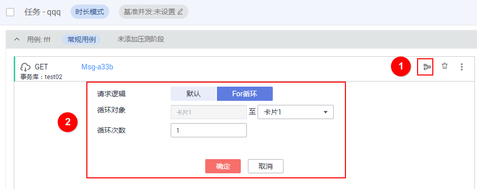

# 管理测试任务

测试任务创建成功后，您可以对测试任务和任务阶段进行管理。

> **说明：**   
>在测试任务运行过程中，不可修改和删除测试任务，且测试任务内的任务阶段也不可修改和删除。  

## 批量启动测试任务

启动同一测试工程下的多个测试任务。

1.  登录CPTS控制台，在左侧导航栏中选择“测试工程“，单击待操作工程后的“编辑事务模型“。
2.  在“测试任务“页签中，选中多个需要启动的任务，单击“批量启动”。
3.  选择对应的资源组，单击“启动”。

## 修改测试任务

1.  登录CPTS控制台，在左侧导航栏中选择“测试工程“，单击待操作工程后的“编辑事务模型“。
2.  在“测试任务“页签中，单击待修改测试任务后的“编辑”。
3.  修改测试任务名称后，单击“确定”。

## 删除测试任务

测试任务删除后将无法恢复，请谨慎操作。

1.  登录CPTS控制台，在左侧导航栏中选择“测试工程“，单击待操作工程后的“编辑事务模型“。
2.  在“测试任务“页签中，单击待删除测试任务后的“删除”。

    选中多个测试任务，单击“批量删除”，可一次性删除多个测试任务。

3.  根据系统提示执行删除操作。

## 删除任务阶段

1.  登录CPTS控制台，在左侧导航栏中选择“测试工程“，单击待操作工程后的“编辑事务模型“。
2.  在“测试任务“页签中，选中待删除的任务阶段，单击。
3.  根据系统提示执行删除操作。

## 修改任务阶段

1.  登录CPTS控制台，在左侧导航栏中选择“测试工程“，单击待操作工程后的“编辑事务模型“。
2.  在“测试任务“页签中，选中待修改的任务阶段，单击展开任务阶段，根据[表1](创建测试任务.md#table75884531724)修改任务阶段，单击“确定”。

## 逻辑控制器---For循环

对于一个用例内单个或者连续的请求信息进行重复执行的操作。通常在需要循环执行的第一个请求信息中设置，设置从当前请求信息至其后某个请求信息（包括之间所有的请求信息）以及从当前至当前（也就是自身请求信息）循环。

1.  登录CPTS控制台，在左侧导航栏中选择“测试工程“。单击待编辑事务模型工程后的“编辑事务模型“。
2.  在“测试任务“页签中，选择待操作的请求信息，单击右上角。

    **图 1**  逻辑控制器  
    

    > **说明：**   
    >-   仅“常规用例”中的请求信息支持For循环。  
    >-   WebSocket协议的请求信息不支持For循环。  

3.  配置以下参数。
    -   请求逻辑：分为默认和For循环，默认表示不设置For循环。
    -   循环对象：开始对象默认为当前事务请求信息，结束对象可选择当前事务请求信息及其后的任意一个事务请求信息。
    -   循环次数：当前支持1 \~ 100。

        > **说明：**   
        >选择循环对象时，若某一事务请求信息已设置For循环，则该事务请求信息及其之后的事务请求信息均不可被设置为结束对象。  

4.  单击“确定”。

    > **说明：**   
    >若设置For循环，启动调试后，调试结果展示的请求信息结果个数与设置的循环次数一致。  

