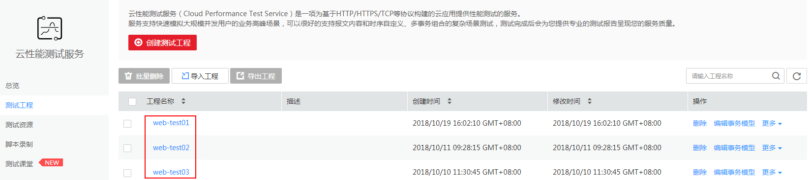

# 管理测试工程<a name="cpts_01_0028"></a>

测试工程创建成功后，您可以对测试工程进行修改和删除操作。

## 修改/删除测试工程<a name="section8455126132213"></a>

1.  登录CPTS控制台。
2.  选择左侧导航栏的“测试工程“。
3.  测试工程创建完成后，您还可执行[表1](#table22151616366)中操作。

    **表 1**  其他操作

    <a name="table22151616366"></a>
    <table><thead align="left"><tr id="row102156161618"><th class="cellrowborder" valign="top" width="28.999999999999996%" id="mcps1.2.3.1.1"><p id="p92150167611"><a name="p92150167611"></a><a name="p92150167611"></a>操作</p>
    </th>
    <th class="cellrowborder" valign="top" width="71%" id="mcps1.2.3.1.2"><p id="p1821651616617"><a name="p1821651616617"></a><a name="p1821651616617"></a>操作说明</p>
    </th>
    </tr>
    </thead>
    <tbody><tr id="row1110017911204"><td class="cellrowborder" valign="top" width="28.999999999999996%" headers="mcps1.2.3.1.1 "><p id="p61012952010"><a name="p61012952010"></a><a name="p61012952010"></a><span class="keyword" id="keyword15942153831710"><a name="keyword15942153831710"></a><a name="keyword15942153831710"></a>修改测试工程</span></p>
    </td>
    <td class="cellrowborder" valign="top" width="71%" headers="mcps1.2.3.1.2 "><a name="ol96596518207"></a><a name="ol96596518207"></a><ol id="ol96596518207"><li>单击测试工程后的“更多”，选择“重命名”。</li><li>修改“工程名称”、“描述”。</li><li>单击“确定”。</li></ol>
    </td>
    </tr>
    <tr id="row14216816667"><td class="cellrowborder" valign="top" width="28.999999999999996%" headers="mcps1.2.3.1.1 "><p id="p1321631620617"><a name="p1321631620617"></a><a name="p1321631620617"></a><span class="keyword" id="keyword979084111173"><a name="keyword979084111173"></a><a name="keyword979084111173"></a>删除测试工程</span></p>
    </td>
    <td class="cellrowborder" valign="top" width="71%" headers="mcps1.2.3.1.2 "><a name="ol1021617169613"></a><a name="ol1021617169613"></a><ol id="ol1021617169613"><li>单击测试工程后的“删除”。</li><li>单击“确定”。<p id="p16216840171410"><a name="p16216840171410"></a><a name="p16216840171410"></a>测试工程删除后将无法恢复，请谨慎操作。</p>
    </li></ol>
    </td>
    </tr>
    </tbody>
    </table>


## 导出/导入测试工程<a name="section12931512191512"></a>

为简化操作，我们不必从零开始编写测试工程，只需要找到与自己业务模型类似的工程，导出测试工程，再导入测试工程，在此基础上略作修改即可。

1.  登录CPTS控制台。
2.  选择左侧导航栏的“测试工程“。
3.  复选框选择待要导出的工程，您可以在复选框中选择多个工程。
4.  单击“导出工程”，保存测试工程文件ProjectList\(_序列号_\).json到本地。
5.  修改文件中所有的工程名称（工程名称需唯一），并保存文件。

    ```
        "新增工程": {
          "工程名称": "web-test",
          "工程描述": "cc"
    ```

    > **说明：**   
    >-   请勿修改ProjectList\(_序列号_\).json文件的格式。  
    >-   工程名称只能以汉字、字母、数字、中划线（-）、下划线（\_）和点（.）组成。  
    >-   若待导入的工程名称在云性能服务中已存在，则会导入工程失败，提示“同名工程已经存在”。  

6.  单击“导入工程”，选择修改后的测试工程文件。

    > **说明：**   
    >导入工程前，可以修改测试工程文件属性，具体请参考[修改导出的工程文件](修改导出的工程文件.md)。  

    **图 1**  导入工程<a name="fig15394285454"></a>  
    

7.  单击，可在工程列表中查看到导入成功的工程。

    **图 2**  查看导入工程<a name="fig19675714154710"></a>  
    

8.  您可以根据业务需要参照[修改/删除测试工程](#section8455126132213)、[管理事务](管理事务.md)和[管理事务元素](管理事务元素.md)修改测试工程。

