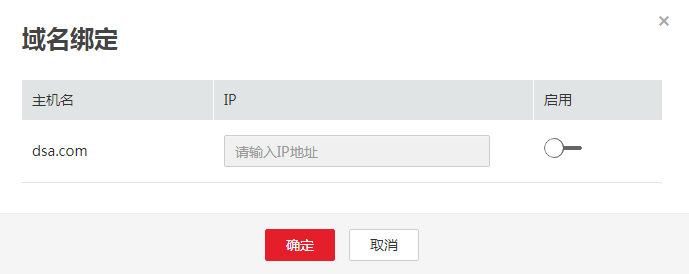

# 绑定域名

支持配置DNS地址池，实现域名与地址的映射，在URL定义域名，通过DNS地址池自动化获取IP。

1.  登录CPTS控制台。
2.  选择左侧导航栏的“测试工程“，单击待编辑测试工程后的“编辑事务模型“。
3.  在“事务模型”页签下，单击“域名绑定”。

    **图 1**  绑定域名  
    

4.  根据实际规划，绑定事务的域名。

    **图 2**  绑定事务的域名  
    

5.  配置完成后，单击“确定”。

