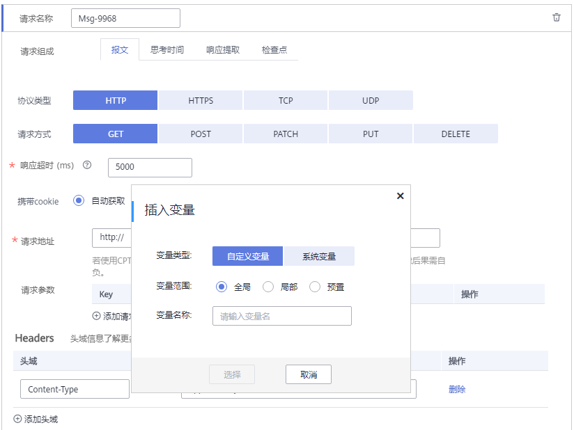

# 设置全局变量

全局变量用于构造数据集合，使测试数据更加丰富。在报文事务请求信息的报文内容中引用全局变量，执行压测任务过程会将报文内容中的变量值动态替换为指定的值。

全局变量适用于很多场景，例如需要用户名密码的业务，需要使用不同的用户名以及对应密码模拟多用户场景进行压测。

> **说明：**   
>-   使用全局变量前，请确保执行压测任务的资源组已升级到最新版本，否则全局变量功能将不可用。  
>-   压测任务运行时，顺序读取全局变量的值，即第一个虚拟用户取变量的第一个值，第二个虚拟用户取第二个值。  

## 设置全局变量

1.  登录CPTS控制台，在左侧导航栏中选择“测试工程“。单击待编辑测试工程后的“编辑事务模型“。
2.  在“事务库”页签中，单击“全局变量”。

    **图 1**  添加全局变量  
    

3.  方式一：通过手工输入方式添加全局变量。
    1.  单击“添加变量”。
    2.  参照[表1](#table918124018388)设置参数。

        **表 1**  设置全局变量

        
        <table><thead align="left"><tr id="row11754023811"><th class="cellrowborder" valign="top" width="24.7%" id="mcps1.2.3.1.1">
参数

        </th>
        <th class="cellrowborder" valign="top" width="75.3%" id="mcps1.2.3.1.2">
参数说明

        </th>
        </tr>
        </thead>
        <tbody><tr id="row1718174033820"><td class="cellrowborder" valign="top" width="24.7%" headers="mcps1.2.3.1.1 ">
变量名称

        </td>
        <td class="cellrowborder" valign="top" width="75.3%" headers="mcps1.2.3.1.2 ">
新增全局变量的名称。

        </td>
        </tr>
        <tr id="row81844012387"><td class="cellrowborder" valign="top" width="24.7%" headers="mcps1.2.3.1.1 ">
变量类型

        </td>
        <td class="cellrowborder" valign="top" width="75.3%" headers="mcps1.2.3.1.2 ">
新增变量类型，支持整数和枚举两种类型。

        </td>
        </tr>
        <tr id="row418154019387"><td class="cellrowborder" valign="top" width="24.7%" headers="mcps1.2.3.1.1 ">
变量值

        </td>
        <td class="cellrowborder" valign="top" width="75.3%" headers="mcps1.2.3.1.2 ">
压测任务运行时会读取对应全局变量的参数值，针对每个虚拟用户，依次轮询变量值，即第一个虚拟用户取变量的第一个值，第二个虚拟用户取第二个值，依顺序取值，不够则循环。

        
 说明： 

变量的内容，在压测时将以明文传输，请谨慎输入，注意数据安全。

        

        <ul id="ul718740123817"><li>变量类型为整数时，输入变量值范围。</li><li>变量类型为枚举时，单击，输入变量值。</li></ul>
        </td>
        </tr>
        </tbody>
        </table>

    3.  设置完成后，单击保存。

        变量创建完成后，可单击“编辑”进行修改。若该全局变量已被事务所引用，变量修改后，事务中的全局变量值会同步修改。

4.  方式二：文件变量导入。

    > **说明：**   
    >若需要通过本地导入方式创建全局变量，请事先准备要csv格式或xlsx格式的文件。  

    1.  单击“文件变量导入“，导入格式为csv或xlsx的文件。

        -   变量名称：导入的文件名称。
        -   变量值：实际的变量名称，多个变量名称之间用“,”分隔。
        -   变量类型：文件。

        **图 2**  导入全局变量  
        

    2.  全局变量导入成功后，您还可以执行如下操作：
        -   单击“再次导入”，导入新的全局变量文件。
        -   已导入的全局变量文件，若本地做了修改，可单击“重新上传”进行重新上传。
        -   单击“删除”，删除导入的全局变量文件。

            > **说明：**   
            >全局变量文件被引用时，不可删除。  

## 支持插入变量

添加请求信息时，在输入框内输入“$”，支持插入变量，详情请参见[添加请求信息（报文）](添加请求信息（报文）.md)、[添加请求信息（思考时间）](添加请求信息（思考时间）.md)。

**图 3**  插入变量  

-   自定义变量
    -   变量名称：自定义变量名称。
    -   变量范围：选择变量范围。

-   系统变量

    选择函数名称

    -   身份证号：随机生成一个身份证号。
    -   手机号：随机生成一个手机号。
    -   区间随机数：根据用户输入区间，随机生成区间内的任一整数。
    -   随机字符串：根据用户输入的位数（1-32），随机生成小写字母和数字混合的字符串。
    -   时间戳：根据用户选择（秒（s）/毫秒（ms）），生成执行时当前时间戳（秒（s）对应10位，毫秒（ms）对应13位）。
    -   UUID：随机生成一个不带“-”的32个16进制的字符。

        > **须知：**   
        >当事务类型为常规事务和视频流事务时，支持插入预置变量，预置事务不支持。  

