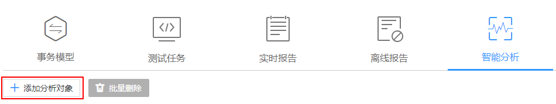

# 设置智能分析

为创建成功的测试工程添加分析对象。

## 前提条件

-   已开通应用性能管理（APM），并在云容器引擎 CCE上创建了带APM探针的工作负载。
-   已开通应用运维管理（AOM）。

## 添加分析对象

1.  登录CPTS控制台，在左侧导航栏中选择“测试工程“。
2.  在测试工程列表中，单击待编辑测试工程后的“编辑事务模型“。
3.  在“智能分析“页签下，单击“添加分析对象“。

    分析对象可以为应用组和节点。

    **图 1**  添加分析对象  
    

4.  配置完成后，单击“确定”。

## 编辑分析对象

1.  登录CPTS控制台，在左侧导航栏中选择“测试工程“。
2.  在测试工程列表中，单击待编辑测试工程后的“编辑事务模型“。
3.  在“智能分析“页签中，单击待修改分析对象后的“编辑”。
4.  根据系统提示执行编辑操作。

## 删除分析对象

1.  登录CPTS控制台，在左侧导航栏中选择“测试工程“。
2.  在测试工程列表中，单击待编辑测试工程后的“编辑事务模型“。
3.  在“智能分析“页签下，单击待删除分析对象后的“删除”。

    选中多个分析对象，单击“批量删除”，可一次性删除多个分析对象。

4.  根据系统提示执行删除操作。

