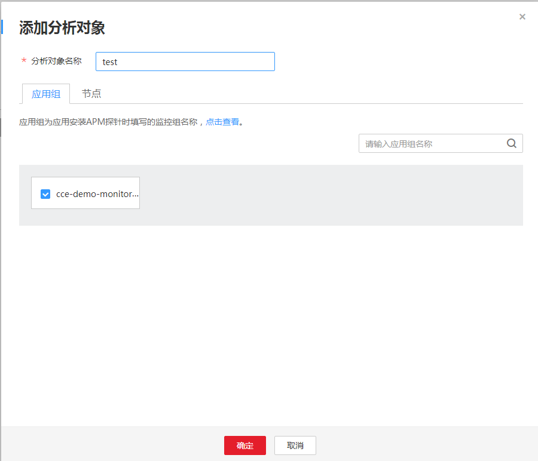

# 设置智能分析

为创建成功的测试工程添加分析对象。

## 前提条件

-   已开通应用性能管理（APM），并在云容器引擎上创建了带Java探针的工作负载，具体操作请参见[性能管理配置](https://support.huaweicloud.com/usermanual-cce/cce_01_0055.html)，当前支持给Java类工作负载提供调用链、拓扑等监控能力。
-   已开通应用运维管理（AOM）。

## 添加分析对象

1.  登录CPTS控制台，在左侧导航栏中选择“测试工程“。
2.  在待编辑测试工程所在行，单击“编辑测试任务”。
3.  在“智能分析“页签中，单击“添加分析对象“。

    分析对象可以为应用组和节点。

    **图 1**  添加分析对象  
    

4.  配置完成后，单击“确定”。
5.  您还可以编辑和删除分析对象。
    -   编辑分析对象：在“智能分析“页签中，单击待修改分析对象后的“编辑”，根据系统提示执行编辑操作。

        > **说明：**   
        >若分析对象已被测试任务关联，编辑分析对象参数后，测试任务中关联分析对象的参数也会相应改变。  

    -   删除分析对象：在“智能分析“页签中，单击待删除分析对象后的“删除”。选中多个分析对象，单击“批量删除”，可一次性删除多个分析对象。

        > **说明：**   
        >删除分析对象时，若分析对象已被测试任务使用，则不可删除。  

