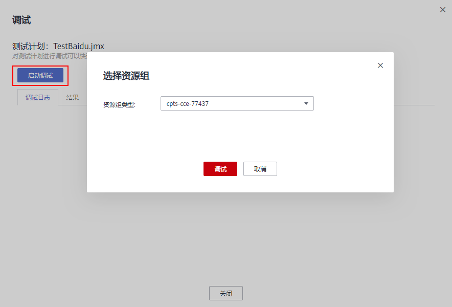
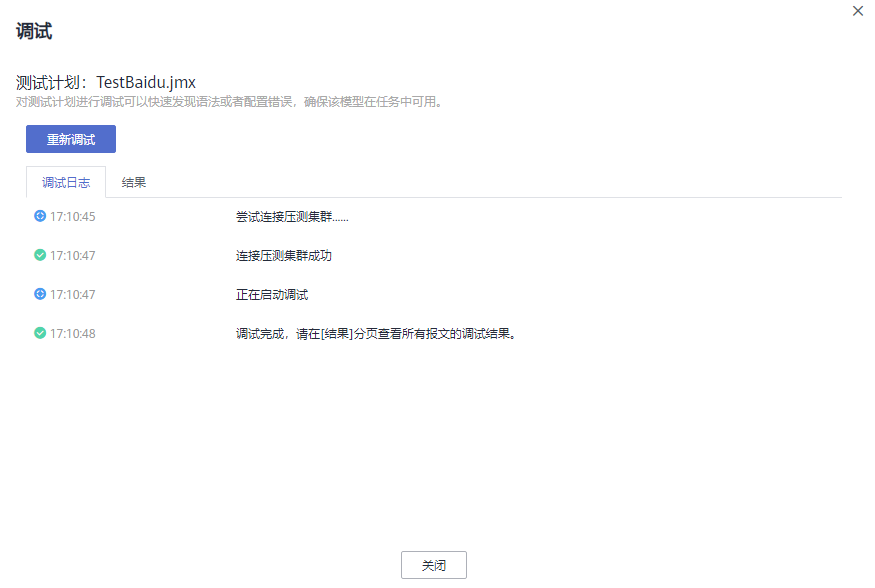
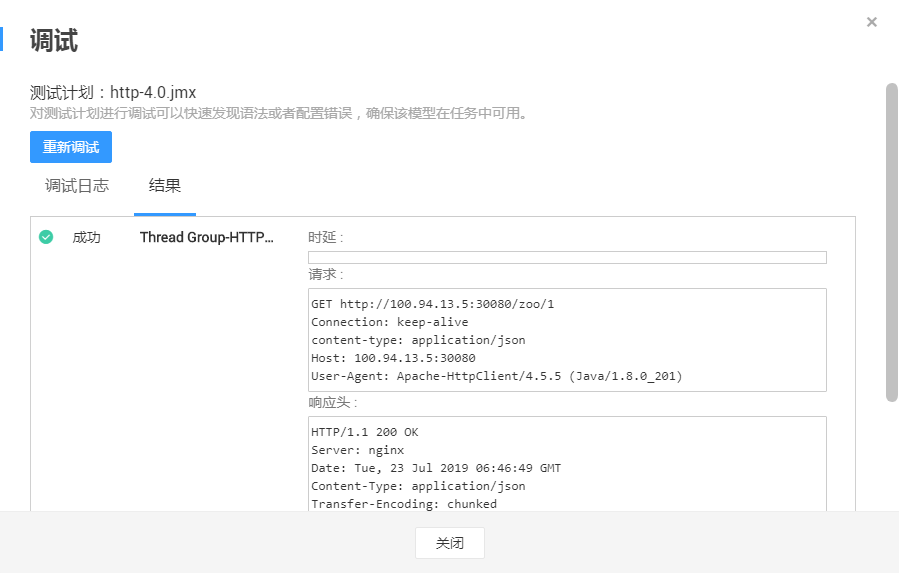

# 调试事务

新增或修改事务后，可通过调试快速发现语法或配置错误。

## 前提条件

-   确保资源组状态为“运行中”。
-   确保资源组的管理节点上的32001和32002端口在安全组被开启。
-   确保资源组的管理节点和被压测的应用之间网络互通。

## 操作步骤

1.  登录CPTS控制台，在左侧导航栏中选择“测试工程“。单击待调试事务所在工程后的“编辑事务模型“。
2.  单击待调试事务后的“调试”。
3.  单击“启动调试”，选择资源组进行调试，如[图1](#fig12991031110)所示。

    **图 1**  选择资源组  
    

    -   共享资源组：基于CCE的放置在CPTS的内置租户下的共享资源组，共享资源组分内网和外网。
    -   虚拟资源组：本机创建的虚拟机资源组。
    -   实例化资源组：基于CCI的实例化资源组（暂未上线）。

4.  在“调试日志”页签，查看调试的操作日志。

    **图 2**  调试日志  
    

5.  调试完成后，在“结果”页签，查看事务调试的具体内容。

    若调试结果报错，可根据错误日志信息，修改相应的事务元素，重新进行调试。

    **图 3**  查看调试结果  
    

