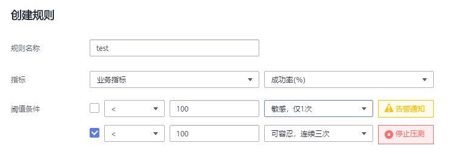

# 配置SLA规则

服务等级定义（Service Level Agreement，以下简称SLA）是判断性能压测是否异常的重要依据。性能压测过程中，通过监控核心服务状态的SLA指标数据，您可以更直观地了解性能压测业务的状态。

在CPTS中，支持为CPTS测试工程配置SLA规则，JMeter测试工程暂不支持配置SLA规则。压测过程中，CPTS测试用例的请求满足SLA规则时，停止压测或者在SLA报告中显示告警通知。

CPTS支持通过以下两种方式配置SLA规则。

-   [预先创建SLA规则模板，然后导入模板](#section365811576310)：SLA规则模板设置完成后，在任意一个CPTS测试任务中都可以导入使用。
-   [在测试任务中创建SLA规则](#section9663195715310)：测试任务中创建的SLA规则，仅适用于此测试任务。

## 预先创建SLA规则模板，然后导入模板

1.  登录CPTS控制台，在左侧导航栏中选择“SLA管理”，单击“创建SLA规则”。

    > **说明：** 
    >同一个区域，每个帐号最多创建20个SLA规则模板。

2.  设置SLA基本信息。
    -   SLA名称：自定义SLA名称，用于识别不同的SLA规则。同一区域，SLA名称不能相同。
    -   规则定义：对于SLA规则的描述信息，可以不设置。

3.  单击“添加规则”，弹出“创建规则”对话框。
4.  参考[表1](#table17332010143116)设置SLA规则。

    **表 1**  创建规则参数说明

    
    <table><thead align="left"><tr id="row273218105318"><th class="cellrowborder" valign="top" width="16%" id="mcps1.2.3.1.1">
参数

    </th>
    <th class="cellrowborder" valign="top" width="84%" id="mcps1.2.3.1.2">
参数说明

    </th>
    </tr>
    </thead>
    <tbody><tr id="row1873261011312"><td class="cellrowborder" valign="top" width="16%" headers="mcps1.2.3.1.1 ">
规则名称

    </td>
    <td class="cellrowborder" valign="top" width="84%" headers="mcps1.2.3.1.2 ">
自定义规则，用于识别不同的规则。

    </td>
    </tr>
    <tr id="row4733610123112"><td class="cellrowborder" valign="top" width="16%" headers="mcps1.2.3.1.1 ">
指标

    </td>
    <td class="cellrowborder" valign="top" width="84%" headers="mcps1.2.3.1.2 ">
支持三种指标：

    <ul id="ul2909939112816"><li>RT：平均响应时间达到设定的阈值条件后，触发告警通知或者停止压测。</li><li>RPS：每秒请求数达到设定的阈值条件后，触发告警通知或者停止压测。</li><li>成功率：成功率达到设定的阈值条件后，触发告警通知或者停止压测。</li></ul>
    </td>
    </tr>
    <tr id="row10314308145"><td class="cellrowborder" valign="top" width="16%" headers="mcps1.2.3.1.1 ">
阈值条件

    </td>
    <td class="cellrowborder" valign="top" width="84%" headers="mcps1.2.3.1.2 ">
设置触发告警通知或者停止压测的阈值条件。

    
例如，设置阈值条件为“&lt;100，可容忍，连续三次，停止压测”，此时表示业务指标连续三次&lt;100时，测试任务停止压测。

    </td>
    </tr>
    </tbody>
    </table>

    **图 1**  预先创建SLA规则创建规则  
    

5.  单击“确定”，完成规则的创建。
6.  （可选）如果需要创建多条规则，参考[3](#li15807191414516)\~[5](#li14827175671418)，完成其他规则的创建。

    > **说明：** 
    >每个SLA规则最多添加5条规则。

7.  单击“确定”，完成SLA模板的创建。

    SLA模板创建成功后，在“SLA管理”页面查看已创建的SLA模板列表。

    > **说明：** 
    >如果需要编辑或者删除SLA模板，请在对应的SLA模板所在行，单击“编辑”/“删除”。

8.  在左侧导航栏中选择“CPTS测试工程”，在需要配置SLA规则的工程所在行，单击“编辑测试任务”。
9.  在“测试任务”页签中，单击，展开测试任务。
10. 单击“SLA配置”，进入SLA配置页面。
11. 单击“从已有SLA模板导入”，进入“SLA规则配置”页面。
12. 在“导入SLA模板”中，选择已创建的SLA模板名称，导入SLA模板。
13. 在“SLA规则”区域的“适用对象”中，为每条规则选择对应的请求，支持多选。

    您还可以根据实际需求，编辑/删除/添加规则。

    > **说明：** 
    >SLA规则对于预置用例不生效。

14. 单击“保存SLA配置”，完成测试用例SLA规则的配置。
15. 在测试任务名称所在行，单击“启动”，弹出“启动测试任务”对话框。
16. 选择资源组类型，单击“启动”。
17. 单击“查看报告”，进入“实时报告”页面。
18. 选择[15](#li72591957114618)的测试任务名称，在“SLA报告”页签，查看此任务下配置了SLA规则的请求在压测过程中是否触发SLA规则。

    SLA规则采集时间为每6s一次。如果触发了SLA规则，在“触发事件”中会显示触发SLA规则的时间、请求名称和当前的触发次数。

    > **说明：** 
    >您也可以在压测任务结束后，在“离线报告”下，选择测试任务名称，单击需要查看报告后的“查看报告”，在“SLA报告”页签中，查看此任务下配置了SLA规则的请求在压测过程中是否触发SLA规则。

## 在测试任务中创建SLA规则

1.  登录CPTS控制台，在左侧导航栏中选择“CPTS测试工程”。
2.  在需要配置SLA规则的工程所在行，单击“编辑测试任务”。
3.  在“测试任务”页签中，单击，展开测试任务。
4.  单击“SLA配置”，进入SLA配置页面。
5.  单击“创建SLA”，进入“SLA规则配置”页面。
6.  设置SLA基本信息。
    -   SLA名称：自定义SLA名称。
    -   规则定义：对于SLA规则的描述信息，可以不设置。

7.  单击“添加规则”，弹出“创建规则”对话框。
8.  参考[表2](#table5823204691510)设置SLA规则。

    **表 2**  创建规则参数说明

    
    <table><thead align="left"><tr id="row5824194620157"><th class="cellrowborder" valign="top" width="16%" id="mcps1.2.3.1.1">
参数

    </th>
    <th class="cellrowborder" valign="top" width="84%" id="mcps1.2.3.1.2">
参数说明

    </th>
    </tr>
    </thead>
    <tbody><tr id="row1182424691514"><td class="cellrowborder" valign="top" width="16%" headers="mcps1.2.3.1.1 ">
规则名称

    </td>
    <td class="cellrowborder" valign="top" width="84%" headers="mcps1.2.3.1.2 ">
自定义规则，用于识别不同的规则。

    </td>
    </tr>
    <tr id="row1582484615154"><td class="cellrowborder" valign="top" width="16%" headers="mcps1.2.3.1.1 ">
指标

    </td>
    <td class="cellrowborder" valign="top" width="84%" headers="mcps1.2.3.1.2 ">
支持三种指标：

    <ul id="ul482484611158"><li>RT：平均响应时间达到设定的阈值条件后，触发告警通知或者停止压测。</li><li>RPS：每秒请求数达到设定的阈值条件后，触发告警通知或者停止压测。</li><li>成功率：成功率达到设定的阈值条件后，触发告警通知或者停止压测。</li></ul>
    </td>
    </tr>
    <tr id="row13824184617154"><td class="cellrowborder" valign="top" width="16%" headers="mcps1.2.3.1.1 ">
阈值条件

    </td>
    <td class="cellrowborder" valign="top" width="84%" headers="mcps1.2.3.1.2 ">
设置触发告警通知或者停止压测的阈值条件。

    
例如，设置阈值条件为“&lt;100，可容忍，连续三次，停止压测”，此时表示业务指标连续三次&lt;100时，测试任务停止压测。

    </td>
    </tr>
    </tbody>
    </table>

    **图 2**  在测试任务中创建SLA规则  
    

9.  （可选）如果需要创建多条规则，参考[7](#li1382312463157)\~[8](#li1082324615152)，完成其他规则的创建。

    > **说明：** 
    >每个SLA规则最多添加5条规则。

10. 在“适用对象”中，为每条规则选择对应的请求，支持多选。

    > **说明：** 
    >SLA规则对于预置用例不生效。

11. 单击“保存SLA配置”，完成测试用例SLA规则的配置。
12. 在测试任务名称所在行，单击“启动”，弹出“启动测试任务”对话框。
13. 选择资源组类型，单击“启动”。
14. 单击“查看报告”，进入“实时报告”页面。
15. 选择[12](#li970633710213)的测试任务名称，在“SLA报告”页签，查看此任务下配置了SLA规则的请求在压测过程中是否触发SLA规则。

    SLA规则采集时间为每6s一次。如果触发了SLA规则，在“触发事件”中会显示触发SLA规则的时间、请求名称和当前的触发次数。

    > **说明：** 
    >您也可以在压测任务结束后，在“离线报告”下，选择测试任务名称，单击需要查看报告后的“查看报告”，在“SLA报告”页签中，查看此任务下配置了SLA规则的请求在压测过程中是否触发SLA规则。

