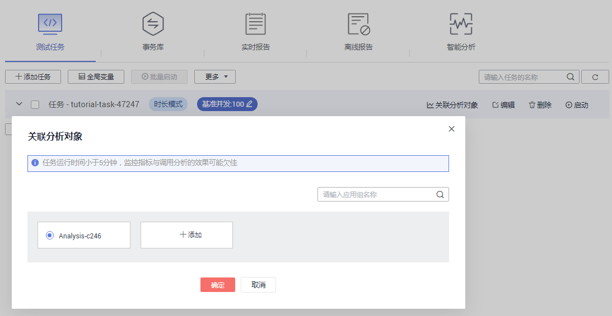

# （可选）关联分析对象

为测试任务选择关联分析对象。若测试任务处于已启动状态，则无法关联分析对象。

## 前提条件

测试任务处于未启动状态。

## 操作步骤

1.  登录CPTS控制台，在左侧导航栏中选择“测试工程“，单击待操作工程后的“编辑事务模型“。
2.  在“测试任务“页签中，选择需要关联分析对象的测试任务，单击“关联分析对象”。

    **图 1**  关联分析对象  
    

3.  勾选需要关联的分析对象，若需关联新的分析对象，单击“添加”，参照[设置智能分析](设置智能分析.md)添加分析对象，添加完毕后，选择需关联的分析对象，单击“确定”。

