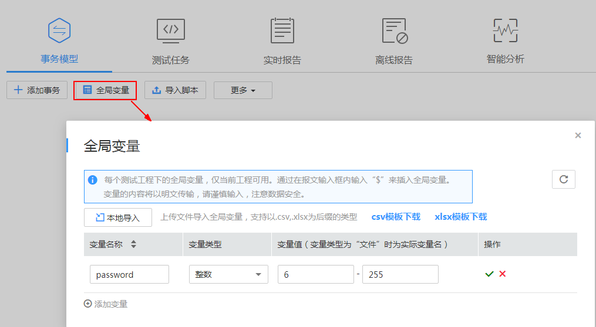
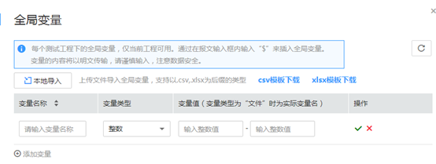
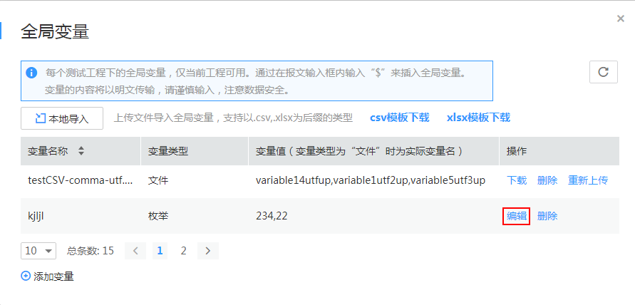
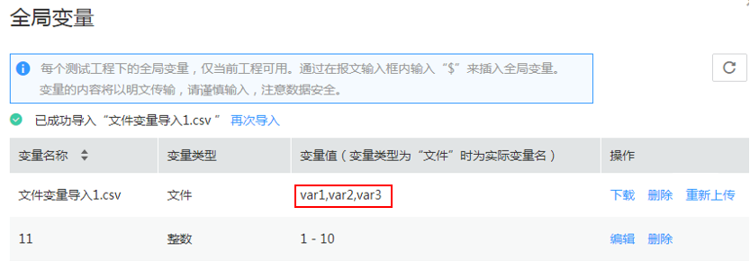
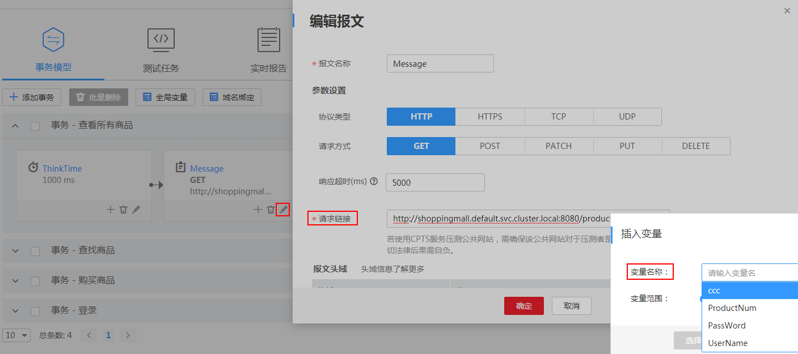

# （可选）设置全局变量

全局变量用于构造数据集合，使测试数据更加丰富。在报文事务元素的报文内容中引用全局变量，执行压测任务过程会将报文内容中的变量值动态替换为指定的值。

全局变量可以用于很多场景，例如需要用户名密码的业务中，需要使用不同的用户名以及对应密码模拟多用户场景进行压测。

> **说明：**   
>新增全局变量，并在压测任务的报文中使用时，若执行此压测任务的资源组未升级到最新版本，全局变量功能将不可用。资源组升级请参见[升级资源组](升级资源组.md)。  

## 设置全局变量

1.  登录CPTS控制台。
2.  选择左侧导航栏的“测试工程“，单击待编辑测试工程后的“编辑事务模型“。
3.  在“事务模型”页签下，单击“全局变量”。

    **图 1**  添加全局变量  
    

    > **说明：**   
    >每个测试工程下的全局变量，仅当前工程可用。  

4.  单击“添加变量”，参照[表1](#table9822191913365)设置基本信息，其中带“\*”标志的参数为必填参数。

    **图 2**  设置全局变量参数  
    

    **表 1**  设置全局变量

    
    <table><thead align="left"><tr id="row1821131923616"><th class="cellrowborder" valign="top" width="23%" id="mcps1.2.3.1.1">
参数

    </th>
    <th class="cellrowborder" valign="top" width="77%" id="mcps1.2.3.1.2">
参数说明

    </th>
    </tr>
    </thead>
    <tbody><tr id="row15821121953612"><td class="cellrowborder" valign="top" width="23%" headers="mcps1.2.3.1.1 ">
*变量名称

    </td>
    <td class="cellrowborder" valign="top" width="77%" headers="mcps1.2.3.1.2 ">
全局变量的名称。

    </td>
    </tr>
    <tr id="row11821181943618"><td class="cellrowborder" valign="top" width="23%" headers="mcps1.2.3.1.1 ">
*变量类型

    </td>
    <td class="cellrowborder" valign="top" width="77%" headers="mcps1.2.3.1.2 ">
支持整数和枚举。

    </td>
    </tr>
    <tr id="row1182261933613"><td class="cellrowborder" rowspan="2" valign="top" width="23%" headers="mcps1.2.3.1.1 ">
*变量值

    
 说明： 

变量的内容，在压测时将以明文传输，请谨慎输入，注意数据安全。

    

    </td>
    <td class="cellrowborder" valign="top" width="77%" headers="mcps1.2.3.1.2 ">
变量类型为整数时，输入变量值范围。

    
压测任务运行时会读取对应全局变量范围内的值，针对每个虚拟用户，依次轮询变量值，即第一个虚拟用户取变量的第一个值，第二个虚拟用户取第二个值，依顺序取值，不够则循环。

    </td>
    </tr>
    <tr id="row982211191364"><td class="cellrowborder" valign="top" headers="mcps1.2.3.1.1 ">
变量类型为枚举时，执行以下步骤。

    <ol id="ol1582201993619"><li>单击。</li><li>输入变量值。</li><li>（可选）您可以根据业务需求添加多个变量值。</li></ol>
    
压测任务运行时会读取对应全局变量的参数值，针对每个虚拟用户，依次轮询变量值，即第一个虚拟用户取变量的第一个值，第二个虚拟用户取第二个值，依顺序取值，不够则循环。

    </td>
    </tr>
    </tbody>
    </table>

5.  设置完后单击。
6.  （可选）您可以参考[4](#li1382885820223)~[5](#li154570223331)添加多个全局变量。
7.  单击。

## 修改全局变量

1.  登录CPTS控制台。
2.  选择左侧导航栏的“测试工程“，单击待编辑测试工程后的“编辑事务模型“。
3.  在“事务模型”页签下，单击“全局变量”。

    **图 3**  事务模型-全局变量  
    

4.  单击待修改的全局变量后的“编辑”，参照[表1](#table9822191913365)修改**变量类型**和**变量值**。

    单击待修改的全局变量后的“下载”，可以下载该全局变量。

    **图 4**  修改全局变量  
    

    > **说明：**   
    >若该全局变量被事务所引用，则修改后，事务中的全局变量值同步修改。  

5.  修改完后单击。

## 导入全局变量文件

通过文件的方式导入全局变量。

1.  登录CPTS控制台。
2.  选择左侧导航栏的“测试工程“，单击待编辑测试工程后的“编辑事务模型“。
3.  在“事务模型”页签下，单击“全局变量”。

    **图 5**  添加全局变量  
    

4.  单击“本地导入”上传文件，支持上传xlsx、csv格式的文件。

    > **说明：**   
    >页面上提供了xlsx、csv模板的下载。您可以根据需要，下载对应模板，然后按照模板格式进行编辑，编辑完成后再导入。  

    **图 6**  本地导入  
    

5.  上传成功后，导入的全局变量文件会在页面显示如下。

    其中：

    -   变量名称为导入的文件名称。
    -   变量值为实际的变量名称，多个变量名称之间以“,”分隔。

    **图 7**  查看导入的全局变量  
    

    > **说明：**   
    >-   全局变量文件导入完成后，您还可以“再次导入”新的全局变量文件。  
    >-   对于已经导入的全局变量文件，如果您本地做了修改，还可以“重新上传”。  
    >-   若您不再使用导入的全局变量文件，可以单击“删除”按钮，删除导入的全局变量文件。  

6.  单击事务的按钮，在“编辑元素”页面的“请求链接”下，输入**$**符号，可以选择导入的变量名称。

    **图 8**  编辑报文  
    

